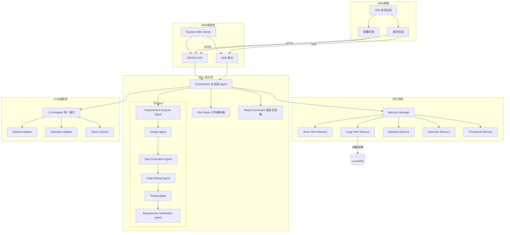
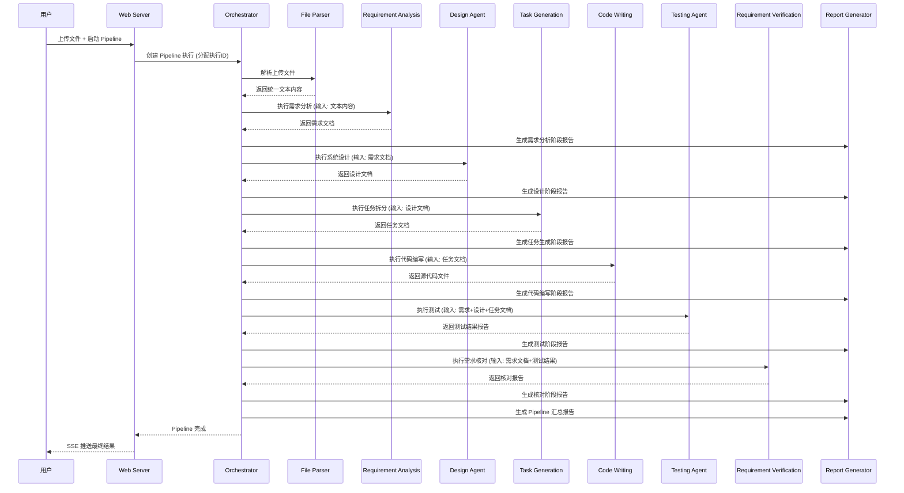
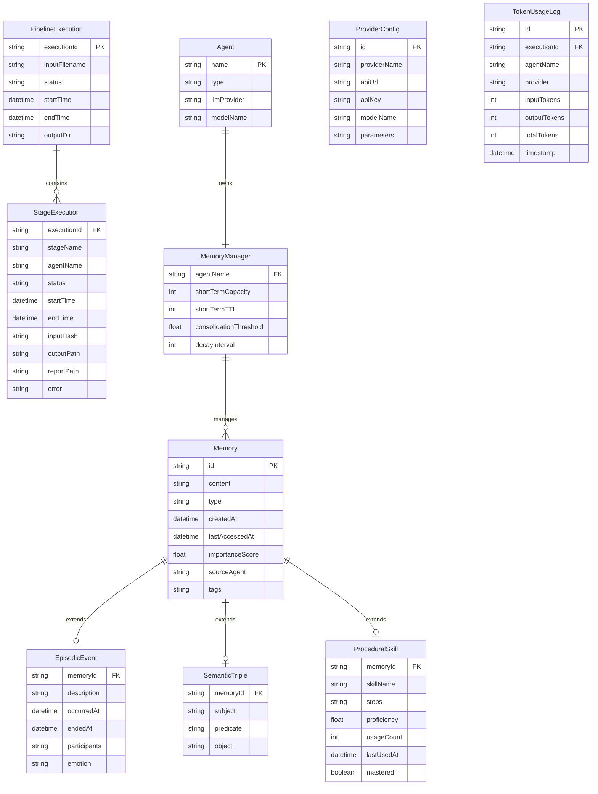

# 设计文档

## 概述

本系统是一个基于 Node.js 的多 Agent 协同工作平台，采用 Pipeline 架构实现从需求分析到需求核对的完整软件开发流水线。系统核心由以下四大子系统组成：

1. **核心流水线系统**：包含 Orchestrator（主协调 Agent）和 6 个子 Agent（需求分析、设计、任务生成、代码编写、测试、需求核对），以及文件解析器和报告生成器
2. **记忆系统**：为每个 Agent 提供独立的多层记忆管理能力，包含短期记忆、长期记忆、经历性记忆、语义记忆和程序性记忆五种类型
3. **LLM 提供商适配层**：通过适配器模式屏蔽不同 LLM 提供商（OpenAI、Anthropic 等）的 API 差异，为所有 Agent 提供统一的 LLM 调用接口
4. **Web 前端系统**：基于 Node.js HTTP 服务器托管 SPA 前端，提供模型配置页面和聊天主页面

### 设计目标

- **可扩展性**：通过注册机制支持动态添加新的子 Agent 和 LLM 提供商适配器
- **松耦合**：各子系统通过明确定义的接口通信，Agent 不直接依赖特定 LLM 提供商
- **可观测性**：每个阶段生成执行报告，Pipeline 状态实时推送到前端
- **记忆增强**：Agent 可利用历史经验提升执行质量，支持跨 Agent 记忆共享

### 技术选型

| 领域 | 技术方案 | 选型理由 |
|------|---------|---------|
| 运行时 | Node.js (>=18) | 项目要求，原生支持 async/await 和 Stream |
| 文件解析 (DOC/DOCX/PPT/PPTX) | [officeparser](https://www.npmjs.com/package/officeparser) | 支持 docx、pptx 等 Office 格式文本提取，轻量无外部依赖 |
| 文件解析 (HTML) | [cheerio](https://www.npmjs.com/package/cheerio) | 成熟的 HTML 解析库，支持结构化提取 |
| 文件解析 (XMind) | [xmind-js](https://www.npmjs.com/package/xmind-js) / JSZip + JSON 解析 | XMind 文件本质是 ZIP 包含 JSON，可直接解析节点层级 |
| 向量数据库 | [LanceDB](https://github.com/lancedb/lancedb) | 嵌入式向量数据库，无需外部服务，支持 Node.js，适合本地部署 |
| LLM SDK (OpenAI) | [openai](https://www.npmjs.com/package/openai) | 官方 SDK，支持流式响应和 Function Calling |
| LLM SDK (Anthropic) | [@anthropic-ai/sdk](https://www.npmjs.com/package/@anthropic-ai/sdk) | 官方 SDK，支持流式响应和 Tool Use |
| Web 服务器 | Express.js | 成熟稳定，生态丰富，支持 SSE |
| 前端 | 原生 HTML/CSS/JS (SPA) | 轻量无构建依赖，满足配置和聊天两个页面需求 |
| 配置存储 | JSON 文件 | 简单可靠，适合本地配置持久化 |
| 默认 LLM 提供商 | NVIDIA API (OpenAI 兼容) | 通过 OpenAI SDK 接入 `https://integrate.api.nvidia.com/v1`，使用 `z-ai/glm-5.1` 模型，支持流式响应和 thinking 模式 |


## 架构

### 系统架构概览



### 分层架构

系统采用四层架构：

1. **表现层（Web 前端）**：SPA 应用，包含配置页面和聊天页面，通过 HTTP/SSE 与服务层通信
2. **服务层（Web Server + API）**：Express 服务器，提供 RESTful API 和 SSE 端点，负责请求路由和静态资源托管
3. **业务层（核心流水线 + 记忆系统）**：Orchestrator 协调子 Agent 执行，Memory Manager 管理记忆生命周期
4. **基础设施层（LLM 适配层 + 存储）**：LLM Adapter 屏蔽提供商差异，LanceDB 提供向量存储，JSON 文件提供配置存储

### Pipeline 执行流程




## 组件与接口

### 1. 文件解析器（File Parser）

文件解析器负责将多种格式的输入文件转换为统一的纯文本内容。采用策略模式，每种文件格式对应一个独立的解析策略。

```typescript
// 文件解析策略接口
interface FileParserStrategy {
  supportedExtensions: string[];
  parse(buffer: Buffer, filename: string): Promise<ParseResult>;
}

// 解析结果
interface ParseResult {
  success: boolean;
  content: string;        // 提取的纯文本内容
  metadata: {
    filename: string;
    format: string;
    pageCount?: number;   // PPT 页数
    nodeCount?: number;   // XMind 节点数
  };
  error?: string;
}

// 文件解析器主类
class FileParser {
  private strategies: Map<string, FileParserStrategy>;
  
  registerStrategy(strategy: FileParserStrategy): void;
  parse(buffer: Buffer, filename: string): Promise<ParseResult>;
}
```

**解析策略实现：**
- `HtmlParserStrategy`：使用 cheerio 解析 HTML，提取文本内容和结构信息
- `OfficeParserStrategy`：使用 officeparser 解析 DOC/DOCX/PPT/PPTX 文件
- `XMindParserStrategy`：XMind 文件本质是 ZIP 包，内含 `content.json`，使用 JSZip 解压后递归遍历节点树提取层级文本

### 2. Agent 基础接口

所有 Agent 遵循统一的接口规范，通过 Orchestrator 的注册机制进行管理。

```typescript
// Agent 执行上下文
interface AgentContext {
  executionId: string;           // Pipeline 执行 ID
  inputData: Record<string, any>; // 输入数据
  config: AgentConfig;           // Agent 配置
  memoryManager: MemoryManager;  // 该 Agent 的记忆管理器
  llmAdapter: LLMAdapter;       // LLM 调用接口
  outputDir: string;             // 输出目录
}

// Agent 执行结果
interface AgentResult {
  success: boolean;
  outputData: Record<string, any>; // 输出数据
  artifacts: string[];             // 生成的文件路径列表
  summary: string;                 // 执行摘要
  error?: string;
}

// Agent 接口
interface Agent {
  getName(): string;
  execute(context: AgentContext): Promise<AgentResult>;
}

// Agent 基类（提供通用功能）
abstract class BaseAgent implements Agent {
  protected name: string;
  
  getName(): string;
  abstract execute(context: AgentContext): Promise<AgentResult>;
  
  // 通用辅助方法
  protected async callLLM(prompt: string, context: AgentContext): Promise<string>;
  protected async storeMemory(content: string, type: MemoryType, context: AgentContext): Promise<void>;
  protected async retrieveMemory(query: string, context: AgentContext): Promise<Memory[]>;
  protected async saveDocument(content: string, filename: string, outputDir: string): Promise<string>;
}
```

### 3. Orchestrator（主协调 Agent）

```typescript
// Pipeline 阶段定义
interface StageDefinition {
  name: string;
  agent: Agent;
  inputMapper: (pipelineState: PipelineState) => Record<string, any>;
}

// Pipeline 状态
interface PipelineState {
  executionId: string;
  stages: StageStatus[];
  currentStageIndex: number;
  stageOutputs: Map<string, AgentResult>;
  startTime: Date;
  endTime?: Date;
}

// 阶段状态
interface StageStatus {
  name: string;
  status: 'pending' | 'running' | 'completed' | 'failed';
  startTime?: Date;
  endTime?: Date;
  error?: string;
}

// Orchestrator
class Orchestrator {
  private agents: Map<string, Agent>;
  private stageDefinitions: StageDefinition[];
  private memoryManagers: Map<string, MemoryManager>;
  private sharedMemory: MemoryManager;
  private eventEmitter: EventEmitter;
  
  registerAgent(agent: Agent): void;
  unregisterAgent(name: string): void;
  
  async executePipeline(input: Buffer, filename: string, config: PipelineConfig): Promise<PipelineState>;
  
  getPipelineStatus(executionId: string): PipelineState;
  
  // 跨 Agent 记忆访问
  async crossAgentMemoryRetrieve(
    requestingAgent: string, 
    targetAgent: string, 
    query: string
  ): Promise<Memory[]>;
  
  // 事件通知（用于 SSE 推送）
  onStageChange(callback: (stage: StageStatus) => void): void;
  onPipelineComplete(callback: (state: PipelineState) => void): void;
}
```

### 4. 报告生成器（Report Generator）

```typescript
interface StageReport {
  executionId: string;
  stageName: string;
  startTime: Date;
  endTime: Date;
  duration: number;       // 毫秒
  status: string;
  outputSummary: string;
}

class ReportGenerator {
  generateStageReport(stageStatus: StageStatus, agentResult: AgentResult, executionId: string): string;
  generatePipelineSummary(pipelineState: PipelineState): string;
  saveReport(content: string, filename: string, outputDir: string): Promise<string>;
  
  // 报告命名规范：{executionId}_{stageName}_report.md
  getReportFilename(executionId: string, stageName: string): string;
}
```

### 5. 记忆系统接口

```typescript
// 记忆类型枚举
enum MemoryType {
  SHORT_TERM = 'short_term',
  LONG_TERM = 'long_term',
  EPISODIC = 'episodic',
  SEMANTIC = 'semantic',
  PROCEDURAL = 'procedural'
}

// 记忆数据结构
interface Memory {
  id: string;                    // 唯一标识符
  content: string;               // 记忆内容
  type: MemoryType;              // 记忆类型
  createdAt: Date;               // 创建时间戳
  lastAccessedAt: Date;          // 最后访问时间戳
  importanceScore: number;       // 重要性分数 (0-1)
  sourceAgent: string;           // 来源 Agent 名称
  tags: string[];                // 关联标签列表
  metadata?: Record<string, any>; // 扩展元数据
}

// 记忆管理器
class MemoryManager {
  private shortTermMemory: ShortTermMemory;
  private longTermMemory: LongTermMemory;
  private episodicMemory: EpisodicMemory;
  private semanticMemory: SemanticMemory;
  private proceduralMemory: ProceduralMemory;
  
  async store(content: string, type: MemoryType, metadata?: Record<string, any>): Promise<Memory>;
  async retrieve(query: string, type?: MemoryType, limit?: number): Promise<Memory[]>;
  async delete(memoryId: string): Promise<boolean>;
  async update(memoryId: string, updates: Partial<Memory>): Promise<Memory>;
  
  // 记忆巩固：短期 → 长期
  async consolidate(): Promise<number>;
  // 记忆衰减
  async decay(): Promise<number>;
  // 计算重要性分数
  calculateImportanceScore(content: string, type: MemoryType, interactionType?: string): number;
}
```

#### 5.1 短期记忆（Short-Term Memory）

```typescript
interface ShortTermMemoryConfig {
  capacity: number;       // 队列容量
  ttl: number;            // TTL（毫秒）
}

class ShortTermMemory {
  private queue: Memory[];
  private config: ShortTermMemoryConfig;
  
  async store(memory: Memory): Promise<void>;
  async retrieve(query: string, limit?: number): Promise<Memory[]>;
  async getAll(): Promise<Memory[]>;
  async remove(memoryId: string): Promise<boolean>;
  
  // 淘汰策略：Importance_Score 最低 + 最后访问时间最早
  private evict(): void;
  // TTL 清理
  private cleanExpired(): void;
}
```

#### 5.2 长期记忆（Long-Term Memory）

```typescript
interface LongTermMemoryConfig {
  maxResults: number;          // 最大返回数量
  similarityThreshold: number; // 最低相似度阈值
  dbPath: string;              // LanceDB 存储路径
}

class LongTermMemory {
  private db: LanceDB;
  private config: LongTermMemoryConfig;
  
  async store(memory: Memory, embedding: number[]): Promise<void>;
  async retrieve(queryEmbedding: number[], limit?: number, threshold?: number): Promise<Memory[]>;
  async delete(memoryId: string): Promise<boolean>;
  async restore(): Promise<number>;  // 系统重启后恢复
}
```

#### 5.3 经历性记忆（Episodic Memory）

```typescript
interface EpisodicEvent {
  description: string;       // 事件描述
  occurredAt: Date;          // 发生时间戳
  endedAt?: Date;            // 结束时间戳
  participants: string[];    // 参与者列表
  emotion?: string;          // 情感标注
}

class EpisodicMemory {
  async store(event: EpisodicEvent, sourceAgent: string): Promise<Memory>;
  async queryByTimeRange(start: Date, end: Date): Promise<Memory[]>;
  async queryByParticipant(participant: string): Promise<Memory[]>;
  async consolidateEvents(eventIds: string[]): Promise<Memory>;  // 事件整合
}
```

#### 5.4 语义记忆（Semantic Memory）

```typescript
interface Triple {
  subject: string;    // 主体
  predicate: string;  // 谓词
  object: string;     // 客体
}

interface Concept {
  name: string;
  definition: string;
  attributes: string[];
  relations: { target: string; type: string }[];
}

class SemanticMemory {
  async storeTriple(triple: Triple, sourceAgent: string): Promise<Memory>;
  async storeConcept(concept: Concept, sourceAgent: string): Promise<Memory>;
  async queryBySubject(subject: string): Promise<Triple[]>;
  async queryByPredicate(predicate: string): Promise<Triple[]>;
  async queryKnowledgeGraph(startConcept: string, maxDepth: number): Promise<Concept[]>;
}
```

#### 5.5 程序性记忆（Procedural Memory）

```typescript
interface Skill {
  name: string;
  steps: string[];
  proficiency: number;     // 掌握度 (0-1)
  usageCount: number;
  lastUsedAt: Date;
  mastered: boolean;       // 掌握度 >= 0.8 时为 true
}

class ProceduralMemory {
  async store(skill: Omit<Skill, 'proficiency' | 'usageCount' | 'mastered'>): Promise<Memory>;
  async recordExecution(skillName: string, success: boolean): Promise<Skill>;
  async queryByName(skillName: string): Promise<Skill | null>;
  async listByProficiency(): Promise<Skill[]>;  // 按掌握度降序
}
```

### 6. LLM 适配层接口

```typescript
// 统一消息格式
interface UnifiedMessage {
  role: 'system' | 'user' | 'assistant' | 'tool';
  content: string | ContentBlock[];
  toolCalls?: ToolCall[];
  toolCallId?: string;
}

interface ContentBlock {
  type: 'text' | 'image';
  text?: string;
  imageUrl?: string;
}

interface ToolCall {
  id: string;
  name: string;
  arguments: Record<string, any>;
}

interface ToolDefinition {
  name: string;
  description: string;
  parameters: Record<string, any>;  // JSON Schema
}

// LLM 调用结果
interface LLMResponse {
  content: string;
  toolCalls?: ToolCall[];
  usage: TokenUsage;
  finishReason: 'stop' | 'tool_calls' | 'length' | 'error';
}

interface TokenUsage {
  inputTokens: number;
  outputTokens: number;
  totalTokens: number;
  provider: string;
}

// 流式回调
type StreamCallback = (chunk: string, done: boolean) => void;

// LLM 适配器统一接口
interface LLMAdapterInterface {
  chat(messages: UnifiedMessage[], options?: LLMOptions): Promise<LLMResponse>;
  stream(messages: UnifiedMessage[], callback: StreamCallback, options?: LLMOptions): Promise<LLMResponse>;
  countTokens(text: string): Promise<number>;
}

interface LLMOptions {
  model?: string;
  temperature?: number;
  maxTokens?: number;
  topP?: number;
  tools?: ToolDefinition[];
  [key: string]: any;  // 提供商特定参数
}

// Provider 适配器接口
interface ProviderAdapter {
  name: string;
  chat(messages: UnifiedMessage[], options: LLMOptions): Promise<LLMResponse>;
  stream(messages: UnifiedMessage[], callback: StreamCallback, options: LLMOptions): Promise<LLMResponse>;
  countTokens(text: string): Promise<number>;
}

// LLM 适配器主类
class LLMAdapter implements LLMAdapterInterface {
  private providers: Map<string, ProviderAdapter>;
  private defaultProvider: string;
  private tokenCounter: TokenCounter;
  private retryConfig: RetryConfig;
  
  registerProvider(adapter: ProviderAdapter): void;
  setDefaultProvider(name: string): void;
  
  async chat(messages: UnifiedMessage[], options?: LLMOptions): Promise<LLMResponse>;
  async stream(messages: UnifiedMessage[], callback: StreamCallback, options?: LLMOptions): Promise<LLMResponse>;
  async countTokens(text: string): Promise<number>;
  
  getTokenUsageStats(): TokenUsage[];
}

interface RetryConfig {
  maxRetries: number;
  baseDelay: number;      // 基础退避间隔（毫秒）
  maxDelay: number;       // 最大退避间隔
}
```

### 7. Web 服务与前端接口

```typescript
// RESTful API 端点
// POST   /api/config          - 保存模型配置
// GET    /api/config          - 获取模型配置
// POST   /api/chat/upload     - 上传文件
// POST   /api/chat/message    - 发送聊天消息
// GET    /api/chat/stream/:id - SSE 流式响应端点
// GET    /api/pipeline/:id    - 获取 Pipeline 状态
// GET    /api/pipeline/:id/report/:stage - 获取阶段报告

// 模型配置数据结构
interface ProviderConfig {
  id: string;
  providerName: string;     // 'openai' | 'anthropic' | 'nvidia' | ...
  apiUrl: string;
  apiKey: string;
  modelName: string;
  parameters: {
    temperature?: number;
    maxTokens?: number;
    topP?: number;
    chatTemplateKwargs?: Record<string, any>;  // 提供商特定扩展参数（如 NVIDIA 的 enable_thinking）
    [key: string]: any;
  };
  isDefault?: boolean;      // 是否为默认提供商
}

// 默认提供商配置（NVIDIA API，OpenAI 兼容格式）
// {
//   id: 'default-nvidia',
//   providerName: 'openai',
//   apiUrl: 'https://integrate.api.nvidia.com/v1',
//   apiKey: '<nvidia-api-key>',
//   modelName: 'z-ai/glm-5.1',
//   parameters: {
//     temperature: 1,
//     topP: 1,
//     maxTokens: 16384,
//     chatTemplateKwargs: { enable_thinking: true, clear_thinking: false }
//   },
//   isDefault: true
// }

// SSE 事件类型
interface SSEEvent {
  type: 'message' | 'stage_update' | 'pipeline_complete' | 'error';
  data: {
    content?: string;          // Agent 响应内容片段
    stageStatus?: StageStatus; // 阶段状态更新
    pipelineState?: PipelineState; // Pipeline 完成状态
    error?: string;
  };
}
```


## 数据模型

### 核心数据模型



### 记忆重要性分数计算模型

重要性分数（Importance Score）基于以下五个维度加权计算，结果归一化到 [0, 1] 区间：

```
ImportanceScore = w1 * contentLengthFactor 
                + w2 * emotionIntensityFactor 
                + w3 * interactionTypeFactor 
                + w4 * memoryTypeFactor 
                + w5 * repetitionFrequencyFactor
```

| 维度 | 权重 | 计算方式 |
|------|------|---------|
| 内容长度 (w1=0.15) | contentLengthFactor | `min(content.length / 1000, 1.0)` |
| 情感强度 (w2=0.20) | emotionIntensityFactor | 基于情感关键词匹配，0-1 |
| 交互类型 (w3=0.25) | interactionTypeFactor | 用户直接输入=1.0, Agent间传递=0.7, 系统生成=0.4 |
| 记忆类型 (w4=0.20) | memoryTypeFactor | procedural=0.9, semantic=0.8, episodic=0.7, long_term=0.6, short_term=0.3 |
| 重复频率 (w5=0.20) | repetitionFrequencyFactor | `min(accessCount / 10, 1.0)` |

### 记忆衰减模型

衰减采用分段指数衰减策略：

```
newScore = currentScore * decayRate ^ (timeSinceLastAccess / decayInterval)

其中 decayRate:
  - ImportanceScore > 0.7: decayRate = 0.95 (慢衰减)
  - 0.3 <= ImportanceScore <= 0.7: decayRate = 0.90 (中等衰减)
  - ImportanceScore < 0.3: decayRate = 0.80 (快衰减)
```

### 目录结构

```
project/
├── src/
│   ├── index.js                    # 应用入口
│   ├── core/
│   │   ├── orchestrator.js         # Orchestrator 主协调 Agent
│   │   ├── base-agent.js           # Agent 基类
│   │   ├── pipeline-state.js       # Pipeline 状态管理
│   │   └── report-generator.js     # 报告生成器
│   ├── agents/
│   │   ├── requirement-analysis.js # 需求分析 Agent
│   │   ├── design.js               # 设计 Agent
│   │   ├── task-generation.js      # 任务生成 Agent
│   │   ├── code-writing.js         # 代码编写 Agent
│   │   ├── testing.js              # 测试 Agent
│   │   └── requirement-verification.js # 需求核对 Agent
│   ├── parser/
│   │   ├── file-parser.js          # 文件解析器主类
│   │   ├── html-strategy.js        # HTML 解析策略
│   │   ├── office-strategy.js      # Office 文件解析策略
│   │   └── xmind-strategy.js       # XMind 解析策略
│   ├── memory/
│   │   ├── memory-manager.js       # 记忆管理器
│   │   ├── memory.js               # Memory 数据结构
│   │   ├── short-term-memory.js    # 短期记忆
│   │   ├── long-term-memory.js     # 长期记忆
│   │   ├── episodic-memory.js      # 经历性记忆
│   │   ├── semantic-memory.js      # 语义记忆
│   │   └── procedural-memory.js    # 程序性记忆
│   ├── llm/
│   │   ├── llm-adapter.js          # LLM 适配器主类
│   │   ├── provider-adapter.js     # Provider 适配器接口
│   │   ├── openai-adapter.js       # OpenAI 适配器
│   │   ├── anthropic-adapter.js    # Anthropic 适配器
│   │   └── token-counter.js        # Token 计数器
│   ├── web/
│   │   ├── server.js               # Express Web 服务器
│   │   ├── routes/
│   │   │   ├── config.js           # 配置 API 路由
│   │   │   ├── chat.js             # 聊天 API 路由
│   │   │   └── pipeline.js         # Pipeline API 路由
│   │   └── sse.js                  # SSE 管理器
│   └── public/
│       ├── index.html              # SPA 入口页面
│       ├── css/
│       │   └── style.css           # 样式文件
│       └── js/
│           ├── app.js              # SPA 路由和主逻辑
│           ├── config-page.js      # 配置页面逻辑
│           └── chat-page.js        # 聊天页面逻辑
├── data/
│   ├── config.json                 # 模型配置持久化
│   └── memory/                     # LanceDB 数据目录
├── output/                         # Pipeline 输出目录
├── package.json
└── README.md
```

