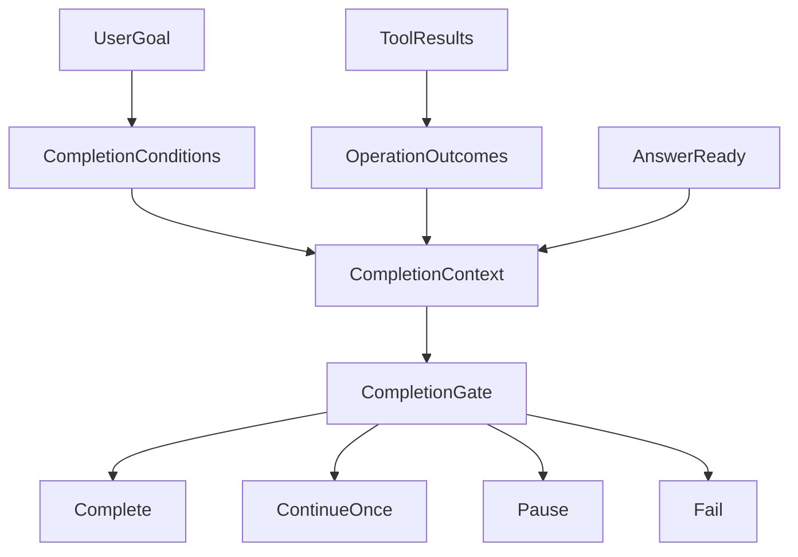

# Harness、单轴监管与统一收尾门控

> 版本：2026-09-09
> 适用范围：iceCoder Harness 主循环、Completion Gate、L0/L1/L3 单轴监管

## 1. 架构

Harness 将事实采集、收尾裁决和执行监管分开：

- 事实采集器记录完成条件、操作状态、风险与证据。
- `CompletionGate` 是唯一收尾裁决器。
- ModeDecisionEngine、ToolGate、BranchBudget 和 GraphExecutor 约束执行过程，不独立裁决任务完成。



核心门控不读取任务类别、文件扩展名、具体工具名、语言或旧验证状态。新增能力只需把事实适配为 `CompletionCondition` 或 `OperationOutcome`。

## 2. 统一事实模型

### 2.1 CompletionCondition

```ts
interface CompletionCondition {
  id: string;
  label: string;
  required: boolean;
  status: 'pending' | 'satisfied' | 'failed' | 'unverifiable';
  source: 'user' | 'graph' | 'runtime';
  sourceRef: string;
  evidenceRefs: string[];
}
```

只有来源可追踪且可客观判定的要求才能成为 required。模糊推断和主观标准不能升级为硬条件。

### 2.2 OperationOutcome

每次工具结果归一化为：

- `status`：完成、失败、运行中或等待审批。
- `effect`：观察、局部变化、外部变化或执行。
- `risk`：风险等级。
- `scope`：受影响对象。
- `receipt`：操作产生的可验证结果。
- `disposition`：执行、执行失败、策略阻止或用户拒绝。

同一 scope 的后续成功可以解除失败；其他 scope 的成功不能掩盖失败。账本保留历史 tool-call 结果，供条件证据引用。

## 3. 用户决定验证强度

- 用户明确要求验证或成功条件：登记为 required，必须取得真实证据。
- 用户明确禁止额外检查：操作成功且状态结清后直接收尾。
- 用户未说明：模型可以自主选择一次低成本相关观察，CompletionGate 不硬拦。
- 用户后续改变要求：按最新指令更新业务条件；真实 pending、审批、失败和高风险缺证据仍必须保留。

额外观察是软行为，不会创建第二套 Verification Gate。

## 4. 裁决优先级

`CompletionGate.evaluate()` 按固定顺序执行：

1. required 条件 pending/failed：最多注入一次汇总提示；无进展则暂停或失败。
2. required 条件不可验证：暂停。
3. 操作 pending 或等待审批：暂停。
4. unresolved failure：最多一次差异化恢复；无进展则失败；用户拒绝则暂停。
5. 高风险操作缺证据：最多请求一次相关观察；无进展则暂停。
6. 答案尚未就绪：最多继续一次。
7. 有成功副作用但没有独立观察：`completed_unverified`。
8. 条件、操作和答案均结清：`completed`。

输出动作只有 `complete | continue | pause | fail`。停止原因统一为 `model_done | completion_paused | completion_failed`；资源耗尽和用户中断仍使用 Harness 原有停止原因。

## 5. 有界收尾

门控通过阻塞快照签名保证有限退出：

- 相同快照最多注入一次。
- 只有 required 条件、pending scope、失败 scope 或证据发生实质改善才算进展。
- 无关工具调用和文本改写不能重置预算。
- 每个失败 scope 最多一次恢复。
- 每个高风险缺证据 scope 最多一次观察请求。
- 多个 required 条件合并为一条提示。
- 达到全局上限后保留真实状态并退出。

因此任何输入都会在有限门控续轮内到达完成、暂停或失败，不会形成验收死循环。

## 6. Harness 接入

### 6.1 工具轮

`harness-tool-round.ts` 只采集事实：

- 归一化工具结果并写入 `OperationOutcomeLedger`。
- 更新兼容条件适配器。
- 注入执行期失败摘要。
- 向执行监管提交信号。

工具轮不独立裁决完成。

### 6.2 无工具轮

`harness-round-no-tools.ts` 完成空响应、截断和 Stop Hook 等前置处理后，只调用一次统一门控：

- `continue`：注入门控生成的领域无关提示。
- `pause/fail`：保存 checkpoint 并返回结构化终态。
- `complete`：以 `model_done` 正常收尾。

### 6.3 任务图结束

`harness-graph-stop.ts` 使用同一个 Completion Context builder 和同一个 Gate。任务图不能绕过 required 条件、pending 操作、失败或证据要求。

### 6.4 Checkpoint

Project Checkpoint V3 是运行时唯一事实源：

- `execution.taskState` 只保存任务、阶段和文件/命令事实，不含旧 verification 镜像。
- 完成状态只来自 `completion.conditions` 与 `completion.operationOutcomes`。
- `checkpointHasPendingWork` 只检查 required blocker 与尚未产出的明确文件交付物。
- capture/restore 传递完整 V3 聚合；`ProjectCheckpointStore.restore(snapshot)` 覆盖活动文件，不与进程内旧状态合并。
- 工具批次执行期间 `setPersistBlocked(true)`，禁止产生可恢复快照；批次结束后才允许落盘。
- active checkpoint 每次原子覆盖整个聚合，不做字段级 merge；generation 拒绝过期写入。

兼容窗口只保留一个旧版本：v1/v2 仅在 legacy adapter 或 session-memory parser 边界读取，读取后立即迁移为 V3/V2 新写模型；生产路径不再写旧字段，未知 JSON-safe extension 原样保留。

当前 `ProjectCheckpointStore` 只维护单个 active snapshot。未来若增加 snapshot store、历史保留或按轻量边界自动采样，应接在 `CheckpointSnapshotProvider` / `CheckpointSnapshotRestorer` 与 lightweight boundary 扩展点之后，不能重新引入并行事实源或改回增量合并写。

## 7. 状态与可观测性

最终状态：

- `completed`：完成且证据充分，或任务无需副作用且答案就绪。
- `completed_unverified`：操作完成，但没有用户要求之外的独立观察。
- `paused`：仍需外部条件、审批或证据。
- `failed`：必要条件或操作失败，恢复预算已用完。
- `interrupted`：资源上限、超时或用户中断。

HarnessResult、final step event 和 telemetry summary 都携带 `completionStatus`；门控正常路径同时携带 `completionReason`。UI 必须区分四种业务终态，不能把 `completed_unverified` 折叠成普通成功。

## 8. 单轴监管

执行监管保持独立：

- ModeDecisionEngine 在 free/forced 间切换。
- ToolGate 在 forced 模式约束工具调用。
- BranchBudget 限制重复失败与无效分支。
- GraphExecutor 约束任务图步骤。
- 连续失败阶梯和 circuit breaker 处理执行期异常。

这些机制可以阻止不安全或无效操作，但不能创建另一套完成判定。

## 9. 关键源码

- `src/harness/completion-condition.ts`
- `src/harness/completion-context.ts`
- `src/harness/completion-gate.ts`
- `src/harness/operation-outcome.ts`
- `src/harness/harness-round-no-tools.ts`
- `src/harness/harness-tool-round.ts`
- `src/harness/harness-graph-stop.ts`
- `src/prompts/sections.ts`
