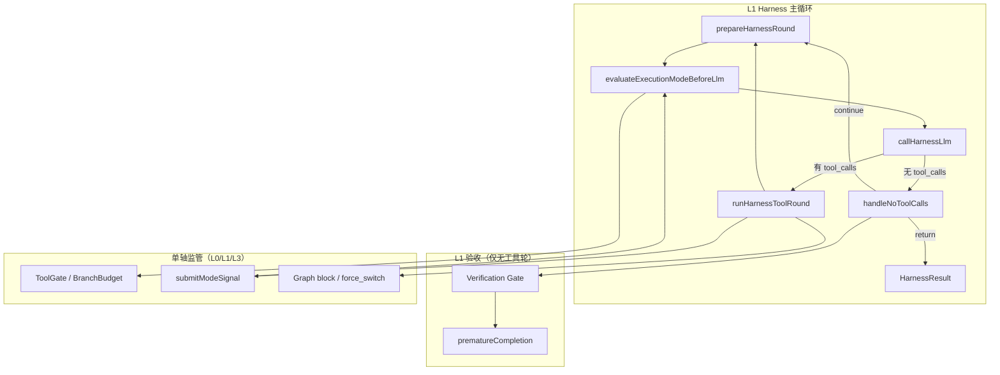
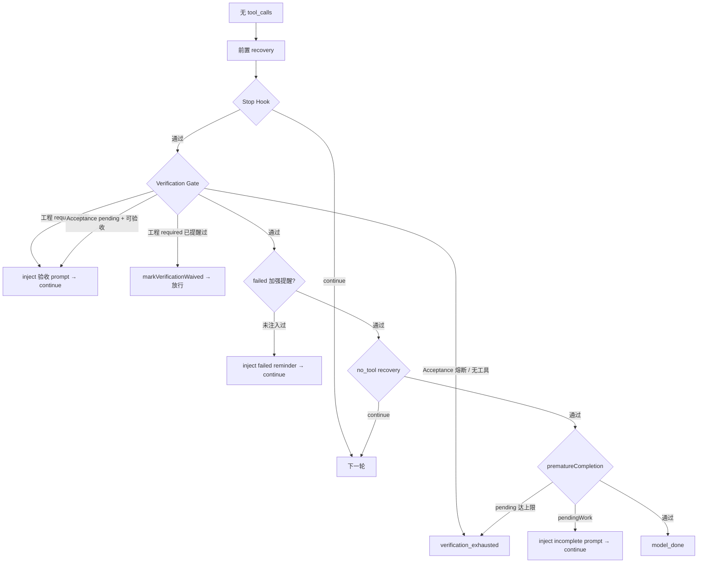

# Harness、单轴监管与 Gate 收尾工作逻辑

> 版本：2026-09-01  
> 适用范围：iceCoder Harness 主循环、Verification Gate / Acceptance Gate、L0/L1/L3 单轴监管  
> **原 L2 Runtime Supervisor**（takeover / PassiveObserver / CorrectionPort / EventTimeline）已于 **2026-08-31 退役**，详见 [`../L2监管层详解.md`](../L2监管层详解.md)。  
> 当前监管架构：[`../双模机制详解.md`](../双模机制详解.md)  
> 相关源码：`src/harness/harness.ts`、`harness-round-no-tools.ts`、`harness-tool-round.ts`、`supervisor/*`、`incomplete-completion.ts`、`document-deliverable.ts`

---

## 1. 架构总览

Harness 运行时分为 **主循环 + 收尾 Gate + 单轴监管**，职责互不替代：

| 层级 | 名称 | 职责 | 典型停止原因 |
|------|------|------|--------------|
| **L1 Core** | Harness 主循环 | 消息预处理 → 模式评估 → LLM → 工具执行 → 无工具收尾 | `model_done`、`max_output_tokens`、`user_abort` |
| **L1 验收** | Verification Gate + Acceptance Gate | **收尾门槛**：工程源码变更提示跑单测；benchmark 多步命令 | `verification_exhausted`（熔断） |
| **L0/L1 监管** | ModeDecisionEngine + ToolGate | 档位策略、free/forced、工具门禁、分支预算 | —（不单独作为 stopReason） |
| **L3** | GraphExecutor 硬约束 | 图合约 block / `force_switch`；无 fallback 时停 | `user_checkpoint` |

**定调（当前实现）：**

- **Gate** 只管收尾是否放行：**工程源码变更**在 `verificationStatus=required` 时 inject 单测提示；纯文档/样式变更不 inject。
- **工程单测 Gate 只硬提醒 1 次**，之后 `markVerificationWaived()` 允许 `model_done`（Acceptance Gate 仍走多轮熔断）。
- **监管** 只管执行过程约束（forced / ToolGate / 图硬拦）；**不扩展**为验收层。
- `verificationStatus` 由单测类 `run_command` 结果更新；lint/build/tsc **不算**单测通过。



---

## 2. Harness 主循环（L1 Core）

入口：`Harness.run()` → `runScoped()` → `while (true)` 迭代。

### 2.1 单轮流程

```
prepareHarnessRound
  ├─ 消息预算 / 压缩 / 记忆注入
  ├─ Runtime State / Workspace Anchor 注入
  ├─ 首轮 TaskGraph init（strict 关键任务；adaptive 不首轮建图）
  └─ 其它 prep 副作用

tryGraphTerminalStop（轮前；工具轮后不再 graph-stop）

evaluateExecutionModeBeforeLlm
  ├─ 消费 pendingModeSignals（通常滞后 1 轮）
  ├─ ModeDecisionEngine → free/forced
  └─ applyExecutionModeConstraints / BranchBudget / CheckpointEngine

callHarnessLlm
  ├─ 调用 LLM（可流式）
  └─ 文本 tool_call 抢救（salvage）

分支：
  ├─ 有 tool_calls → runHarnessToolRound → continue
  └─ 无 tool_calls → handleNoToolCalls
        ├─ continue → 下一轮（可再 tryGraphTerminalStop）
        └─ return   → HarnessResult（结束）
```

### 2.2 工具轮要点（`runHarnessToolRound`）

| 阶段 | 行为 |
|------|------|
| 工具执行前 | Preflight（路径/dist/build diagnostic 等）、ToolGate、ExecutionMode 约束 |
| 工具执行 | 更新 `TaskState`、`RepoContext`；Acceptance Gate 进度；file 写后版本 Map |
| 工具执行后 | BranchBudget、rebuild escalation、verification digest inject（软提示）；向 ModeDecisionEngine 提交信号 |
| 收尾 | 记忆注入；**仅当**工程 pending / Acceptance pending 净减少或 blocking 解除时 `verificationGateContinuationCount = 0` |

工具轮 **不** 调用 Verification Gate；Gate 仅在「无 tool_calls」时触发。

### 2.3 执行期约束（非 Gate，不拦 model_done）

以下机制在**工具执行过程中**生效，与 Gate 独立：

| 机制 | 文件 | 作用 |
|------|------|------|
| Preflight dist 读拦截 | `harness-tool-preflight.ts` | `verificationStatus=required/failed` 时禁读 `dist/` |
| Build Diagnostic Gate | 同上 | build 失败后暂停 build 类 `run_command` |
| BranchBudget | `branch-budget.ts` | forced 下限制重复失败命令/文件编辑 |
| ToolGate | `supervisor/tool-gate.ts` | forced 下物理跳过违规工具调用 |
| verification digest | `harness-tool-round.ts` | 验收命令多次失败后 inject 摘要 |
| **连续工具失败阶梯** | `failure-evidence-recovery.ts` | 2~3 轻提示 / 4~6 证据包 / 7~9 强警告 |
| **write 截断恢复** | `harness-tool-truncation-recovery.ts` | `finishReason=length` 或 output 顶满且 write 缺 `path` 时 skip + 换策略提示 |
| step-review | `step-review.ts` | `verificationStatus=failed` 时不计为「有进展」 |

---

## 3. Gate 收尾逻辑

Gate 在 `handleNoToolCalls` 中运行，**每一轮** LLM 返回无 `tool_calls` 时都会评估（不限最后一轮）。

### 3.1 无工具轮完整顺序

```
1. 失忆恢复（压缩后）
2. max-output-tokens 恢复 / 停止
3. 空响应 / 仅 reasoning 重试
4. Stop Hook（模型自述未完成）
5. ★ Verification Gate（Acceptance + 工程单测提示；含 failed 加强提醒）
6. no_tool execution recovery（该调工具没调）
7. ★ prematureCompletionRecovery（pendingWork 第二道栏）
8. model_done 正常收尾
```



### 3.2 Verification Gate（工程单测）

**判定函数：** `TaskState.isVerificationBlockingFinal(acceptanceIncomplete)`  
→ Acceptance pending **或** `shouldPromptEngineeringUnitTest(filesChanged, verificationStatus)`（工程目标路径且 status=`required`）。

| 条件 | 是否 block |
|------|-----------|
| `acceptanceIncomplete === true` | ✅（多轮，直至完成或熔断） |
| 工程源码变更 && `verificationStatus === 'required'` | ✅（**仅首轮 inject**；下一无工具轮 waive） |
| 工程源码变更 && `verificationStatus === 'passed'` | ❌ |
| `verificationStatus === 'failed'`（单测失败） | ❌ hard block；**另** inject 一次加强提示 |
| 仅 `.md` / 样式等非单测目标 | ❌ |
| 无写文件 | ❌ |

**单测目标路径：** `engineeringTestTargetPaths(filesChanged)` — 工程白名单扩展名（`.ts/.py/.java` 等），**不含** `.css/.scss/.less`；豁免目录见 verification-exempt 配置。

**验收命令识别：** `isUnitTestVerificationCommand`（`npm test` / `vitest` / `pytest` / `mvn test` 等）；**不含** `lint` / `build` / `tsc` / `test:e2e`。

**`verificationStatus` 更新（`TaskState.recordToolResult`）：**

```
write_file / edit_file（工程源码） → verificationStatus = 'required'
run_command 单测类命令：
  前台成功/失败           → passed / failed
  后台 mode:background    → 保持 required（等 action:check 完成）
  check completed exit 0  → passed
  check completed 非 0    → failed
再次 edit 工程源码        → required（并重置 failedUnitTestReminderInjected）
Gate 已提醒且模型仍想停  → markVerificationWaived() → not_required
```

**工具可用性：** `canVerifyDeliverableKind(filesChanged, toolNames, acceptanceIncomplete, verificationStatus)`

| pending 类型 | 需要工具 |
|--------------|----------|
| Acceptance Gate | `run_command` |
| 工程变更待跑单测 | `run_command` |

**Gate 注入：** `buildVerificationPrompt()` — 列出变更工程文件；文案允许「低风险可简述后收尾」（与 waive 行为一致）。

**工程 Gate 计数：** 非 Acceptance 时，`verificationGateContinuationCount >= 1` 即 waive 放行。  
**Acceptance 熔断：** `verificationGateContinuationCount >= MAX`（默认 **5**）→ `verification_exhausted`。

**工具轮 Gate 计数重置：** `maybeResetVerificationGateCounter` — 工程 pending 或 Acceptance pending 净减少、或 blocking 解除时归零。

**图 terminal 停止：** `shouldBlockGraphTerminalStop` 与 Verification Gate 同标尺；`verificationStatus=failed` **不**拦截。**工具轮后不再 graph-stop**。

**prematureCompletion：** 达上限后若仍有 `pendingWork`，走 `verification_exhausted`，不允许 `model_done`。

**遗留 write/confirm 版本 Map：** 仍写入 checkpoint 供兼容；**不再**驱动 Gate 放行。

### 3.3 Acceptance Gate（独立硬验收）

与 Verification Gate **并列**，用于 benchmark 等多步命令链（如 `npm ci → test → build`）。

| 项目 | 说明 |
|------|------|
| 管理器 | `TaskAcceptanceTracker` |
| pending 判定 | `hasPendingAcceptanceWork(acceptance)` |
| 同步 | `syncTaskVerificationFromAcceptance` → 写回 `TaskState.verificationStatus` |
| 拦截点 | Gate 的 `acceptanceIncomplete` + prematureCompletion 的 `hasPendingWork` |
| inject | `acceptance.buildAcceptancePrompt()` |
| 熔断 | 走 Verification Gate 的 `MAX_VERIFICATION_GATE_CONTINUATIONS`（默认 5） |

### 3.4 prematureCompletionRecovery（第二道收尾栏）

**判定：** `hasPendingWork(task, acceptance?)`

```typescript
// 二者任一成立 → pendingWork = true
hasPendingAcceptanceWork(acceptance)
hasUnfulfilledFileDeliverableGoal(goal, filesChanged, intent)  // goal 要求写文件但未写
```

Gate 通过后若仍 `pendingWork`，inject `buildIncompleteContinuationPrompt` → `continue`（有上限 `MAX_PREMATURE_COMPLETION_RECOVERY`）。

**注意：** 单测未跑 / 测失败 **不**构成 `pendingWork`（由 Verification Gate 或 failed 提醒 inject 处理）。

### 3.5 Stop Hook 跳过条件

避免与 Verification Gate 叠层拦截（`harness-round-no-tools.ts`）：

1. casual 意图（question / inspect 等，`shouldApplyCasualHarness`）
2. **本任务已有写文件变更**（`filesChanged.length > 0`）——由 Gate / prematureCompletion 接管收尾
3. `!pendingWork &&` 本轮用户消息之后已有过工具调用

Stop Hook 本身只识别模型回复中的**前向未完成承诺**（如「我还需要继续」「next step」）。

### 3.6 model_done 收尾

- TaskGraph `advanceOrComplete`（若有）
- checkpoint：`pendingWork ? 'paused' : 'completed'`
- `stopReason: 'model_done'`

---

## 4. 单轴监管（L0 / L1 / L3）

> 完整说明见 [`../双模机制详解.md`](../双模机制详解.md)。原 L2 退役说明见 [`../L2监管层详解.md`](../L2监管层详解.md)。

档位来源：`data/config.json` 的 `supervisorMode`（优先）+ `data/supervisor-config.json` 的 `executionMode` 阈值。  
加载入口：`loadHarnessSupervisorRuntime()`。未注入时 Harness 默认 `mode: 'off'`。

### 4.1 核心组件（现存）

| 组件 | 职责 |
|------|------|
| **ModeController / resolveGlobalPolicy** | L0 档位 → `modeDecisionEngineEnabled`、`executionModeFloor` 等 |
| **ModeDecisionEngine** | 消费 ModeSignal，裁决 free ↔ forced |
| **TaskRiskClassifier** | 运行态风险分级，供决策上下文 |
| **applyExecutionModeConstraints** | **唯一**写入 `executionMode` 的入口 |
| **ToolGate** | forced 下 block 违规工具（物理跳过） |
| **GraphExecutor** | 图上下文注入 + L3 block / force_switch |
| **BranchBudgetTracker** | forced 下重复失败预算 |

### 4.2 接入时机

| 时机 | 入口 | 行为 |
|------|------|------|
| **每轮 LLM 前** | `evaluateExecutionModeBeforeLlm` | 消费上一轮信号 → 切换 free/forced → 同步 BranchBudget / CheckpointEngine |
| **工具执行前** | ToolGate / Preflight | block 则跳过执行 |
| **工具轮末** | `submitModeSignal` | 累积 `tool_failure` / `recovery_pending` / 图信号等，**下轮**再 evaluate |
| **图硬偏离** | GraphExecutor | `block`；重复/critical → `force_switch`；无 fallback → `user_checkpoint` |
| **首轮 prep** | TaskDomainGate + L0 | `off`/`adaptive` 不首轮建图；`strict` 关键工程任务首轮 init |
| **新 run** | `modeDecisionEngine.resetSubmittedSignals` + `graphExecutor.resetGraph` | 避免跨 run 泄漏 |

### 4.3 三档体验

| 档位 | 行为 |
|------|------|
| **off** | 不启用 ModeDecisionEngine；不首轮建图 |
| **adaptive**（默认） | 默认 free，结构性信号后进入 forced；不首轮建图 |
| **strict** | forced floor；关键工程任务首轮建图 |

进入 forced 后保留 `modeLockRounds` 与 `forcedMinDwellRounds`，避免模式闪跳。

### 4.4 已删除（勿再按旧文档验收）

以下均已不在 `src/harness/supervisor/` 中：

- `supervisorPhase` / takeover / handoff / cooldown
- PassiveObserver / GoalDriftDetector
- RecoverySupervisor / CorrectionPort / RecoveryBoundary / CorrectionBudget
- Supervisor EventTimeline / `supervisor-events.jsonl`
- shadow evaluate、`ICE_SUPERVISOR_SHADOW`

偏离后的替代路径：提交 `recovery_pending` → L1 forced；图硬拦 / `force_switch`；连续失败阶梯与 circuit breaker；无 fallback → `user_checkpoint`。

---

## 5. 行为速查表

| 场景 | Verification Gate | prematureCompletion | 监管 | 能否 model_done |
|------|-------------------|---------------------|------|-----------------|
| 写 `.md`，goal 要求写文件但未写 | ❌ | ✅ 拦 | 旁观 | ❌ |
| 只改 `.ts` 未跑测（首次无工具轮） | ✅ inject 一次 | ❌ | 可能进 forced | 本轮 ❌ |
| 只改 `.ts` 已提醒过仍未跑测 | waive → 放行 | ❌ | 旁观 | ✅ |
| npm test 失败想停 | ❌ hard；可有一次 failed 提醒 | ❌ | 可能 digest / forced | 提醒后 ✅ |
| Acceptance 只完成部分命令 | ✅ 拦（多轮至熔断） | ✅ 拦 | 旁观 | ❌ |
| 该调工具却只聊天 | no_tool recovery | 视 pending | 旁观 | 视情况 |
| 图无 fallback 硬失败 | — | — | L3 `user_checkpoint` | ❌ |

---

## 6. 停止原因一览

| stopReason | 来源 | 说明 |
|------------|------|------|
| `model_done` | Gate 通过后正常收尾 | 主成功路径 |
| `verification_exhausted` | Acceptance 熔断 / 无验收工具 / pendingWork 耗尽 | 工程单测默认不靠此熔断（1 次后 waive） |
| `user_checkpoint` | L3 图无 fallback / 其它监管停 | 请求用户介入 |
| `stop_hook` | Stop Hook 连续干预超限 | |
| `max_output_tokens` | 输出 token 截断 recovery 耗尽 | |
| `user_abort` | 用户取消 | |

---

## 7. 关键源码索引

| 主题 | 文件 |
|------|------|
| 主循环 | `src/harness/harness.ts` |
| 轮次准备 | `src/harness/harness-round-prep.ts` |
| 工具轮 | `src/harness/harness-tool-round.ts` |
| 无工具轮 / Gate | `src/harness/harness-round-no-tools.ts` |
| pendingWork | `src/harness/incomplete-completion.ts` |
| 工程路径 / 单测提示判定 | `src/harness/document-deliverable.ts` |
| Gate 判定 | `src/harness/task-state.ts` |
| Acceptance Gate | `src/harness/task-acceptance-tracker.ts` |
| 模式决策 | `src/harness/supervisor/mode-decision-engine.ts` |
| 模式写入 | `src/harness/supervisor/execution-mode-constraints.ts` |
| ToolGate | `src/harness/supervisor/tool-gate.ts` |
| 配置加载 | `src/harness/supervisor/supervisor-config.ts` |
| 图硬约束 | `src/harness/task-graph-executor.ts` |
| Stopping rules prompt | `src/prompts/sections.ts` |
| checkpoint 续跑建议 | `src/harness/checkpoint.ts` |
| tool-planner 软 hint | `src/harness/tool-planner.ts` |

---

## 8. 变更记录

| 日期 | 变更 |
|------|------|
| 2026-09-01 | 对齐 2026-08-31 单轴监管：删除旧 L2 章节；补充工程 Gate 1 次后 waive；修正 Stop Hook / 行为表；监管改为 L0/L1/L3 |
| 2026-06-10 | Verification Gate 改为工程单测提示：去掉写后读硬拦；`isUnitTestVerificationCommand`；样式扩展名不 inject；失败后改代码回到 `required` |
| 2026-05-28 | 统一写后读：Gate / pendingWork / stop hook 均基于全部 `filesChanged`；engineering 测试仍非硬条件 |
| 2026-05-28 | 初版：弱化 Verification Gate（仅 file 验收 + Acceptance）；统一 `snapshotHasUnconfirmedFileDeliverables`；P3 stop hook / tool-planner 对齐 |
