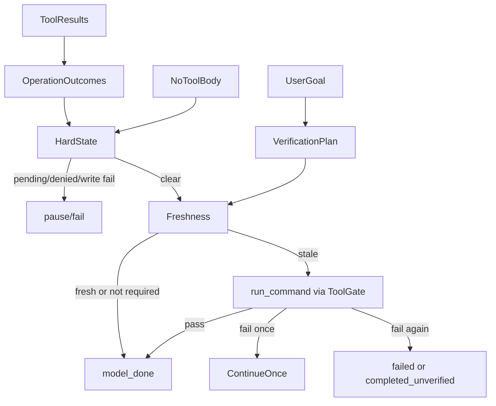

# Harness、单轴监管与停时验收

> 版本：2026-09-16
> 适用范围：iceCoder Harness 主循环、D′ 停时验收、L0/L1/L3 单轴监管
> 收尾策略全文：`收尾策略-模型停手与验收门控.md`

## 1. 架构

Harness 将事实采集、结束提议和执行监管分开：

- 事实采集器记录操作状态、风险与证据。
- 模型无工具且写出正文，即提出结束。
- 运行时只因确定性硬状态或过期验收延迟结束；验收命令走现有 `run_command` ToolGate，不另起子进程。
- ModeDecisionEngine、ToolGate、BranchBudget 和 GraphExecutor 约束执行过程，不独立裁决任务完成。

启发式反引号清单和旧 `CompletionGate` 不再否决 `model_done`。

## 2. 统一事实模型

### 2.1 VerificationPlan

按优先级生成一个计划：严格用户句式 → 安全的 `package.json#scripts.test`。没有可靠来源则不猜命令。

### 2.2 OperationOutcome

每次工具结果归一化为 status / effect / risk / scope / receipt / disposition。同一 scope 的后续成功可以解除失败；其他 scope 的成功不能掩盖失败。

### 2.3 Freshness

用 `workspaceMutationVersion` + plan fingerprint，不用时间戳。验收命令若自己改了工程文件，结果不能标为 fresh。

## 3. 用户决定验证强度

- 用户明确要求验证：计划 source=`user`，失败终态 `failed`。
- 用户未说明但改了工程文件：仅在存在安全默认测试时运行；失败终态 `completed_unverified`。
- 问答 / inspect / 纯阅读：不运行验收命令。
- 真实 pending、审批、写失败和高风险缺证据仍必须保留为硬状态。

不要创建第二套 Verification Gate，也不要把 prompt 里的普通反引号升级成 required。

## 4. 无工具轮裁决顺序

`harness-round-no-tools.ts` 在空响应、截断、嵌入工具、实现任务从未调用工具等前置恢复之后：

1. 硬状态（pending / 审批 / 用户拒绝 / 写失败 / 高风险缺回执）→ `paused` 或 `failed`。
2. 无计划且有工程修改 → `completed_unverified`。
3. 计划已 fresh → `completed`。
4. 通过 ToolGate 执行一次计划。
5. 全绿 → `completed`；失败则注入短回执并只续一轮。
6. 再失败：显式计划 `failed`，默认计划 `completed_unverified`。

停止原因仍以 `model_done` 为主；硬暂停使用 `completion_paused`。资源耗尽和用户中断用原有停止原因。

## 5. 有界收尾

- 同一段工作只许顶一次（对齐 `stop_hook_active`）。
- 前置恢复不消费验收续跑预算。
- 无关 `git diff` / 列目录失败不污染验收状态。
- 达到上限后保留真实终态退出，不把失败写成 `completed`。

## 6. Harness 接入

### 6.1 工具轮

`harness-tool-round.ts` 只采集事实：归一化工具结果、失败摘要、监管信号。工具轮不独立裁决完成。

### 6.2 无工具轮

`harness-round-no-tools.ts` 把无工具正文当作结束提议，再跑硬状态与停时验收。

### 6.3 任务图结束

任务图不再有单独的 graph-stop 门控。图完成后仍走同一条无工具收尾路径，不能绕过硬状态或过期验收。

### 6.4 Checkpoint

Project Checkpoint V3 是运行时唯一事实源：

- `execution.taskState` 只保存任务、阶段和文件/命令事实，不含旧 verification 镜像。
- 完成状态来自 `completion.status` / `reason`、`verificationPlan` 与 `verificationState`。
- capture/restore 传递完整 V3 聚合；工具批次执行期间禁止可恢复快照。

兼容窗口只保留一个旧版本：v1/v2 仅在 legacy adapter 边界读取，读取后立即迁移。

## 7. 状态与可观测性

- `completed`：完成且验收 fresh，或任务无需副作用。
- `completed_unverified`：改过工程文件但没有可靠计划，或默认测试仍失败。
- `paused`：审批、pending、显式计划不可执行。
- `failed`：显式验收失败且续跑已用完，或硬写失败。
- `interrupted`：资源上限、超时或用户中断。

UI 必须区分这些终态，不能把 `completed_unverified` 折叠成普通成功。

## 8. 单轴监管

执行监管保持独立：ModeDecisionEngine、ToolGate、BranchBudget、GraphExecutor、连续失败阶梯和 circuit breaker。它们可以阻止不安全操作，但不能创建另一套完成判定。停时验收必须复用 ToolGate，不能绕过审批。

## 9. 关键源码

- `src/harness/verification-plan.ts`
- `src/harness/verification-state.ts`
- `src/harness/harness-stop-verification.ts`
- `src/harness/harness-verification-tool-adapter.ts`
- `src/harness/completion-state.ts`
- `src/harness/operation-outcome.ts`
- `src/harness/harness-round-no-tools.ts`
- `src/harness/harness-tool-round.ts`
- `src/prompts/sections.ts`
