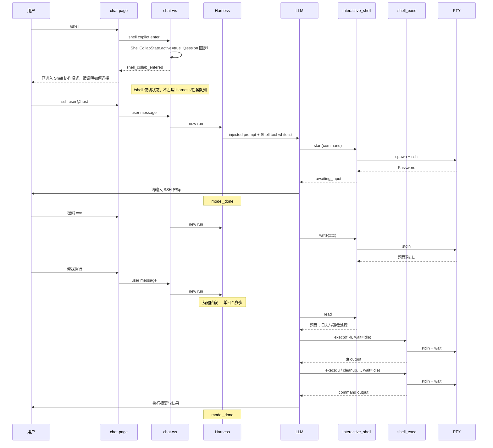

# `/shell` Shell 协作 — 需求文档

> **状态**：待实现  
> **版本**：v1.8  
> **日期**：2026-08-06  
> **范围**：斜杠命令 `/shell` · 持久 PTY 会话 · Human-in-the-loop Harness · Shell 专用工具 · 敏感命令强制确认 · 最小模式标识 · 配套 Skill  
> **模式名称**：**Shell 协作模式**（对外）；内部代码名可沿用 `ShellCopilot` / `shell_collab`  
> **关联模块**：`chat-commands.js` · `chat-page.js` · `chat-session-sidebar.js` · `chat-ws.ts` · 新 `interactive-shell-manager.ts` · Harness permission runtime · `data/skills/`

---

## 1. 目标

让用户在 **不看命令行窗口** 的情况下，通过聊天与 AI 协作完成 **交互式终端任务**（SSH 登录、考试系统、多段密码提示、`yes/no` 确认等）。

用户在本 **会话（session）** 中 **只需发送一次 **`/shell`**（无参数）**，即可将该会话 **永久固定为 Shell 协作模式**；之后所有普通聊天（密码、`帮我执行`、追问等）**无需再带 **`/shell`**。如需普通 Agent，用户应新建会话。

在该模式下，AI **读取终端输出、用人话汇报**；用户在聊天中 **做决策或提供敏感输入**（如密码），AI **代写终端 stdin**，循环直至任务结束或用户退出。

登录完成后，用户可用 **「帮我执行」「做一下」「你来处理」** 等简短授权语气，AI 在 **同一 Harness 回合内** 自动读题、分析、在 PTY 中连续执行命令并汇报结果，普通命令无需逐条确认；命中强制确认规则的敏感命令必须弹框由用户批准。

### 1.1 用户故事

| # | 需求 | 说明 |
|---|------|------|
| R1 | **一次 `/shell` 固定会话** | 在本 session **首次**发送 **`/shell`**（无后缀）→ 该会话 **永久处于 Shell 协作模式**（直至 exit）；后续消息 **普通发送即可**，不必重复 `/shell` |
| R2 | **AI 读终端、用户决策** | 终端有新输出时，AI 摘要汇报；**用户不必看黑窗口** |
| R3 | **遇提示暂停 Harness** | 出现「请输入密码」等交互提示时，AI 告知用户并 **结束当前 Harness 回合**，等待下一条用户消息 |
| R4 | **用户提供交互输入后续跑** | 用户回复密码、账号或 yes-no 后，新一轮 Harness 通过 **`interactive_shell` write** 写入 PTY；shell 命令统一使用 `shell_exec` |
| R5 | **同一会话保持 SSH/考试 shell** | 跨多条用户消息、多次 Harness run，**同一条 PTY 会话**不断开 |
| R6 | **纯聊天协作 + 明确模式标识** | 不新增终端面板或 xterm；聊天输入区底部与左侧 session item 显示 Shell 模式标识，让用户始终知道当前会话类型 |
| R7 | **安全处理敏感输入** | 密码等不得写入 tool checkpoint / telemetry；用户消息仍会进入聊天历史，AI 必须明确提示并优先建议 SSH Key |
| R8 | **授权语气自动解题** | 登录后用户说「帮我执行」等，AI **同一回合内** read → `shell_exec` → read 循环，在 PTY 内自主完成实操题 |
| R9 | **Shell 模式严格工具隔离** | 普通 session 使用现有完整工具集且看不到 Shell 专用工具；Shell 协作 session 一旦固定，模型 **始终只能**看到并执行 Shell 专用白名单 |
| R10 | **可配置敏感命令强制确认** | 设置中的正则规则是强制确认的唯一可配置来源：命中规则的命令写入 PTY 前必须弹框确认，未命中规则的命令跳过普通权限确认并直接执行；灾难性 hard block 与宿主保护不可配置关闭 |

### 1.2 典型场景

**远程考试（SSH + 考试系统）：**

```text
用户: /shell
AI:   当前会话已进入 Shell 协作模式。请告诉我如何连接（如 ssh user@exam.host），或我按你之前说明执行。

用户: ssh student@exam.example.com
AI:   [terminal_write 启动 ssh]
      服务器提示：请输入 SSH 密码。请把密码发给我（仅用于本次连接）。
      （Harness 本轮结束）

用户: 密码是 xxx
AI:   [terminal_write 密码]
      考试系统提示：请输入你的考试账号。
      （Harness 本轮结束）

用户: 账号 2024001，密码 yyy
AI:   [interactive_shell write …]
      已进入考试系统。
      （Harness 本轮结束 — 仅因密码类 awaiting_input 或 AI 主动汇报后结束）

--- 终端此时输出（用户不看黑窗口）---

      题目：日志与磁盘处理

用户: 帮我执行
AI:   （**同一 Harness 回合，不结束**，直至做完或遇 password 提示）
      [interactive_shell read]  ← 读到题面「日志与磁盘处理」
      [shell_exec] ← df -h
      [shell_exec] ← du -sh /var/log/* | sort -hr | head
      [shell_exec] ← 按题意清理/rotate 日志（示例；敏感命令先强制确认）
      已完成：磁盘使用率从 95% 降至 72%；清理 /var/log/app/*.log 共 1.2GB。
      执行的命令：……（摘要列表）
      （Harness 本轮结束 — model_done）
```

**示例要点（R8）：**

- 题面来自 **PTY 输出**，用户 **不必复制** 到聊天；AI 必须先 **`read`**，不得臆测题目。
- 「帮我执行」= 用户授权 AI 在 **已登录的远程 shell** 内自主排查与操作，**不是**走本机 `run_command`。
- **同一用户消息** 触发的一轮 Harness 内，可 **多次** `read` / `write`，无需用户每条命令再说「执行」。
- 仅当再次出现 **`awaiting_input`**（如 `sudo` 要密码）或服务端判定命令必须 **强制确认** 时，才暂停等人。
- 题面过宽（仅「日志与磁盘处理」）时，AI 应先 **探测**（`df`、`du`、`find` 大文件）再操作；Skill 可约定删除类命令前一句汇报计划。

### 1.3 设计决策

| 方案 | 结论 |
|------|------|
| 读外部系统 CMD / Windows Terminal 窗口 | ❌ 不采用。无法获取 OS 外部窗口缓冲 |
| spawn detached `cmd.exe` 后读屏 | ❌ 不采用。无 PTY 句柄 |
| **iceCoder 托管 PTY + AI 后台读写 + 聊天摘要** | ✅ 采用 |
| 内嵌/隐藏 xterm、终端面板 | ❌ 不采用。本功能是 AI 协作模式，不是终端 UI |
| 输入区 + session item 最小模式标识 | ✅ 采用。只表达当前 session 类型，不展示终端内容 |
| Harness 内阻塞 await 密码（类似 confirm Promise） | ❌ 初版不采用。实现复杂，用户 mid-flight 难改主意 |
| **工具返回 `awaiting_input` → Harness 自然结束 → 下条用户消息续跑** | ✅ 采用 |
| 新增独立工具 `interactive_shell` | ✅ 采用（与 `run_command` 一次性命令职责分离） |
| **`interactive_shell` 常驻全局 tool 列表** | ❌ **不采用**。仅 `ShellCollabState.active === true` 的 session 注入 LLM |
| Shell 模式保留 PDF / DOC / 文件 / MCP 等普通工具 | ❌ **不采用**。Shell 模式严格限制为 Shell 专用白名单 |
| Shell 模式只有一个多 action 工具 | ❌ 不采用。保留底层 `interactive_shell`，增加高频 `shell_exec`、`shell_wait`、`shell_send_keys` |
| Shell 命令统一遵循普通权限确认 | ❌ 不采用。仅命中 Shell 强制确认规则时弹框；未命中时直接执行 |
| **每条消息都须带 `/shell` 前缀** | ❌ **不采用**。**一次 `/shell` 固定整 session**；后续普通聊天仍在 Shell 协作模式 |
| `/shell` 带参数（如 `/shell ssh …`） | ❌ **不采用**。v1 仅 **`/shell`**，连接方式由后续 **普通聊天** 或 AI 询问完成 |

### 1.4 非目标（v1）

- 不做 **跨 server 重启** 的 PTY 恢复（与现有 `[stale]` 后台任务语义一致）
- 不做 **全自动填密码**（无用户消息时 AI 不得猜测或从记忆拉密码）
- 不替代现有 **`run_command`** 短命令 / 后台 dev server 双轨（见 `shell-双轨执行-finish.md`）
- 不做 **OCR 读外部终端截图**（用户粘贴/截图走现有聊天能力，非本方案）
- 不做 **任何内嵌终端 UI / xterm / 终端直连键盘体验**；仅提供输入区与 session item 的最小模式标识
- 不做专用 Secret 弹窗；密码若通过聊天发送会进入会话历史，优先建议 SSH Key / ssh-agent
- 不保证 **100% 提示检测**（启发式 + AI 读 raw output 兜底）

---

## 2. 现状与差距

### 2.1 已具备（可复用）

| 能力 | 实现位置 |
|------|----------|
| 斜杠命令面板 `/also` `/next` | `src/public/js/chat-commands.js` · `chat-page.js` |
| Harness 多轮 tool → LLM 读输出 | `src/harness/harness-tool-executor.ts` |
| 用户 confirm 暂停等人（工具执行**前**） | `chat-ws.ts` `onConfirm` · `chat-page.js` Modal |
| 按 sessionId 隔离后台任务 | `src/tools/background-task-manager.ts` |
| 应用退出 kill 全部 shell | `src/tools/session-shell-control.ts` |
| ETL / WS 实时 step 推送 | `chat-ws.ts` · `chat-execution-plan.js` |
| Skill `#` 注入 | `data/skills/` · prompt 加载 |

### 2.2 差距

| 需求 | 现状 | 差距 |
|------|------|------|
| R1 `/shell` 无参进入 | 无 `/shell` | 前端注册 + 服务端路由 |
| R2 AI 读终端 | `run_command` stdin=`ignore` | PTY + 输出缓冲 + `read_terminal` |
| R3 遇提示停 Harness | 无 `awaiting_input` 协议 | 工具返回约定 + prompt 约束 |
| R4 用户输入后续跑 | 无 `terminal_write` | PTY `write()` |
| R5 跨 Harness 持久会话 | 每命令新 spawn | `InteractiveShellManager` 按 session 单例 PTY |
| R6 模式标识 | 已有聊天输入区与 session sidebar | 输入区底部显示 `Shell 协作中`；Shell session item 显示终端图标 / `Shell` 标签 |
| R7 敏感信息 | 聊天全量进 session JSON | tool 参数、checkpoint、telemetry、日志必须脱敏；聊天发送密码须提示风险 |
| R9 Shell 模式严格工具隔离 | 全局 toolDefs 无按 session 白名单；执行器持有完整 Registry | 按 session 创建专用 ToolSystem；LLM definitions 与执行 Registry 均严格限制为 Shell 专用工具集 |
| R10 敏感命令强制确认 | 现有 `shellBlacklist` 语义为直接阻止，不能表达“命中确认、未命中直行” | 保留配置字段兼容性，将其作为 `shellMandatoryConfirm` 正则来源；hard block 独立且优先 |
| R1 会话级固定 | 无 Shell 协作 session 标记 | 以 session sidecar 持久化 `shellCollabActive`；每轮 Harness 从服务端状态恢复 |

---

## 3. 核心概念

### 3.1 Shell 协作模式 — 会话级固定（Session-sticky）

**`/shell` 不是「每条消息的修饰符」，而是「把当前 session 切成 Shell 协作类型」。**

由 **`/shell`** 一次性触发的 **会话级状态**，存于服务端 `Map<sessionId, ShellCollabState>`，并 **落盘** 到该 session 元数据（与 checkpoint / 队列同级，刷新、重连后恢复）：

```typescript
interface ShellCollabState {
  active: boolean;           // true = 本 session 已固定为 Shell 协作模式
  taskId: string | null;     // 当前 PTY 任务 ID（可无，等 AI start）
  enteredAt: number;         // 首次 /shell 时间
}
```

输出 cursor 属于 `InteractiveShellManager` 中的 PTY task，而不是模式状态。`read` 调用方通过 `since` 维护消费位置。

**生命周期：**

| 事件 | `active` | 后续普通消息 | `interactive_shell` |
|------|----------|--------------|---------------------|
| 新建 session，未发 `/shell` | `false` | 普通 Agent 模式 | **不传给模型** |
| 用户发送 **`/shell`**（一次） | `true` | **仍是 Shell 协作**，无需再带 `/shell` | **每条 Harness 均注入** |
| 用户发 `ssh …` / `帮我执行` / 密码等 | `true` | 普通文本即可 | 注入 |
| 删除 / 清空 session | — | — | kill PTY + 清标记 |
| 切换到 **其他 session** | 各 session 独立 | 见该 session 的 `active` | 按目标 session |

**进入（仅首次或 exit 后再进）：**

- 用户发送 **`/shell`** → `active: true` 并持久化  
- 若该 session **已是** `active: true` 再发 `/shell`：**幂等**，提示「已在 Shell 协作模式」，不重置 PTY  
- 若已有 PTY 则复用；否则等 AI 调 `interactive_shell` start  

**固定语义：**

- `active` 只允许 `false → true`；除删除会话外不可回退  
- 旧命令 `/shell exit` 只返回“模式已固定，请新建会话”，不改变状态、不 kill PTY  
- AI `action: "stop"` 只 kill 当前 PTY 并将 `taskId` 置空，session 仍处于 Shell 协作模式，可继续 `start` 新 PTY  
- **不会**因单条 Harness `model_done`、Stop Agent、刷新页面而自动 `active: false`  

**与 `/also` 关系：** Shell 协作 session 内 `/also` 仍可用，作为对 AI 的补充约束。

**与多会话：** 侧边栏 session A 发了 `/shell` 只固定 **session A**；切到 session B 若无 `/shell` 则为普通模式。

### 3.2 持久 PTY 会话

与 `BackgroundTaskManager` **并列**，新建 **`InteractiveShellManager`**：

| 字段 | 说明 |
|------|------|
| `taskId` | 如 `ish_abc123` |
| `pty` | `node-pty` 实例 |
| `outputBuffer` | 环形缓冲 + 可选落盘 `data/sessions/<sid>/ish/<taskId>.log` |
| `totalOutputLines` / `cursor` | 增量 read |
| `awaitingInput` | 是否处于等人输入状态 |
| `lastPromptHint` | 如 `password` / `yes_no` / `text` |
| `lifespan` | 默认 **`copilot`**：Stop Agent **不杀**；删 session / shutdown **杀** |

**每 session 同时最多 1 个活跃协管 PTY**（v1）；新开 `start` 须先 `stop` 旧的或提示用户。

### 3.3 `awaiting_input` 与 Harness 结束

当 PTY 输出匹配提示启发式（或 AI 从 raw output 判断）时，工具返回：

```json
{
  "status": "awaiting_input",
  "taskId": "ish_abc123",
  "promptText": "请输入密码",
  "promptHint": "password",
  "recentOutput": "…最后 N 行…",
  "cursor": 842
}
```

**Harness 行为：**

1. 工具 `success: true`（非 error），结果进入 LLM 上下文  
2. LLM 根据系统 prompt + Skill：**向用户汇报提示，不再调用 write**  
3. LLM 输出自然语言 → **`model_done`** → **本轮 Harness 结束**  
4. 用户下一条消息 → 新 Harness run → LLM 调 `terminal_write` 或 `read_terminal`

这与 **confirm**（工具执行前阻塞）不同：`awaiting_input` 是 **工具已返回、回合结束、等人聊天**。命中 §8.1 `shellMandatoryConfirm` 时仍复用执行前阻塞 confirm：用户批准后同一 Harness 回合继续，拒绝后工具返回 denied。

### 3.4 Human-in-the-loop 角色分工

| 角色 | 职责 |
|------|------|
| **用户** | 连接目标、密码、授权语气（「帮我执行」）、关键分叉决策；**不看终端也可** |
| **AI** | 读输出、摘要、在授权范围内 `write` 执行；遇 `awaiting_input` 必须停 |
| **PTY** | 真实 bash/cmd + 子程序（ssh、考试 CLI） |

### 3.5 两阶段 Harness 行为（凭证 vs 解题）

Shell 协作在同一 PTY 上会交替出现两种 Harness 节奏，**不可混为一谈**：

| 阶段 | 典型终端表现 | 用户说什么 | Harness 行为 |
|------|--------------|------------|--------------|
| **凭证阶段** | `Password:`、`请输入密码`、考试账号 | 明文密码、账号 | 工具返回 **`awaiting_input`** → AI 汇报 → **结束本回合** → 下条用户消息再 `write` |
| **解题阶段** | 题目正文、命令输出、错误信息 | 「帮我执行」「做一下」「按题目处理」 | AI 先 **`read`** → 同一回合内 **循环 `write` + `read`** → 完成后自然语言汇报 → **结束本回合** |

**解题阶段 — 单回合多步工具链（示例：日志与磁盘）：**

```text
用户消息: 「帮我执行」

Harness iteration（同一 run，可多轮 LLM ↔ tool）:
  LLM → interactive_shell read(since=cursor)
  LLM → shell_exec("df -h", wait_until="idle")
  LLM → shell_exec("du -sh /var/log/* 2>/dev/null | sort -hr | head -20", wait_until="idle")
  LLM → shell_exec("# 按题意处理，如 truncate / rotate / rm 指定日志", wait_until="idle")
        ↳ 若命中敏感规则，服务端 mandatory confirm 后才写 PTY
  LLM → 向用户汇报结论（不再调工具）
  → model_done
```

**须停止解题、回到凭证阶段的情况：**

- 输出再次匹配 **`awaiting_input`**（如 `[sudo] password`）
- 命中 `shellMandatoryConfirm` 的敏感命令 — 服务端在写入 PTY 前强制弹框；批准后继续，拒绝则不得执行
- Harness **`maxRounds` / token 预算** 触顶 — 汇报进度，下条消息「继续」

**与 `run_command` 的边界：** 解题阶段所有命令 **必须** 通过 `shell_exec` 写入 **当前 PTY**（已在 SSH/考试 shell 内）；**禁止**用 `run_command` 在本机另开 shell 假装完成远程题。`interactive_shell write` 只用于 manager 已确认的 password / passphrase / yes-no / text 输入态。

---

## 4. `/shell` 命令设计

### 4.1 语法（v1 严格）

| 输入 | 行为 |
|------|------|
| **`/shell`** | **唯一入口**。将 **当前 session 固定** 为 Shell 协作模式（无参数；**只需一次**） |
| `/shell exit` | 旧命令，仅拒绝并提示新建会话；不改变当前 session |

**明确不做：**

- `/shell ssh user@host` — 连接信息走 **后续普通用户消息**
- `/shell read` / `/shell write` — 读写由 **AI 调工具**完成，不对用户暴露

### 4.2 前端（`chat-commands.js`）

在 `SLASH_LOCAL_COMMANDS` 增加：

```javascript
{ name: 'shell', description: '将当前会话固定为 Shell 协作模式（只需发送一次）', prefix: '/' }
```

### 4.3 前端发送语义（`chat-page.js`）

识别 **`/shell`** 精确匹配；旧 `/shell exit` 仅用于返回固定拒绝提示：

**`/shell` 处理：**

1. **不**走普通任务队列隐式 `/next` 的「长任务描述」路径（或走专用短路由）  
2. 向 WS 发送 **结构化 shell 模式消息**，或在 body 前缀约定：

```text
/shell

[Shell Copilot Mode]
Enter interactive terminal copilot mode. Do not run unrelated tasks until user exits.
If no PTY session exists, ask the user how to connect (e.g. ssh command) or wait for instructions.
Always summarize terminal output for the user; never assume passwords.
When status is awaiting_input, report the prompt and stop calling tools this turn.
```

3. 插入一条普通可见 agent 消息：`当前会话已进入 Shell 协作模式（只需 /shell 一次）。后续直接说话即可，无需再带 /shell。`  
4. 聊天输入区底部显示常驻标识：`>_ Shell 协作中`；tooltip 提示需要普通 Agent 时新建会话  
5. 左侧当前 session item 显示终端图标与 `Shell` 标签；切换 session、F5 后从服务端状态恢复  
6. 不新增终端面板、xterm 或终端输出 UI  

**已处于 Shell 协作 session 的普通消息：**

- 用户输入 **不含** `/shell` 前缀（如 `ssh user@host`、`密码 xxx`、`帮我执行`）  
- 服务端按 **普通 user message** 入队、跑 Harness  
- 因 `ShellCollabState.active === true`，**自动** 注入 `interactive_shell` + Shell 协作 prompt  
- **禁止**要求用户每条消息重复 `/shell`

**与 `/also` 区别：** `/shell` **固定 session 类型**（一次）；`/also` 仅注入单条备注。

### 4.4 服务端（`chat-ws.ts`）

路由优先级（建议插入 `/also` 之后、普通消息之前）：

```text
1. /also
2. /shell          ← 新增
3. /next / 普通发送
```

处理 `/shell`：

- 设置 `ShellCollabState.active = true`（该 sessionId）并写入 session sidecar（建议 `{sessionId}.shell-collab.json`）  
- `/shell` 只切换状态并返回固定提示，**不启动 Harness、不占任务队列**；后续普通消息运行 Harness 时再注入 systemContext  
- **不**自动 spawn PTY；由 Harness 内 AI 调 `interactive_shell` `action:"start"`  
- 广播 WS：`{ type: 'shell_collab_entered', sessionId, sticky: true }`  
- 若已有活跃 `ish_*` task：`{ type: 'shell_collab_resumed', taskId, status }`

处理旧 **`/shell exit`**：返回“Shell 协作模式已固定到当前会话；如需普通 Agent，请新建会话”，不修改 `active`，不 kill PTY。

**普通 user message（本 session 已 `active`）：**

- **不**解析 `/shell`；直接 harness.run  
- `resolveSessionHarnessToolContext(sessionId)` 见 §6.4 → Shell ToolSystem 严格仅含 `SHELL_COLLAB_TOOL_NAMES`

---

## 5. Shell 专用工具设计

**新工具名**：`interactive_shell`（**不**扩展 `run_command` schema，避免 LLM 混淆一次性命令与持久会话）。

### 5.1 Schema 概要

```typescript
{
  name: 'interactive_shell',
  description: 'Persistent PTY terminal for interactive sessions (SSH, exams, password prompts). Only use in Shell Copilot mode after user sent /shell. Actions: start, read, write, check, stop.',
  parameters: {
    action: { enum: ['start', 'read', 'write', 'check', 'stop'] },
    command: { type: 'string', description: 'For start: initial command e.g. ssh user@host' },
    input: { type: 'string', description: 'For write: password/passphrase/yes-no/text response only. Commands must use shell_exec.' },
    task_id: { type: 'string', description: 'Omit on start; required for read/write/check/stop' },
    since: { type: 'number', description: 'For read/check: output cursor' },
    label: { type: 'string', description: 'Optional display label' },
  }
}
```

### 5.2 各 action 行为

| action | 行为 | 返回 |
|--------|------|------|
| **start** | `node-pty` spawn shell，可选 `command` 作为首条输入；sandbox 校验 | `{ status:'started', taskId, shell, cwd }` |
| **read** | 自 `since` 起增量输出 + 检测 `awaiting_input` | `{ status:'running'\|'awaiting_input'\|'completed', output, cursor, … }` |
| **write** | 仅 `awaitingInput === true` 时 `pty.write(input)`；敏感 input 日志脱敏；命令态调用拒绝并提示用 `shell_exec` | `{ status:'running'\|'awaiting_input', … }` |
| **check** | 同 read，别名（对齐 run_command 习惯） | 同上 |
| **stop** | kill 当前 PTY、清 `taskId`，但不退出 session 的 Shell 协作模式 | `{ status:'stopped' }` |

### 5.3 提示检测（启发式，可配置）

```typescript
const PROMPT_PATTERNS: Array<{ re: RegExp; hint: string }> = [
  { re: /password\s*:/i, hint: 'password' },
  { re: /请输入密码/, hint: 'password' },
  { re: /Passphrase\s+for\s+key/i, hint: 'passphrase' },
  { re: /\[sudo\]\s+password/i, hint: 'password' },
  { re: /\(yes\/no\)|\[Y\/n\]/i, hint: 'yes_no' },
  { re: /请输入/, hint: 'text' },
  { re: /input\s*:/i, hint: 'text' },
];
```

匹配 **输出缓冲尾部窗口**（如最后 2KB）→ 置 `awaitingInput: true`。  
**假阳性**：AI 读 `recentOutput` 自行判断；用户可在聊天纠正。

### 5.4 与 sandbox / 强制确认规则

- `start.command` 先走不可配置的 hard block / 宿主保护，再与 `shell_exec.command` 统一走 §8.1 `shellMandatoryConfirm`
- 设置中的 `shellBlacklist` 字段为兼容既有配置暂不改名，产品语义改为“Shell 强制确认规则”
- 命中配置正则 → mandatory confirm；未命中 → 跳过普通 permission，直接写入 PTY
- 明确灾难性命令（如 `rm -rf /`、格式化系统盘）由 hard block 直接拒绝，不受配置清空影响
- `interactive_shell write` 只允许 manager 已确认的 password / passphrase / yes-no / text 输入态；正常命令态或状态未知时拒绝，避免把命令拆成多次 write 绕过确认
- password / passphrase 等非命令输入不做命令分类，但记录 audit 时必须脱敏  
- broad-kill 等模式若命中设置正则则 mandatory confirm；若属于宿主进程保护则 hard block，均由服务端执行，不能只依赖 prompt

### 5.5 高频 Shell 专用工具

`interactive_shell` 保留为底层生命周期、读取与交互提示输入入口；另外提供三个高频专用工具，统一命令执行入口，并正确处理长命令和控制键。

#### 5.5.1 `shell_exec` — 当前 PTY 内执行命令并等待

**用途：** 登录完成后的最高频操作。向当前 PTY 写入一条命令，并等待输出达到 `idle`、重新出现 prompt、进程退出或超时后一次性返回。

```typescript
{
  name: 'shell_exec',
  description: 'Execute one command inside the current persistent PTY. Never spawns a new local shell.',
  parameters: {
    task_id: { type: 'string' },
    command: { type: 'string' },
    wait_until: { enum: ['idle', 'prompt', 'exit'], default: 'idle' },
    timeout_ms: { type: 'number', minimum: 1000, maximum: 120000 }
  }
}
```

返回：`{ status, output, cursor, exitCode?, promptHint? }`。

约束：

- 复用当前 `taskId`，**不得**另行 spawn shell
- `awaitingInput === true` 时拒绝把 `command` 当作密码/回答写入；提示模型改用 `interactive_shell write`
- 等价于受控的 `write(command + newline) → wait → read`，不是本机 `run_command`
- 超时只结束本次等待，不 kill PTY；模型可继续 `shell_wait` 或 `interactive_shell read`

#### 5.5.2 `shell_wait` — 等待异步输出或提示

**用途：** 长命令、安装器、服务启动、网络连接等暂时没有新输出的场景，避免模型高频空轮询。

```typescript
{
  name: 'shell_wait',
  parameters: {
    task_id: { type: 'string' },
    since: { type: 'number' },
    until: { enum: ['output', 'idle', 'prompt', 'exit'] },
    pattern: { type: 'string', description: 'Optional plain-text matcher; not raw regex' },
    timeout_ms: { type: 'number', minimum: 1000, maximum: 120000 }
  }
}
```

返回：`{ status:'running'|'awaiting_input'|'completed'|'timeout', output, cursor, matched? }`。

约束：

- `pattern` 按普通文本匹配，避免把模型生成的正则直接用于高成本扫描
- timeout 是正常状态，不作为 tool error；不得因 timeout 自动 kill PTY
- 检测到 password / yes-no 等提示时立即返回 `awaiting_input`

#### 5.5.3 `shell_send_keys` — 发送固定控制键

**用途：** 中断命令、发送 EOF、补全、确认，以及操作简单交互式 CLI。

```typescript
{
  name: 'shell_send_keys',
  parameters: {
    task_id: { type: 'string' },
    keys: {
      type: 'array',
      items: { enum: ['CTRL_C', 'CTRL_D', 'CTRL_Z', 'ENTER', 'TAB', 'ESC', 'UP', 'DOWN', 'LEFT', 'RIGHT'] }
    }
  }
}
```

返回：`{ status, sent, cursor }`。

约束：

- handler 将枚举映射到固定字节序列，不接受 raw bytes / 任意 ANSI escape
- `CTRL_C` 只中断 PTY 当前前台程序，不退出 Shell 协作模式
- 发送后模型应调用 `shell_wait` 或 `interactive_shell read` 检查结果

#### 5.5.4 暂不提供

- `shell_upload` / `shell_download`：涉及第二条 SCP/SFTP 连接、凭证与路径安全，非核心闭环
- `shell_resize`：无 xterm UI，不需要终端尺寸联动
- `shell_history`：命令与输出已由 PTY buffer + cursor 覆盖，避免重复状态
- `shell_parse_*`：PDF、DOC、XLSX 等不属于 Shell 工具域

### 5.6 Shell 模式严格工具白名单（硬约束 R9）

**原则：Shell 协作是独立的 Agent 工具域，不是在普通 Agent 工具集上追加一个 PTY 工具。**

| session 状态 | 传给 LLM 的 tools | 执行器 Registry |
|--------------|-------------------|-----------------|
| 未进入 `/shell` | 现有 builtin + MCP + `request_analysis` | 现有完整 Registry；**不含任何 Shell 专用工具** |
| `ShellCollabState.active === true` | **仅 Shell 专用白名单** | Shell 专用 Registry；注册 8 个白名单工具（4 PTY + 4 文件 CRUD） |
| 其他 session | 按各自状态独立计算 | 不共享 Shell ToolSystem |

#### 5.6.1 Shell 模式允许工具

| 工具 | 用途 |
|------|------|
| `interactive_shell` | 底层生命周期与低级读写：start / read / write / check / stop |
| `shell_exec` | 在当前 PTY 执行一条命令并等待结果；登录后的高频主路径 |
| `shell_wait` | 等待异步输出、prompt、idle 或 exit，避免空轮询 |
| `shell_send_keys` | 发送 Ctrl-C、Ctrl-D、Tab、方向键等固定控制键 |
| `read_file` | 读取工作区本地文件（查） |
| `write_file` | 创建或覆盖小文件（增） |
| `edit_file` | 查找替换式修改（改） |
| `fs_operation` | 文件系统操作；删除用 `operation: delete`（删）；另含 list/create_dir/move/copy |

`run_command` **不在 Shell 模式提供**。本机命令与 SSH/考试 PTY 命令容易混淆；进入 Shell 模式后，远程/考试命令必须通过 `shell_exec` 写入当前 PTY，password / yes-no / text prompt 等交互回答使用 `interactive_shell write`。本地工作区文件增删改查使用上表四个文件工具。若用户需要 glob/grep/MCP/解析文档等完整 Agent 能力，应新建会话。

唯一白名单常量：

```typescript
const SHELL_ONLY_TOOL_NAMES = [
  'interactive_shell',
  'shell_exec',
  'shell_wait',
  'shell_send_keys',
] as const;

const SHELL_FILE_TOOL_NAMES = [
  'read_file',
  'write_file',
  'edit_file',
  'fs_operation',
] as const;

const SHELL_COLLAB_TOOL_NAMES = [
  ...SHELL_ONLY_TOOL_NAMES,
  ...SHELL_FILE_TOOL_NAMES,
] as const;
```

#### 5.6.2 Shell 模式明确排除

- **文件与搜索（超出 CRUD 白名单）**：`append_file`、`file_info`、`glob`、`grep`、`diff_files`、`batch_edit_file`、`patch_file`、`undo_edit`
- **一次性执行与环境**：`run_command`、`env_info`、`git`
- **文档与媒体**：`parse_document`、`parse_pptx_deep`、`parse_xmind_deep`、`parse_doc_legacy`、`parse_xlsx_deep`、`image_read`、`notebook_read`
- **网络与文件浏览**：`fetch_url`、`web_search`、`list_drives`、`browse_directory`、`open_file`
- **扩展能力**：全部 `mcp_*`、`request_analysis` / SubAgent

#### 5.6.3 三层隔离

1. **LLM definitions 白名单（主路径）**
   - 每轮 Harness 按 `runSessionId` 读取 `ShellCollabState.active`
   - 普通模式沿用完整 `toolDefs`
   - Shell 模式的最终 `toolDefs.map(t => t.name).sort()` 必须严格等于 `SHELL_COLLAB_TOOL_NAMES` 的排序结果
   - 不允许“完整 tools + prompt 提醒不要调用”的软隔离

2. **专用 Registry / Executor（执行隔离）**
   - Shell 专用 PTY 工具不注册进 `initializeToolSystem()` 或全局 `ToolRegistry`
   - Shell 模式创建专用 `ToolRegistry + ToolExecutor`，Registry 中注册绑定当前 session 的 8 个白名单工具（PTY handler + 文件 CRUD 实例）
   - 不先创建完整 ToolSystem 再只过滤 definitions；否则隐藏工具的 handler 仍可被旧 checkpoint、伪造 tool call 或 salvage 路径触达
   - PTY manager 可为进程级单例，但 handler 必须绑定并校验当前 `sessionId`

3. **通用 Executor allowlist（防御层）**
   - `harness-tool-executor.ts` 在执行前校验 tool call 名是否存在于本轮 `currentTools`
   - 不在本轮 definitions 中的调用统一返回 policy error，handler 不得运行
   - 此 gate 同时拦截 `request_analysis` 特例、旧 checkpoint 与文本 tool-call salvage

#### 5.6.4 旁路隔离

- **MCP**：Shell 模式不等待 MCP 初始化、不注册 MCP handler、不构建 `mcpRuntimeContext`
- **`request_analysis`**：Harness 构造器在 Shell 模式禁止 `ensureRequestAnalysisTool()` 自动注入
- **文件浏览直通**：`chat-ws.ts` 的 direct file-browser shortcut 在 Shell active 时必须跳过，所有普通消息进入 Shell Harness
- **Prompt / Skill**：注入 Shell Copilot prompt；不得出现 PDF、DOC、MCP、`run_command`、glob/grep 等被排除工具的说明（文件 CRUD 四工具除外）
- **Memory**：不得从长期 memory 拉取密码或凭证；建议 Shell 模式不注入长期 memory，也不写入 memory
- **HTTP 工具 API**：Shell 专用工具不在全局 Registry，因此 `/api/tools` 与 `/api/tools/execute` 不得列出或执行它们
- **CLI / eval**：未显式加载 active Shell session 时默认普通模式，且无任何 Shell 专用工具

#### 5.6.5 生命周期与恢复

- `/shell`：下一条普通消息开始使用 Shell 专用 ToolSystem
- 删除 session：销毁该 session 的 Shell ToolSystem；新会话默认使用普通完整 ToolSystem
- `model_done`、Stop Agent、F5、切换 session：不改变 `active`；恢复后仍严格只有 Shell 专用白名单
- `action:stop`：只结束当前 PTY，不解除工具白名单

**验收（R9 + R1）：**

- 普通 session：tools 为现有完整集合，且 **无任何 Shell 专用工具**
- Shell active session：tools **严格等于** `SHELL_COLLAB_TOOL_NAMES`
- Shell 模式伪造调用 `run_command`、`glob`、`parse_document`、任意 `mcp_*`、`request_analysis`：执行层拒绝，handler 未运行
- Shell 模式合法调用 `read_file` / `write_file` / `edit_file` / `fs_operation`：经 Shell 专用 Registry 执行；`fs_operation (delete|move)` 走 `onConfirm`，且**不受** `skipPermissionChecks` 影响
- 两个 session 分别为普通 / Shell 模式：工具集互不污染
- 旧 `/shell exit` 不改变工具集；Shell session 始终保持专用白名单
- F5 / 切走再切回：`active` 仍为 true，下一轮仍只有 Shell 专用白名单
- 重复发 `/shell`：幂等，不重置 PTY

---

## 6. Harness 与 Prompt

### 6.1 动态 system 注入（`/shell` 后）

追加 prompt section（或加载 Skill `#shellCopilot/skill.md`）：

```markdown
# Shell Copilot Mode (active)

You are operating a persistent interactive terminal on behalf of the user.

Rules:
1. After each interactive_shell result, summarize terminal output in plain language for the user.
2. If status is `awaiting_input`, explain what the terminal is asking for and STOP calling tools this turn.
3. Never invent passwords. Wait for the user's next message.
4. When the user says 「帮我执行」「做一下」「你来处理」or similar authorization AFTER login:
   - First read the terminal to get the actual question/output — never guess.
   - In the SAME harness turn, loop shell_exec until the task is done or you hit awaiting_input.
   - Do NOT ask 「是否执行」for ordinary commands.
   - Sensitive commands are intercepted by the mandatory confirmation layer. Never split, encode, alias, or rewrite a command to bypass confirmation.
5. For vague exam titles (e.g. 「日志与磁盘处理」): probe first (df, du, find large logs), then act.
6. Prefer shell_exec for commands; it already waits and returns new output.
7. Your tools: interactive_shell, shell_exec, shell_wait, shell_send_keys, plus read_file, write_file, edit_file, fs_operation for local file CRUD. Never use run_command, MCP, parse_document, or other normal Agent tools in this mode.
8. After login, use shell_exec for every shell command. Use interactive_shell write only when the tool reports awaiting_input for passwords, answers, or other text prompts.
9. Use shell_wait for long-running/asynchronous output. Use shell_send_keys for Ctrl-C, EOF, completion, and simple TUI navigation.
10. For local files: read_file before edit_file; write_file for new/small files; fs_operation delete for removing files. Remote exam tasks still go through the PTY.
11. Shell mode is fixed for this session. To use the full normal Agent, tell the user to create a new session.
```

### 6.2 Skill（推荐一并交付）

路径：`data/skills/shellCopilot/skill.md`

- `/shell` 进入后 AI 自动遵循（通过 system 注入引用，**不强制**用户 `#` 选取）  
- 含 SSH/考试场景示例、汇报模板、错误处理

### 6.3 与普通 Agent 工具域的边界

| session 模式 | 可见工具 | 行为 |
|--------------|----------|------|
| 普通 Agent | 现有 builtin + MCP + `request_analysis` | 编码、文件、解析、网络、本机一次性命令；无任何 Shell 专用工具 |
| Shell 协作 | **仅 `SHELL_COLLAB_TOOL_NAMES`** | 持久 PTY 执行/等待/控制键 + 本地文件 CRUD；无 run_command/MCP/搜索/解析等 |
| 未 `/shell` 却要远程交互 | 无持久 PTY 工具 | 提示在本 session 发一次 `/shell` |
| Shell 模式需要完整 Agent | 不在本模式混用 | 提示新建会话（glob/grep/MCP/解析等） |

### 6.4 Harness 侧 tools 组装（实现锚点）

不要只对 `baseTools` 做数组过滤；Shell 模式必须使用独立 Registry 与 Executor。建议由共享的 session tool policy 在 Web/CLI Harness 入口选择 ToolSystem（概念代码）：

```typescript
async function resolveSessionHarnessToolContext(sessionId: string) {
  const collab = getShellCollabState(sessionId);

  if (!collab?.active) {
    return resolveWorkspaceToolContext(...); // 现有完整 ToolSystem + MCP
  }

  const { workspaceRoot } = await resolveEffectiveWorkspaceRoot(sessionDir, sessionId);
  const registry = new ToolRegistry();
  for (const tool of createShellCollabTools({ sessionId, cwd: workspaceRoot })) {
    registry.register(tool);
  }

  return {
    effectiveWorkspaceRoot: workspaceRoot,
    toolRegistry: registry,
    toolExecutor: new ToolExecutor(registry, ..., defaultValidator),
    toolDefs: registry.getDefinitions(), // 严格等于 SHELL_COLLAB_TOOL_NAMES
    enableRequestAnalysis: false,
    mcpRuntimeContext: {},
  };
}
```

- 每轮 Harness run 按 session `active` 重新选择 ToolSystem
- Shell 分支不调用 `registerMcpToolsOnRegistry()`，不复用默认 `toolExecutor`
- `HarnessConfig` 增加 `enableRequestAnalysis: false`，避免构造器追加虚拟工具
- `harness-tool-executor.ts` 用本轮 `currentTools` 做执行前 allowlist 校验
- `chat-ws.ts` 在 Shell active 时跳过 direct file-browser shortcut
- 日志 / telemetry 记录 `shellCollabActive` 与最终 `toolNames`，便于审计工具泄漏

---

## 7. 聊天路由与反馈

### 7.1 WS 事件（最小集合）

| 事件 | 方向 | 说明 |
|------|------|------|
| `shell_collab_entered` | S→C | 本 session 已固定为 Shell 协作（`sticky: true`） |
`shell_collab_entered` 只用于让现有聊天页插入普通 agent 提示消息；不承载终端输出推流。PTY 输出仅由 `interactive_shell read/check` 返回给 Harness，再由 AI 用自然语言汇报。

初始 connected / session list / session switched 载荷须包含对应 session 的 `shellCollabActive`，用于 F5 与多 session 标识恢复。敏感命令弹框复用现有 `tool_confirm` / `confirm_response` 协议，并增加 `mandatory: true`、风险类别、脱敏命令预览；服务端必须自行执行 mandatory 规则，不能信任前端字段。

### 7.2 最小模式标识（不做终端 UI）

**聊天输入区：**

- 输入框下方 / 底部工具栏左侧显示 `>_ Shell 协作中`
- 标识在该 session 生命周期内常驻，不因 `model_done`、Stop Agent 或 PTY `action:stop` 消失
- tooltip：`此会话已固定使用 Shell 专用工具；需要普通 Agent 请新建会话`
- 标识不可仅依赖颜色，必须包含终端图形符号与文字

**左侧 session item：**

- `shellCollabActive === true` 时显示终端图标与紧凑 `Shell` 标签
- 非当前 session 也显示，方便用户切换前识别会话用途
- session 列表初始数据必须包含 `shellCollabActive`；不能只依赖当前页面收到过 `shell_collab_entered`
- 收到 `shell_collab_entered` 后同步更新输入区标识与对应 session item

**边界：**

- 不引入 xterm、终端面板、分栏、终端输出推流或终端直连键盘
- 标识只表达 session 类型，不显示命令输出，不提供第二套终端交互入口
- 模式状态仍以服务端 `ShellCollabState.active` 为 SSOT，前端标识仅为投影
- AI 遇到输入提示或任务完成时，仍通过普通聊天消息汇报

---

## 8. 安全与隐私

### 8.1 可配置敏感命令强制确认

Shell 模式对命中设置正则的命令使用独立的 **`shellMandatoryConfirm`** 安全层。它复用现有 confirm Modal / WS 等待机制，但判定与优先级独立于普通工具权限设置。配置内部字段暂沿用 `shellBlacklist` 以兼容已有配置，设置页展示名改为“Shell 强制确认规则”。

设置页须明确提示：`命中的命令执行前必须确认；未命中的命令跳过普通权限确认并直接执行。清空规则不影响灾难性 hard block 与宿主进程保护。`

**优先级：**

```text
hard block > shellMandatoryConfirm > 普通 permission / 自动执行设置
```

- hard block / 宿主保护始终生效，不属于可配置规则，清空规则也不能关闭
- 命中 `shellBlacklist` 正则 → `shellMandatoryConfirm`；一旦命中，全局“自动执行”、工具自动批准、`skipPermissionChecks` 与“始终允许”均不得跳过
- 未命中任何配置正则 → **不进入普通 permission 确认，直接执行**（仅 shell 命令工具；Shell 模式文件 CRUD 仍走 `onConfirm`，且不受 `skipPermissionChecks` 影响）
- `shellBlacklist: []` → 不触发任何可配置强制确认，仅保留 hard block / 宿主保护
- 强制确认没有“本次会话始终允许”选项；每条敏感命令按精确内容单次授权
- 批准只对 `sessionId + taskId + normalizedCommandHash` 生效一次；命令被修改、重新生成或换 PTY 后必须重新确认
- 拒绝或超时（建议 60 秒）时不得向 PTY 写入任何字节；工具返回 `denied` / `confirmation_timeout`
- 用户拒绝后，AI 不得在同一 Harness 回合重复提交相同命令规避决定

#### 8.1.1 检测入口

以下写入路径在触碰 PTY **之前**统一调用 `classifyShellCollabCommandRisk()`：

- `shell_exec.command`
- `interactive_shell action:"start"` 携带的初始 command：先走 hard block，再走强制确认

`interactive_shell action:"write"` 只允许 manager 已确认的交互输入态，不允许写 shell command；正常命令态和未知状态均拒绝，从结构上防止模型把危险命令拆成多个 write 绕过确认。`shell_wait` 与 `shell_send_keys` 不做命令文本分类；其中 `CTRL_C` 仅中断当前前台程序，不视为系统破坏命令。

#### 8.1.2 默认可配置强制确认规则

| 默认类别 | 默认正则覆盖示例 | 原因 |
|----------|------------------|------|
| 递归 / 强制删除 | `rm -rf …`、`rmdir /s`、`del /f`、`erase /q` | 大范围且难恢复的数据删除 |
| 系统电源 | `shutdown`、`reboot`、`poweroff`、`halt` | 中断整机与当前会话 |
| 磁盘 / 文件系统 | `mkfs`、`dd if=…`、`diskpart`、`fdisk`、`format` | 高破坏且通常不可恢复 |
| Git 破坏性操作 | `git push --force`、`git reset --hard`、`git clean -f` | 可能覆盖远端或删除本地工作 |
| 数据库破坏性操作 | `dropdb`、`DROP TABLE`、`DROP DATABASE` | 可能不可逆地删除数据 |

上表用于生成设置页的默认正则列表；用户可增删、替换或清空。保存后的正则列表是 `shellMandatoryConfirm` 的唯一可配置判定来源，不在列表中的命令不得因普通 permission 再次弹框。不可配置的 hard block / 宿主保护规则不显示在该列表中。

实现至少要：

- quote-aware 地拆分 `;`、`&&`、`||`、pipeline 与多行脚本；任一子命令命中即整次确认
- 对 `sh -c`、`bash -c`、`cmd /c`、`powershell -Command` 的内层命令递归检查
- 归一化空白、大小写与常见短/长参数，但保留原始命令用于确认展示
- 不依赖 LLM 自报风险；模型描述仅用于补充原因
- 组合与嵌套命令先解析、归一化，再用同一配置正则匹配；分类器不得在配置列表外自行增加 mandatory confirm

#### 8.1.3 确认弹框

弹框至少展示：

- 标题：`Shell 敏感命令确认`
- 当前 session、PTY label / 远程目标（若已知）
- 原始命令（已对 token、password、secret 等已知敏感参数脱敏）
- 命中的风险类别与简明影响说明
- 操作：`取消`（默认焦点）/ `确认执行`
- 固定提示：`此确认不会被“自动执行”设置跳过`

用户批准后原 Harness 回合继续执行该 tool call；拒绝后将明确的 denied 结果返回模型，由 AI 向用户汇报并停止该命令。

### 8.2 凭证与日志

| 项 | 策略 |
|----|------|
| 密码进聊天 | **默认允许**（用户主动发送），但 AI 在请求密码时必须说明「该消息会保存在会话记录中」，并优先建议 SSH Key / ssh-agent |
| checkpoint / telemetry | `write` 的 `input` 记 `[redacted]`；`promptHint=password` 时不记录 input 明文 |
| session JSON | 不脱敏用户消息（与现有一致）；本方案不新增专用 Secret UI |
| PTY 日志 | password / passphrase 阶段禁止记录 write input；仅记录 `[redacted]` 与输入类型 |
| 考试合规 | 文档声明：用户须自行遵守考场规则 |

---

## 9. 生命周期与 kill 策略

| 事件 | 协管 PTY |
|------|----------|
| Harness `model_done` | **保持** |
| 用户 Stop Agent | **保持**（同 detached 后台 shell） |
| 切换 session | **保持**（留在原 session） |
| `action:stop` | **kill 当前 PTY，但保持 Shell 协作模式 active** |
| 旧 `/shell exit` | **拒绝，不 kill PTY，不清 active** |
| 删除 / 清空 session | **kill** |
| 应用 shutdown | **kill** |

`lifespan: 'copilot'` 写入 `InteractiveShellManager`，`session-shell-control` 增加 **只杀 copilot 于删 session / shutdown** 的分支。

---

## 10. 依赖

| 包 | 用途 |
|----|------|
| `node-pty` | 跨平台 PTY（Windows ConPTY / Unix） |

Electron 打包须将 `node-pty` 原生模块纳入 rebuild（参考 desktop 现有 native 依赖流程）。

---

## 11. 文件改动清单（预估）

| 文件 | 改动 |
|------|------|
| `docs/requirement/shell-交互协管-slash-shell.md` | 本文档 |
| `data/skills/shellCopilot/skill.md` | 配套 Skill |
| `src/tools/interactive-shell-manager.ts` | **新建** PTY 管理 |
| `src/tools/builtin/interactive-shell-tool.ts` | **新建** 工具 |
| `src/tools/builtin/shell-exec-tool.ts` | **新建**当前 PTY 命令执行 + 等待工具 |
| `src/tools/builtin/shell-wait-tool.ts` | **新建**异步输出 / prompt 等待工具 |
| `src/tools/builtin/shell-send-keys-tool.ts` | **新建**固定控制键工具 |
| `src/tools/shell-collab-tools.ts` | **新建**Shell 专用工具白名单与工厂 |
| `src/tools/shell-collab-command-risk.ts` | **新建**敏感命令分类、嵌套命令解析与强制确认策略 |
| `src/session/shell-collab-store.ts` | **新建** session 模式状态 sidecar 持久化 |
| `src/session/session-tool-policy.ts` | **新建**按 session 选择普通 / Shell ToolSystem |
| `src/harness/harness.ts` | Shell 模式关闭 `request_analysis` 自动注入 |
| `src/harness/harness-tool-executor.ts` | 按本轮 `currentTools` 执行 allowlist |
| `src/harness/harness-permission-runtime.ts` | 增加不可被 skip / 自动执行绕过的 mandatory confirm |
| `src/tools/session-shell-control.ts` | copilot lifespan kill |
| `src/public/js/chat-commands.js` | 注册 `/shell` |
| `src/public/js/chat-page.js` | `/shell` 路由、输入区 Shell 标识、mandatory confirm 弹框 |
| `src/public/js/chat-session-sidebar.js` | Shell session item 图标 / 标签 |
| `src/web/chat-ws.ts` | `/shell` 状态、session 状态载荷、ToolSystem 分流、mandatory confirm、禁用文件浏览直通 |
| `src/prompts/sections.ts` 或动态 loader | Shell Copilot prompt |
| `test/tools/interactive-shell-*.test.ts` | 单元测试 |

---

## 12. 分阶段交付

### Phase 0 — 文档与 Skill（当前）

- [x] 需求文档  
- [ ] `shellCopilot/skill.md` 初稿  

### Phase 1 — Shell 协作 MVP（唯一产品阶段）

- [ ] `InteractiveShellManager` + `node-pty`  
- [ ] `interactive_shell` start / read / write / stop  
- [ ] `shell_exec` 当前 PTY 命令执行 + idle/prompt/exit 等待  
- [ ] `shell_wait` 异步输出等待 + timeout / awaiting_input  
- [ ] `shell_send_keys` 固定控制键映射  
- [ ] `awaiting_input` 检测与返回  
- [ ] `/shell` 前端 + `chat-ws` 路由 + **Shell 专用 Registry / Executor（R9）**  
- [ ] Shell tools 严格等于 `SHELL_COLLAB_TOOL_NAMES`；关闭 MCP、`request_analysis` 与文件浏览直通  
- [ ] Executor 按 `currentTools` 二次校验，拒绝 definitions 外工具调用  
- [ ] 设置正则驱动 mandatory confirm；命中后不受自动执行 / skip permission 影响，未命中直接执行  
- [ ] 输入区与左侧 session item 的 Shell 模式标识；F5 / 切换 session 正确恢复  
- [ ] Prompt / Skill 隔离，仅注入 Shell Copilot 说明  
- [ ] 敏感 `write` 参数在 checkpoint / telemetry / PTY 日志中脱敏  
- [ ] 单元测试（mock pty 或集成测试 skip CI Windows）  

**验收：**

1. 用户 `/shell` → 聊天描述 `ssh …` → AI 汇报密码提示 → 用户发密码 → AI write → 进入考试 shell。  
2. Mock 考试脚本输出 `题目：日志与磁盘处理` → 用户发 **「帮我执行」** → AI 在同一 Harness 回合内多次 `shell_exec` → 聊天区汇报执行摘要（可用 mock SSH + 本地 `df`/`du` 脚本测）。

### 明确不进入本方案

- xterm / 终端面板 / WS 终端输出推流
- ETL 协管 task、专用设置页；仅保留输入区与 session item 的最小模式标识
- Secret 弹窗或其他专用凭证 UI
- 用户直接操作 PTY 键盘；命令经普通聊天 → AI → `shell_exec`，交互提示输入经 `interactive_shell write`

---

## 13. 测试计划

| 用例 | 步骤 | 期望 |
|------|------|------|
| T1 进入模式 | 发送 `/shell` | 模式 active，提示用户说明连接方式 |
| T2 无参约束 | 发送 `/shell foo` | v1：视为普通消息或提示「仅支持 /shell」 |
| T3 模拟密码提示 | start 脚本 `read -p "请输入密码:"` | `awaiting_input`，AI 汇报后停工具 |
| T4 续跑 | 用户下条消息提供 input → write | PTY 收到输入，继续输出 |
| T5 跨 Harness | 两次用户消息间 PTY 不断 | 同一 `taskId` |
| T6 Stop Agent 不杀 | Harness Stop | PTY 仍存活，可再发消息 write |
| T7 删 session | 删除会话 | PTY killed |
| T8 sandbox | start `rm -rf /` | blocked |
| T9 授权解题 | PTY 输出 `题目：日志与磁盘处理`，用户发「帮我执行」 | 同一 Harness 回合内 ≥2 次 `shell_exec`；聊天汇报含磁盘/日志相关结论；未错误调用本机 `run_command` 代替 PTY |
| T10 题面探测 | 题面仅一行无细节 | AI 先 `df`/`du` 类探测再操作，非盲目 `rm -rf` |
| T11 普通模式隔离（R9） | 未 `/shell` 的 session 发「ssh 到某主机」 | 普通 tools 保持完整，但无任何 Shell 专用工具 |
| T12 Shell 严格白名单 | 发一次 `/shell` 后，发 `ssh …`（无 `/shell`） | tools 严格等于 `SHELL_COLLAB_TOOL_NAMES` |
| T13 后续消息仍隔离 | 固定后再发 `帮我执行`（无 `/shell`） | tools 仍严格等于 `SHELL_COLLAB_TOOL_NAMES` |
| T14 固定模式 | `/shell exit` 后再 Harness | 拒绝退出；仍严格等于 `SHELL_COLLAB_TOOL_NAMES` |
| T15 持久化 | `/shell` 后 F5 或切 session 再切回 | `active` 仍为 true；下一次 Harness 的 tools 与 prompt 恢复 |
| T16 幂等 | 已 active 时再发 `/shell` | 不重置 PTY；提示已在模式中 |
| T17 stop 与 exit 分离 | AI 调 `action:stop` 后再发普通消息 | PTY 已结束，但 tools 仍严格等于 `SHELL_COLLAB_TOOL_NAMES`，可 start 新 PTY |
| T18 无终端 UI | 进入/退出及完整协作流程 | 页面无 xterm、终端面板或终端输出区；仅有最小模式标识 |
| T19 禁用普通工具 | Shell 模式检查 definitions | 无 `run_command`、glob/grep、PDF/DOC、网络、Git、MCP；含文件 CRUD 四工具 |
| T20 执行层防伪造 | Shell 模式伪造调用 `run_command` / `glob` / `parse_document` / `mcp_*` / `request_analysis` | policy error；对应 handler 未运行 |
| T21 session 隔离 | session A 为 Shell、session B 为普通 | A 仅 Shell 专用白名单；B 完整普通 tools；互不污染 |
| T22 旁路隔离 | Shell 模式输入文件浏览语句并启用 MCP | 不走 direct file-browser，不等待/注入 MCP，不注入 `request_analysis` |
| T23 全局 Registry 隔离 | 查询 `/api/tools` 或未 active 时尝试调用 | 不列出且不能执行任何 Shell 专用工具 |
| T24 `shell_exec` 高频路径 | 登录后执行 `df -h` | 命令写入当前 PTY；等待后一次返回新增输出与 cursor；未 spawn 新 shell |
| T25 `shell_wait` 长命令 | 执行延迟输出脚本后 wait | 有输出/提示/退出时提前返回；timeout 不 kill PTY |
| T26 `shell_send_keys` 中断 | 执行长命令后发送 `CTRL_C` | 当前前台命令中断，PTY 与 Shell 模式保持 |
| T27 提示态保护 | PTY 正处于 password prompt 时调用 `shell_exec` | 拒绝执行并提示改用 `interactive_shell write` |
| T28 配置规则命中 | 默认设置下分别提交 `rm -rf /tmp/x`、`git reset --hard`、`DROP TABLE users` | 写入 PTY 前均弹 mandatory confirm |
| T29 自动执行不可绕过 | 开启全局自动执行 / skip permission 后提交命中配置规则的命令 | 仍强制弹框，未确认前 PTY 无输入 |
| T30 拒绝与超时 | 取消确认或等待确认超时 | 工具返回 denied / timeout，命令零字节写入 |
| T31 单次精确授权 | 批准命令后修改参数或再次执行 | 新命令 / 第二次执行必须重新确认 |
| T32 凭证输入不误判 | password prompt 下输入包含命令关键词的密码 | 作为敏感输入写入，不触发命令确认，日志仍脱敏 |
| T33 组合与嵌套命令 | `echo ok && rm -rf /tmp/x`、`bash -c "git reset --hard"` | 能识别内层命中配置正则的子命令并强制确认 |
| T34 输入区模式标识 | `/shell`、F5、切换 session、旧 `/shell exit` | 标识进入后显示、恢复后保持、旧退出命令后仍显示 |
| T35 session item 标识 | session A 为 Shell、B 为普通 | A 显示终端图标 + `Shell`；B 不显示；非当前 session 仍可识别 |
| T36 禁止 write 绕过 | 正常命令态分多次调用 write 发送 `rm `、`-rf /tmp/x`、`ENTER` | 每次 write 均在触碰 PTY 前拒绝并提示使用 `shell_exec` |
| T37 未命中直行 | 配置不含 `chmod` / `systemctl`，执行 `chmod 755 file`、`systemctl status nginx` | 跳过普通 permission 确认并直接写入 PTY |

---

## 14. 时序图



---

## 15. 开放问题

| # | 问题 | 建议 |
|---|------|------|
| Q1 | `/shell` 是否占用任务队列？ | **否**。它只做幂等状态切换并返回固定 agent 提示；后续普通消息才照常入队并运行 Harness |
| Q2 | Shell 协作 session 中能否并行 `run_command`？ | **不能**。Shell 模式严格只有 `SHELL_COLLAB_TOOL_NAMES`；需要普通工具时新建会话 |
| Q3 | Windows 默认 shell | 与 `resolveShellExecutable()` 一致（cmd/powershell） |
| Q4 | CLI `chat` REPL | 本方案 MVP 仅 Web/Electron；CLI 是否支持另立需求 |
| Q5 | 是否每条消息都要 `/shell`？ | **否（已拍板）**。**一次 `/shell` 固定当前 session**；exit 或删 session 才解除 |
| Q6 | 哪些 Shell 命令需要权限确认？ | **仅命中设置正则的命令**进入 `shellMandatoryConfirm`，且命中后不可被自动执行 / skip permission 跳过；未命中直接执行，hard block / 宿主保护始终优先 |
| Q7 | 是否需要终端 UI？ | **不需要**。只在输入区底部与左侧 session item 显示 Shell 模式标识 |

---

## 16. 修订记录

| 版本 | 日期 | 说明 |
|------|------|------|
| v1.0 | 2026-08-05 | 初稿：`/shell` 无参进入、Human-in-the-loop、interactive_shell 工具 |
| v1.1 | 2026-08-05 | 更名 Shell 协作；新增 R8、§3.5 两阶段行为；「日志与磁盘处理 + 帮我执行」完整示例；T9/T10 测试用例 |
| v1.2 | 2026-08-06 | 硬约束 R9 / §5.5 / §6.4：`interactive_shell` 仅 Shell 协作 session 传给模型；T11–T13 |
| v1.3 | 2026-08-06 | **会话级固定（R1）**：一次 `/shell` 固定 session，后续普通消息无需再带；持久化 + Q5 拍板；T14–T16 |
| v1.4 | 2026-08-06 | **收敛为纯 AI 协作 Shell 模式**：移除 xterm、终端面板、模式 chip、终端 WS 推流与专用 Secret UI；`/shell` 不占任务队列；区分 PTY stop 与模式 exit；新增 T17–T18 |
| v1.5 | 2026-08-06 | **Shell 工具严格隔离（R9）**：Shell active 时 definitions 与专用 Registry 均仅含 `interactive_shell`；移除 `run_command`、文件/解析/MCP/SubAgent；增加 Executor allowlist 与旁路隔离；新增 T19–T23 |
| v1.6 | 2026-08-06 | **增加高频 Shell 专用工具**：在底层 `interactive_shell` 外增加 `shell_exec`、`shell_wait`、`shell_send_keys`；白名单扩为 `SHELL_COLLAB_TOOL_NAMES`；新增 T24–T27 |
| v1.7 | 2026-08-06 | **强制敏感命令确认 + 最小模式标识**：新增不可被自动执行设置绕过的 `shellMandatoryConfirm`；命令统一走 `shell_exec`，禁止 write 拆分绕过；覆盖删除、权限、服务、电源、进程、磁盘等高风险命令；输入区与 session item 显示 Shell 标识；新增 T28–T36 |
| v1.9 | 2026-08-07 | **Shell 模式增加文件 CRUD 四工具**：白名单扩为 8（4 PTY + read/write/edit/fs_operation）；Shell 文件工具走 onConfirm 且不受 skipPermissionChecks 影响 |
