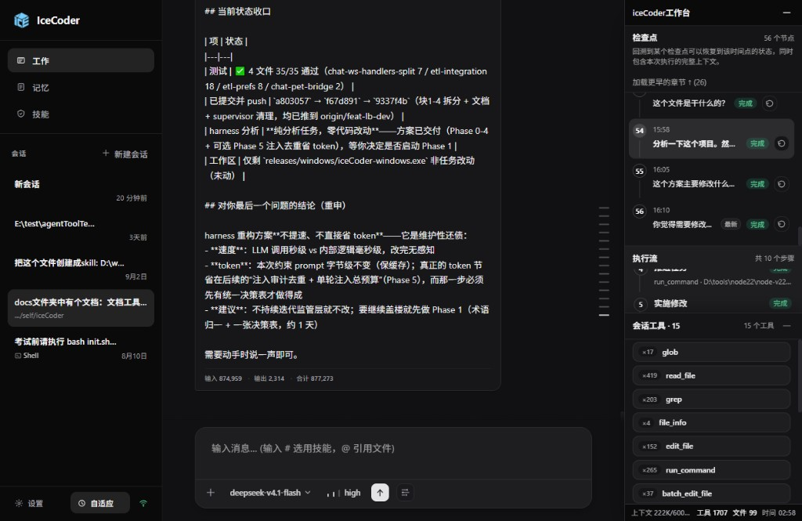
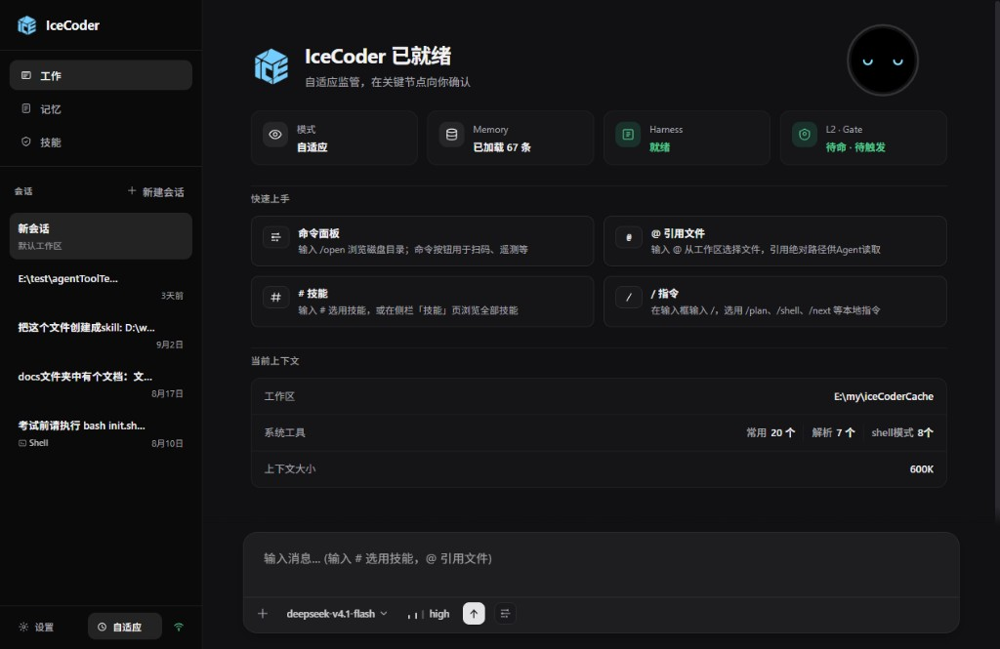
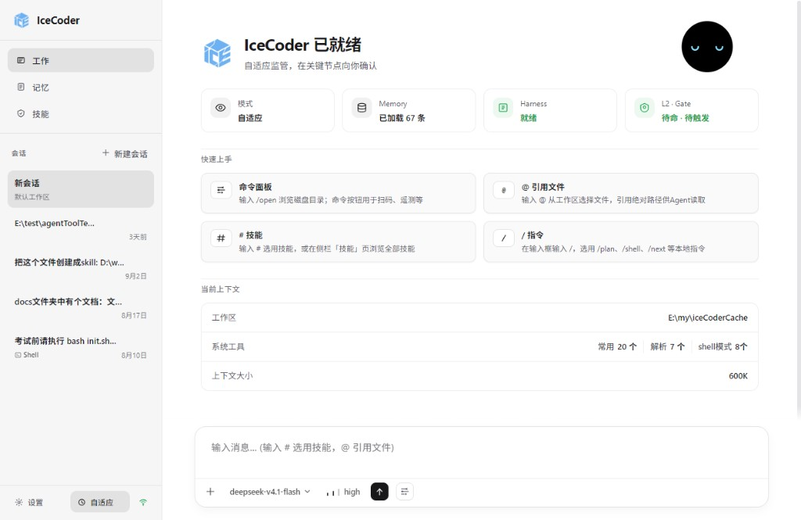

# 工作台融合 · 现状（对齐实现）

> **状态**：已落地。下文按 2026-09-14 `src/public/js/chat-execution-plan.js` / `chat-execution-plan.css` / `etl-chronicle.js` 描述用户现在看见的行为。若与更早的效果稿冲突，以实现为准。
>
> **本文替代** [`执行流-最终效果-finish.md`](./执行流-最终效果-finish.md) 里关于「执行流 / 检查点必须分两个 Tab」「执行流里不能出现恢复」「变更文件常驻在检查点 Tab 下半」的 **UI 约束**。
>
> **不替代** 会话落盘、Intent Checkpoint 协议、**回滚逻辑（确认 / 禁用 / 截断 / 气泡回滚）**、打开文件的后端行为，也不替代编年史「按用户句切章、章内是 Harness 轮次」的数据含义。

---

## 1. 一句话

工作台是一块无 Tab 面板：上半标题是「检查点」（用户句切章的目录），下半标题是「执行流」（选中章的轮次）。**点某一章，下边换成这一章的执行流**；**章节标题右边放回滚按钮，逻辑沿用检查点回滚**。底栏可弹出本会话改过的文件，也可弹出本会话用过的工具名。

未发过话的空会话：聊天区是欢迎页「IceCoder 已就绪」，工作台默认不占右侧。有章节之后才是下面这套面板。

---

## 1.0 界面截图（2026-09-14）

默认：上「检查点」、下「执行流」，底栏是读数。


点底栏「工具」：往上滑出本会话工具名与次数。



点底栏「文件」：往上滑出本会话变更文件（深色 / 浅色同一套层）。


空会话欢迎页（工作台未打开）：





---

## 1.1 交互铁律（先看这条）

| 操作 | 结果 | 禁止 |
|------|------|------|
| 点章节行（标题、摘要、空白处） | **下边打开 / 切换到这一章的执行流** | 点章节不得回滚 |
| 点章节**标题右侧**的回滚按钮 | 走**现有**检查点回滚：同一套确认、同一套禁用、同一个 `messageId`、同一套「回到该用户消息发送时的运行时，之后对话与文件修改丢弃」 | 不得改回滚协议、确认文案语义、运行中禁用条件、聊天气泡回滚 |
| 点执行流里的工具行 | 滚到聊天区对应 trace | 不得打开文件、不得回滚 |

回滚按钮只出现在**章节标题这一行的右边**。执行流区域、底栏、文件层都不要再放第二颗回滚。

---

## 2. 它是什么 / 不是什么

**是**

- 整个 session 的工作台：目录 + 本章施工记录 + 偶发查阅的变更文件。
- 同一根轴：用户每一句话 = 一章 = 一个可回滚点。
- 发下一条消息后，上一章还在；刷新、晚开，只要会话还在，目录和已结束章还在。
- 变更文件是本会话累计产物，用完就关，不占第三块常驻分栏。

**不是**

- 不是两份用户句列表（不再并列「检查点时间轴」和「章节目录」）。
- 不是聊天缩略版：不展示模型正文、思考、stdout、diff。
- 不是文件浏览器：执行流工具行不能打开文件；只有文件层里点名称才定位到磁盘。
- 不是点章节就回滚：回滚只在章节标题右侧那颗按钮上，**逻辑与现有检查点回滚完全相同**。
- 运行中不能从这里打断、改提示、跳过步骤。

---

## 3. 为什么融

执行流做成会话编年史之后，检查点上半和章节目录已经是同一批用户句：编号、摘要、时间高度重复。检查点多出来的只有两件事——回滚、看本会话改过的文件。

继续分两个 Tab，用户要为同一根轴交导航税。融合后：

- **列表只留一条**（章节）。
- **回滚挂在章上**，不再单独占一条时间轴。
- **文件改成底栏唤起**，不再和施工区对半分高度。

---

## 4. 和旁边怎么分工

| 区域 | 用户来这里是为了 | 点击 |
|------|------------------|------|
| 聊天 | 看说了什么、工具原文、完整输出 | 气泡仍可回滚（与工作台回滚同一套协议） |
| **章节** | 选哪一句；标题右侧回滚回到这一句发出时 | 点行 = **下边打开该章执行流**；点标题右侧 ↩ = 现有回滚 |
| **本章执行流** | 看这一章轮次和工具短预览 | 点工具行 → 滚到聊天区对应 trace；跳不到也不复制原文 |
| **变更文件层** | 去磁盘上找本会话写过的文件 | 点文件名 → 打开所在文件夹并定位 |
| 底栏 | 扫一眼上下文 / 工具次数 / 文件数 / 当前章耗时 | 「工具」「文件」可点，弹出底栏层；上下文和时间是读数 |

---

## 5. 打开面板时默认长什么样

工作台标题、监管条（若有）、底栏都还在。**没有 Tab 条。**

默认两层主内容（上区约 46%、下区约 54%，中间有分隔）。目录按时间正序，**最新章节在最下面**，进入时滚到最新（和聊天区一样：旧的在上、新的在下）。上区标题写「检查点」，副文案说明可以回溯；计数是「N 个节点」。下区标题写「执行流」。

```
iceCoder工作台                                              —
────────────────────────────────────────────────────────────
⚠ 已进入监管模式（多文件写入 · 第 2 章）              查看详情
────────────────────────────────────────────────────────────
检查点                                              3 个节点
回溯到某个检查点可以恢复到该时间点的状态，同时包含本次执行的完整上下文。

  ①  补测试并跑 vitest               完成            [↩]
      15:30

  ②  登录失败时不要清掉表单          完成            [↩]
      15:32

  ③  把空态文案改短一点    最新       进行中          [↩]
      15:57

────────────────────────────────────────────────────────────
执行流                                              共 N 个步骤

  1  收集上下文                                 完成  4.2s
  2  实施修改                                   进行中
     正在修改 src/public/js/chat-ui.js · 3.1s

────────────────────────────────────────────────────────────
上下文 32,316/1000K (3.2%)    工具 8    文件 3    时间 02:44
```

每一章是一行标题，结构固定：

```
[编号]  [章节标题 / 用户句短摘要]     [状态]     [↩ 回滚]
        [时刻]
```

- 标题在左，**回滚按钮贴在标题行最右侧**，与聊天气泡回滚同一图标、同一含义。
- 状态徽章在标题和回滚之间。最新一章额外有「最新」标记；选中章高亮，最新章不再单独套同一套高亮。
- 点标题 / 点行 → 下边打开执行流；点 ↩ → 回滚。两块点击区域分开，回滚按钮 `stopPropagation`。

没有任务图的问答章同样占一行。不要凭空画「初始化会话」档；没有可恢复落点就不要多一行。

**默认选中最新一章**，下边已经打开这一章的执行流。更早的章只在目录里占一行。未选中的章：下边不混入它的轮次。

---

## 6. 点章节之后：下边打开执行流

点某一章的标题或行（**不是**点右侧回滚）：

- 该章成为选中态（目录里高亮）。
- **下边「执行流」打开（或切换）为这一章的轮次时间轴。**  
  第一次点某章 = 打开；再点另一章 = 换成那一章。没有 Tab。
- 上区和下区各自滚动；高度按 flex 对分，不是「目录高度锁死、只滚执行流」。
- 底部弹出层若开着，**不关、不按章过滤**。

展开后的单位仍是 **Harness 的一轮**（一次模型调用 + 它带出的工具），不是聊天气泡，也不是固定的「解析 / 读取 / 修改 / 验证」四步流水线。下区标题固定为「执行流」，步骤计数写在右侧。有任务图时 `#etl-task-overview` 出现在执行流头上（目标 / 阶段 / 进度），不是面板最顶一块常驻总览。

章目录每一行目前只画：编号、摘要、状态、「最新」（仅当前章）、时刻、↩。**轮数、改文件数不写在章行上**（装配器 `etl-chronicle` 里有这些字段，UI 还没画出来）。

```
  执行流                                              共 11 个步骤
  ────────────────────────────────────────
  目标  修登录失败清空表单          （有任务图才写）
  阶段  实施修改 → 验证结果
  ────────────────────────────────────────
  1  读取登录与表单相关实现          完成  4.2s
     读了 3 个文件
  2  修改提交失败时的状态处理        完成  9.8s
     ✓ 修改 src/.../LoginForm.tsx     1.2s
     ✓ 修改 src/.../session.ts        0.8s
  3  运行相关测试                    失败  6.1s
  ✓  整理结论                        完成  2.4s
     模型判断本章目标已达成
```

规则：

- 先看到轮次标题，再展开一轮才看到工具清单：意图一句 + 路径或命令短预览 + 耗时 + 成败。
- **没有 stdout、没有 diff、没有思考正文。** 要原文，去聊天区（点工具行能跳则跳；跳不到也不在侧栏复制一份）。
- 「整理结论」是该章最后一轮的收尾。短问答可以只有这一轮，下边执行流看起来空是合法的，不要为了填满去编步骤。
- 执行流内部时间正序：第 1 轮在上。

---

## 7. 正在跑的时候

最新一章是活的：目录上徽章是「进行中」，下边执行流轮次往下长，有一条「正在做」（当前工具 + 文件或命令 + 已耗时）。

**跟随：**

- 用户正盯着最新章，或从未手动选过旧章：新消息到来、新章出现时，选中跟随到新章。
- 用户正翻旧章：不要抢走选中；只在目录里最新章上亮「进行中」，避免误以为任务停了。

上一章冻结：不再闪、不再改统计，除非用户回滚（回滚后目录截到那个点，之后的章消失——因为那些工作已经被回滚掉）。

发下一条用户消息：

- 上一章打上完成或停止。
- 目录最下面出现新的一章，进入进行中（若按跟随规则应选中它，则下边执行流切到新章）。

监管条仍在面板最顶（当前是否处于监管）。压缩 / 失败 / 停止 / 熔断 / 子代理：有信号才在该章或该轮出现标记，不打错误栈、不展示压缩摘要正文。

---

## 8. 回滚：标题右边一颗按钮，逻辑不动

### 8.1 放哪

**只放在章节标题行的最右边。** 每一章一颗，与标题同一行：

```
  ②  登录失败时不要清掉表单          完成            [↩]
```

- 图标、位置、禁用样式与聊天气泡上的 ↩ 对齐。
- 执行流头、工具行、底栏、文件层：**都不放回滚。**
- 当前已回滚落点的那一章：不显示这颗按钮（与「当前位置已回滚则隐藏」一致）。
- 没有检查点的章：按钮在，但禁用，提示「未找到检查点，无法回滚」。
- 任务运行中或回滚进行中：按钮禁用，提示「运行中，请等待当前任务完成后再回滚」。

### 8.2 逻辑不动

点这颗按钮 = 调用现有检查点回滚，和聊天气泡回滚是同一条链路。

**原样保留：**

- 回滚到该章对应用户消息 **发送时** 的运行时
- 之后的对话与文件修改将被丢弃
- 现有确认框 / 确认文案
- 现有 `messageId` 对档、cursor、已回滚落点隐藏
- 现有「运行中 / 回滚进行中不可点」
- 聊天区气泡回滚（不删、不改）
- 回滚成功后会话截断、编年史再读盘（后面的章消失）

**禁止改：** 检查点 schema、restore API、确认协议、截断语义、与气泡回滚分叉成两套逻辑。工作台只是把现有按钮的**入口**从检查点列表挪到章节标题右侧。

---

## 9. 变更文件层

变更文件是偶发查阅，**默认不占高度**。

### 9.1 入口

底栏有两格可点：**文件 N** 和 **工具 N**（与上下文 / 时间并列）：

- 有文件：`文件 3`；无文件：`文件 0`，颜色减弱，仍可点，点开看到空态。
- 有工具：`工具 8`；无数时显示 `—`，仍可点，点开看到空态。
- `title`：文件是「本会话变更的文件，点击查看」；工具是「本会话使用过的工具，点击查看」。
- 上下文、时间仍是读数。

### 9.2 展开

点「文件 N」或「工具 N」，从底栏**往上滑出**同一层 `#etl-snapshot-files`，锚在底栏上方，盖住执行流下半。两种名单共用这一层，用 `data-dock-kind` 区分。

```
  执行流（上半仍可见）
  ┌─ 变更文件 · 3                              ⌄ ─┐
  │ 新建   1.txt                                    │
  │ 新建   4.txt                                    │
  │ 新建   5.txt                                    │
  └────────────────────────────────────────────────┘
────────────────────────────────────────────────────
上下文 …    工具 8    文件 3    时间 02:44
```

层头左侧：文件态是 `变更文件 · N`，工具态是 `会话工具 · N`。右侧关闭按钮文案是「收起」。

文件层体：操作徽章（新建 / 修改 / 删除 / 移动）+ 文件名。点名称：用系统程序打开所在文件夹并定位到该文件。**点文件不关层**。

工具层体：工具名 + 本会话次数，只读，不跳转、不打开文件。名单最多展示 200 条。

0 个文件时层内「尚无变更文件」；0 个工具时「尚无工具调用」。

### 9.3 数据含义

名单是**本会话累计**改过的文件，不是「当前选中章」的筛选结果。选中一章短问答、该章没有写文件，底部仍可能是 1.txt / 4.txt / 5.txt。若以后要做「本章改动」，必须是显式开关，不能 silent 换列表。

### 9.4 开 / 关

**打开：** 点底栏「文件 N」或「工具 N」。已打开同一格再点一次 = 关掉；点另一格 = 换成那一份名单。

**关闭（都要能关）：**

- 层头右上角「收起」
- 再点一次当前底栏格
- `Esc`
- 点层外、工作台内的章节或执行流（点在层内或底栏这两格上不关）

**不要：**

- 打开某个文件后自动关
- 新写入文件时自动弹出（底栏数字变了即可）
- 把开合状态写入 config / session 落盘（只是本次打开面板里的 UI 状态；刷新后默认收起）

运行中、回滚中：层照常可看、可开文件。回滚成功后若层是开的，就地刷新名单，不要强行关掉。

---

## 10. 底栏表示什么

| 格 | 含义 | 是否按钮 |
|----|------|----------|
| 上下文 | 此刻窗口占用（活的） | 否 |
| 工具 | 本会话累计工具次数（封存章合计 + 活章；有服务端权威计数时用权威值）。可点，打开本会话工具名名单 | 是 |
| 文件 | 本会话变更文件个数（检查点时间轴下发的 `sessionTouchedPaths`）。可点，打开变更文件层 | 是 |
| 时间 | **当前活章**从本问发出到做完的耗时，不是整段 session 墙钟。代码：`formatTurnElapsed()` → `liveChapterDurationMs()` | 否 |

---

## 11. 刷新、晚开、空会话、回滚后

- **空会话 / 还没发过话：** 聊天区是欢迎页「IceCoder 已就绪」（模式 / Memory / Harness / L2·Gate、快速上手、当前上下文），工作台默认不打开。若用户手动打开工作台：章节区一句「等待模型开始执行」，没有假卡片；中间执行流空；底栏 `文件 0`。
- **只说过话、Harness 还没转起来：** 已有一章「进行中」，中间轮次区可空，章上已有用户摘要。
- **刷新或晚开：** 目录和已结束章应直接齐；正在跑的章接到当前进度。不应再出现「轮次未载入、去聊天区展开」。
- **回滚之后：** 重新以会话数据为准，后面的章消失；文件名单与回滚后的世界一致。
- **超长会话：** 章节目录自己滚动；默认最多画出最近 30 章，其余用「加载更早的章节 ↑」。活章执行流另有轮次分页（默认 20 轮）。已结束章点开后，轮次来自编年史 `chapter.rounds`，不走活章那套 100/50 裁剪。

---

## 12. 移动端

桌面是右侧停靠栏；移动端是顶部一行「执行透明层 ▸」+ 底部 sheet。**sheet 里是同一套工作台 HTML**（上检查点目录、下执行流、底栏文件/工具层），不是「先目录、点进另一页才看到执行流」。回滚仍在章节标题右侧；聊天气泡回滚保留。

---

## 13. 用户怎么用（走查）

1. 打开旧会话，不说话：工作台已是多章目录，默认选中最新一章，中间能看到该章做过什么。
2. 点上一章的标题：下边打开那一章的执行流；目录高度不变。点该章标题右侧 ↩：走现有回滚确认，不会只因为点了标题就倒带。
3. 继续打一句：新章出现在目录最下面；若用户没在翻旧章，中间跟随到新章。
4. 离开去倒水：回来看中间「正在做」，不必翻聊天折叠。
5. 觉得改多了：点该章**标题右边**的 ↩，确认框与现在检查点回滚相同；回来后后面的章没了，文件名单也符合回滚后的世界。
6. 想看某次命令的完整输出：在执行流里点到那一轮的工具，跳到聊天区；侧栏自己不显示输出。
7. 想在磁盘上找文件：点底栏「文件 N」，名单往上展开，点名称打开文件夹；收起 / Esc / 再点一次能关掉。连开两个文件时层保持开着。想看本会话用过哪些工具：点底栏「工具」。
8. 移动端：底部 sheet 里仍是上目录下执行流，不是单独的章详情页。

---

## 14. 几种工作长什么样

**短问答（几乎没工具）**

目录一行「完成 · 1 轮」。中间可能只有「整理结论」。合法。

**一次中等实现**

目录多章；选中本问后，中间第 1 轮是实际工具，最后一轮才是整理结论。页脚工具次数与各章合计能对上。

**长任务、多问接力**

三章、四章排在目录里（**新的在下**）。用户能看出：第一问搭好、第二问返工、第三问收尾。不会每问一次把侧栏洗成空白。

**失败 / 熔断 / 用户停止**

该章徽章对应文案；中间能看到最后一轮哪次工具红了，或「用户停止 / 熔断保护」。不打错误栈。

**压缩 / 子代理**

有才写标记。点子代理若跳转，去聊天区那条摘要。

---

## 15. 不做（仍成立）

- 不保留「执行流 | 检查点」两个 Tab。
- 不在另一处再复制一份章节列表。
- 不把变更文件做成常驻第三分栏。
- 不按选中章自动过滤文件名单。
- 不在执行流工具行上挂「打开文件」。
- 不点章节标题 / 行就回滚；回滚只响应标题右侧那颗按钮。
- 不在执行流区域再放一颗回滚。
- 不改回滚逻辑：不改 schema、restore API、确认框、禁用条件、气泡回滚。
- 不新增「初始化会话」假节点。
- 不把下边执行流画成固定四步任务图。
- 不改 `session.json` / 检查点 schema / 回滚协议 / `open-file` 语义。
- 不新增 sidecar 作为编年史或「底栏层是否打开」的权威存储。
- 新写入文件时不自动弹出文件层。

## 16. 和眼睛对齐的现状

1. 工作台没有「执行流 / 检查点」两个 Tab；同一批用户句只出现一次（上区目录）。
2. 点一章标题，下边换成该章执行流。点另一章，下边再换。
3. 连说两句，目录是两章，不是第二句把第一句擦掉；**新章在最下面**。
4. 每章标题最右边有一颗 ↩；点标题本身不会倒带。点 ↩ 后的确认、禁用、截断与气泡回滚同一套。执行流里没有回滚按钮。
5. 默认看不见文件/工具名单；点底栏「文件」或「工具」才从下往上展开；收起 / Esc / 再点一次能关掉。点文件名仍是打开文件夹，且层不关。
6. 执行流里找不到「打开文件」；空会话是欢迎页、工作台默认不打开，没有假卡片；长会话章节可「加载更早的章节」。

## 17. 活章内存上限（不是「历史进不了面板」）

旧规格把「页脚工具 20、中间只有整理结论」归因于全局 `MAX_TOOL_HISTORY = 100` 且只 hydrate 当前问。**当前问清空、只回填最后一句用户话，这两件事已经改掉。**

现在的上限只作用在**正在跑的那一章的活缓冲**：

| 常量 | 值 | 作用面 |
|------|----|--------|
| `MAX_TOOL_HISTORY` | 100 | 活章 `toolRecords` FIFO；单轮 DOM 工具行同样裁 |
| `MAX_ROUND_HISTORY` | 50 | 活章 `roundRecords` FIFO |
| `chapterVisibleLimit` | 30 | 目录默认画出最近 N 章，其余「加载更早」 |
| `roundVisibleLimit` | 20 | 活章执行流轮次分页 |

底栏工具数字走 `sessionToolTotal()`（封存合计 / 服务端权威计数），**不被 100 卡住**。已结束章点开走 `chapter.rounds`（`etl-chronicle` 从 structured 装配），也不走这 100/50。

会露馅的场景：盯着正在跑、且单章超过 100 次工具或 50 轮——底栏还能涨，活章中间最早的行会被 `shift` 掉。封章时 `fromLive` 只能带走当时还在缓冲里的记录；刷新后再 hydrate，历史章可以从会话数据补齐。
