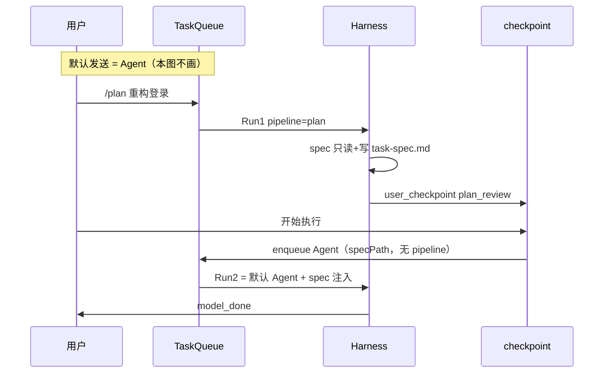

# 规格驱动监管流水线（Ask / Plan）— 设计文档

> **状态**：待实现  
> **日期**：2026-07-17（修订：收窄范围）  
> **范围**：**仅新增 Ask、Plan**；默认发送仍为 **Agent**（既有 Harness，本设计不实现、不改造）  
> **关联文档**：[`双模机制详解.md`](../双模机制详解.md) · [`note-next-commands-finish.md`](./note-next-commands-finish.md) · [`使用文档.md`](../使用文档.md) §异步子代理  
> **关联模块**：`harness/*` · `harness-run-state.ts` · `harness-tool-preflight.ts` · `analysis-workspace-store.ts` · `skills/skill-loader.ts` · `core/skill-registry.ts` · `web/chat-ws.ts` · `chat-commands.js` · `chat-skills.js` · `chat-session-sidebar.js` · `session/task-queue.ts`

---

## 0. 范围声明（必读）

### 0.1 本设计做什么

| 能力 | 说明 | 是否新建运行时 |
|------|------|----------------|
| **Ask** | 只读探索、回答问题；**不改仓库、不出 spec、不 checkpoint** | 否（Harness + 只读 ToolGate） |
| **Plan** | 只读规划 → 写 `task-spec.md` → 用户确认 → **按 spec 走 Agent 执行** | 否（Plan 后半段 = 默认 Agent） |
| **技能库（产品命名）** | 侧栏/底栏导航统一称 **技能库**；`/ask`、`/plan` 与 `#` 技能 **同源**（同一 `ICE_SKILLS_DIR`） | 否（UI 文案 + 技能 frontmatter） |

### 0.2 本设计不做什么

| 能力 | 说明 |
|------|------|
| **Agent** | **默认已是**：输入框直接发送 / 隐式 `/next` → TaskQueue → `harness.run()`，全套工具 + L1/L2 监管。**无需新增模式、无需改路由、无需侧栏 Tab。** |
| **「代理」独立 Tab / 技能/代理** | 不做。Ask/Plan 不是独立 Agent 进程，而是技能库里的条目 + 流水线门控；默认执行体仍是 Harness。 |
| Cursor 式三档 Tab / 每模式独立 context | 不做 |
| 自动按复杂度切 Plan（P2 原案） | **移出本版范围** |
| spec → TaskGraph 自动编译 | **移出本版范围** |
| 新增 `supervisorMode` 档位 | 不做 |

**一句话**：只加 **Ask** 和 **Plan** 两条可选路径；**不选路径时就是 Agent**；**Ask/Plan 定义在技能库维护**。

### 0.3 产品命名：为何叫「技能库」而非「技能/代理」

| 说法 | 结论 |
|------|------|
| **技能库**（推荐 · 侧栏/底栏 Tab） | 与页面 H1「技能库」一致；涵盖 `#` 技能 + `/ask` `/plan` 斜杠定义；用户理解成「可复用的 Prompt / 工作流配置库」 |
| **技能/代理** | 不推荐：斜杠像路径；且 iceCoder 里「Agent」= 默认 Harness，「子代理」= `request_analysis`，与侧栏管理页不是同一概念 |
| **Agent Tab** | 不做：聊天默认就是 Agent，不必再占导航位 |

**功能文案保持不变**（非页面名）：`#` 选用**技能**、按钮「使用技能」、chip「已选技能」——指具体条目，不是导航 Tab 名。

---

## 1. 背景与目标

### 1.1 问题

1. 用户需要 **只读问答**（Ask），当前仅靠 Prompt，无法可靠禁止写操作。  
2. 用户在大任务前需要 **先出任务文档、确认再动手**（Plan），与默认 Action first 冲突。  
3. `/ask`、`/plan` 希望出现在 `/` 下拉，并与 `#` 技能 **在技能库同源维护**（见 §7.4）。  
4. 侧栏导航现称「技能」，与页面「技能库」不一致；需统一为 **技能库**（见 §10.1）。

### 1.2 目标

| 目标 | 说明 |
|------|------|
| **G1** | `/ask`：只读 ToolGate，任务结束即 `model_done`，**不入 Plan 确认流** |
| **G2** | `/plan`：`spec` → `review`（user_checkpoint）→ **Agent 执行**（注入 approved spec） |
| **G3** | 默认发送 **零改动**，仍为 Agent |
| **G4** | 技能库条目支持 `slash: ask \| plan` + `pipeline` frontmatter；动态 `/` 下拉 |
| **G5** | Plan 确认段复用 `user_checkpoint`（`checkpointKind: plan_review`） |
| **G6** | Ask/Plan 与 L1/L2 **正交**：只读段不 enter_forced；Agent 段照旧 |
| **G7** | 主导航 Tab 统一为 **技能库**（桌面侧栏、移动底栏/顶栏、聊天子 Tab） |

### 1.3 非目标

- 不实现、不文档化「Agent 模式」产品开关（默认即是）  
- 不改变 `/also`、`/next`、任务队列语义  
- 不替换 TaskGraph 规则构建器  

---

## 2. 三种用户路径（产品语义）

```text
                    ┌─────────────────────────────────────┐
                    │  默认：直接发送 / 隐式 /next         │
                    │  = Agent（既有，本设计不碰）          │
                    └─────────────────────────────────────┘

┌──────────────────┐              ┌──────────────────────────────────┐
│ /ask <问题>       │              │ /plan <目标>                      │
│ 只读 ToolGate     │              │ spec → review → Agent 执行        │
│ model_done 结束   │              │ （确认后 = 默认 Agent + spec 注入）│
└──────────────────┘              └──────────────────────────────────┘
```

| 用户操作 | 内部 `pipeline` | 工具 | 结束方式 |
|----------|-----------------|------|----------|
| 直接发送（默认） | *(无 / `agent`)* | 全套 | `model_done` 等既有逻辑 |
| `/ask …` 或 `#` + `pipeline: ask` | `ask` | 只读 | `model_done` |
| `/plan …` 或 `pipeline: plan` | `plan` → 确认后 Agent | 规划段只读；执行段全套 | 规划段 `user_checkpoint`；执行段 `model_done` |

**Agent 不是第三种实现**，而是 **未带 `pipeline: ask|plan` 时的默认行为**。

---

## 3. 概念模型

### 3.1 Pipeline 枚举（实现用）

```typescript
/** 队列项 / Run 入口；undefined 表示 Agent（默认） */
export type PipelineKind = 'ask' | 'plan';

/** Plan 子阶段；Ask 无子阶段 */
export type PlanSubPhase = 'spec' | 'review' | 'executing';
```

- **Ask**：整个 run 处于只读 ToolGate，无 `PlanSubPhase`。  
- **Plan**：`spec`（写 task-spec）→ `review`（checkpoint）→ `executing`（**即 Agent**，注入 spec 后走现有 Harness）。

### 3.2 与 TaskPhase / L1 / L2

| 阶段 | TaskPhase | L1 | 写项目文件 |
|------|-----------|-----|------------|
| Ask 全程 | `intent` / `inspect` | `free` | 禁止 |
| Plan · spec | `intent` | `free` | 禁止（除 spec 路径） |
| Plan · review | `intent` | `free` | 禁止 |
| Plan · executing / **Agent 默认** | `context` → … | 照旧 | 允许 |

---

## 4. Ask 详细设计

### 4.1 进入

- 用户消息：`/ask <text>`（或技能 `slash: ask`）  
- 队列入队：`pipeline: 'ask'`  
- 解析后剥离 `/ask` 前缀，剩余文本为 goal  

### 4.2 行为

1. 注入 Ask 段 System 块（技能正文 + 只读约束）。  
2. **只读 ToolGate**（§6），**不允许**写 `task-spec-*.md`（与 Plan 区分：Ask 无交付物文件要求）。  
3. 正常 `harness.run()` 直到模型结束 → **`stopReason: model_done`**。  
4. **不**触发 `user_checkpoint`；**不**自动接力下一队列项以外的 Plan 逻辑。  

### 4.3 Prompt 摘要

```text
[Pipeline / Ask]
Read-only exploration. Answer the user's question using codebase evidence.
Do NOT modify project files or run shell commands that change state.
User question: …
```

### 4.4 结束后的衔接

用户若在 Ask 回复后说「按刚才分析开始改代码」，应 **新发一条默认消息（Agent）** 或 `/plan`，不在同一 Ask run 内切换（避免状态混乱）。

---

## 5. Plan 详细设计

Plan = **规划 run** + **确认** + **Agent run**（两次队列项或一次 run 内阶段切换，见 §5.5）。

### 5.1 规划段（`PlanSubPhase = spec`）

#### 进入

- `/plan <text>` 或 `pipeline: plan`  

#### 行为

1. 只读 ToolGate + **允许**写入 `sessions/{id}/analysis/task-spec-*.md`。  
2. 注入 Plan 规格段 Prompt。  
3. 检测到合格 spec → 进入 `review`。  
4. 轮次耗尽无 spec → `stopReason: plan_incomplete`。  

#### task-spec.md 格式

路径：`{sessionDir}/{sessionId}/analysis/task-spec-{shortHash}.md`

```markdown
---
version: 1
goal: "<用户目标摘要>"
createdAt: "<ISO8601>"
sessionId: "<uuid>"
status: draft | approved
---

## 背景与目标
## 范围（做 / 不做）
## 方案要点
## 步骤（有序列表）
## 风险与回滚
## 验收标准
```

### 5.2 确认段（`PlanSubPhase = review`）

1. `stopReason: user_checkpoint`，`checkpointKind: plan_review`。  
2. 冰豆：「计划已生成，请审阅后点击开始执行」。  
3. **不**自动 TaskQueue 接力（同 `note-next-commands`：checkpoint ≠ model_done）。  

| 用户动作 | 行为 |
|----------|------|
| **开始执行** | spec → `approved`；触发 **Agent 执行**（§5.3） |
| **编辑 spec** | 改 md 或 `/also`；再点执行 |
| **放弃** | 清除 plan 状态；可新发 Agent 消息 |

### 5.3 执行段 = Agent（`PlanSubPhase = executing`）

**与默认 Agent 完全相同**，仅多一段 goal 前缀：

```text
[Approved Task Spec: analysis/task-spec-xxx.md]
<spec body or summary>

[User Request]
<original goal>
```

- `pipeline` 字段清空或视为 Agent；**不再**只读 ToolGate。  
- L0/L1/L2、TaskGraph、Gate：**全部沿用现有逻辑**。  
- 完成后 `model_done`，队列可自动下一项。  

### 5.4 推荐实现：两次 kickoff

| Run | pipeline | 说明 |
|-----|----------|------|
| Run 1 | `plan`（spec → review） | 结束于 checkpoint |
| Run 2 | *(Agent 默认)* | approve 后入队，带 `specPath` |

优点：与「默认即 Agent」一致，Run 2 无需特殊 `pipelinePhase`，只注入 spec。  

### 5.5 备选：单次 run 内阶段切换

同一 `harness.run()` 内 `spec → review → executing`；实现复杂，**P0 不推荐**。

---

## 6. 只读 ToolGate（Ask + Plan·spec/review）

### 6.1 白名单

- 只读工具：`read_file`, `grep`, `glob`, `search_codebase`, `browse_directory`, `request_analysis`, …（对齐 `SubAgentRunner`）  
- **Plan·spec 额外允许**：`write_file` / `edit_file` → 仅 `analysis/task-spec-*.md`  
- **Ask**：**不**允许任何 write（含 spec 路径）  

### 6.2 禁止

- 项目源码/配置的写工具  
- `run_command`（Ask / Plan 规划段）  
- git 写 subcommand  

### 6.3 实现位置

`harness-tool-preflight.ts`（或 `harness-tool-round.ts`）：

```typescript
if (state.pipeline === 'ask') {
  return evaluateAskToolGate(toolName, args);
}
if (state.pipeline === 'plan' && state.planSubPhase !== 'executing') {
  return evaluatePlanSpecToolGate(toolName, args);
}
// pipeline 为空 / executing → 不拦截（Agent）
```

**不用** `executionMode = forced` 表示只读。

---

## 7. 技能库与 `/` 斜杠

### 7.0 技能库、Ask/Plan、Agent 的关系

Ask/Plan **不是新 Agent**，也 **不改变 Harness 主循环**；与无 `pipeline` 的 `#` 技能一样，本质是 **Prompt +（可选）ToolGate +（Plan 专用）checkpoint**。

```text
技能库（ICE_SKILLS_DIR · #/skills）
  ├── 普通技能（无 pipeline）     →  # 引用 → Prompt 注入 → Agent 执行
  ├── pipeline: ask + slash: ask   →  /ask   → 只读 ToolGate → model_done
  └── pipeline: plan + slash: plan   →  /plan   → spec/review → Agent 执行

工作区聊天（默认）                 →  隐式 /next → Agent（本设计不改造）
```

| 层次 | 作用 |
|------|------|
| **Prompt（技能正文）** | 告诉模型以什么角色/步骤做事 |
| **ToolGate（Ask/Plan 规划段）** | 硬禁止写仓库；比纯 Prompt 可靠 |
| **user_checkpoint（Plan）** | 人审 spec 后再进 Agent |
| **Harness 循环** | 各路径共用；L1/L2/TaskGraph 仅在 Agent 段生效 |

### 7.1 Frontmatter（仅 ask | plan）

```yaml
---
name: 计划模式
description: 先分析需求，生成任务文档，确认后再执行
slash: plan
pipeline: plan          # ask | plan（不写 = 仅 # 技能 Prompt，走 Agent）
createdAt: 2026-07-17T00:00:00.000Z
---
```

| pipeline | slash 示例 | 行为 |
|----------|------------|------|
| `ask` | `/ask` | §4 |
| `plan` | `/plan` | §5 |
| *(省略)* | — | `#` 仅 Prompt 注入；发送后仍 **Agent** |

### 7.2 路由优先级（`chat-ws.ts`）

```text
1. /also
2. /next
3. /ask、/plan（内置或技能 slash）
4. 其它自定义 slash（pipeline ask|plan）
5. 默认隐式 /next → Agent
```

**保留名**：`also`, `next`, `ask`, `plan`。

### 7.3 前端

- `GET /api/slash-commands`：返回 `{ name, description, pipeline: ask|plan }`  
- `chat-commands.js`：内置 `ask`、`plan` + 动态技能项  
- 内置 `/ask`、`/plan` 可与示例技能并存；实现时以内置为准  

### 7.4 技能库页职责

| 入口 | 路由 | 说明 |
|------|------|------|
| 桌面侧栏 **技能库** | `#/skills` | 列表、预览、删除；管理全部 `.md` 技能 |
| 移动底栏 **技能库** | `#/m/skills` | 同上 |
| 聊天 `#` | 输入框 | 选用技能 chip，**不经过**技能库页也可 |
| 聊天 `/` | 输入框 | 选用 `slash: ask\|plan` 条目 |

技能库页 hint（`skills-page.js`）建议补充：

> 管理 `#` 技能与 `/ask`、`/plan` 等斜杠指令（同一目录 Markdown，带 `slash` / `pipeline` 字段）。

列表卡片（P1）可增加小标签：`# 技能` · `/plan` · `/ask`，区分入口类型。

### 7.5 与 `#` 技能关系

- **同一文件、两种入口**：`#planMode/skill.md` = Prompt 注入；`/plan` = 同文件 + 自动 `pipeline: plan`。  
- **不改变** `resolveMessage()` 对 `#` 的解析；slash 解析在 **入队前** 合并 pipeline metadata。  
- 自定义 `/review` 等扩展：仍走技能库 + `slash` + 无 `pipeline` 或仅 Prompt，执行段为 **Agent**。

---

| 维度 | Ask / Plan·spec·review | Agent（默认 / Plan·executing） |
|------|------------------------|--------------------------------|
| L0 supervisorMode | 生效 | 生效 |
| L1 executionMode | 保持 `free` | free ↔ forced 照旧 |
| L2 takeover | 不触发（规划段） | 照旧 |
| TaskGraph | 不 init | 照旧 |
| user_checkpoint | 仅 Plan·review | recovery 等照旧 |

---

## 9. 持久化与 API

### 9.1 QueuedTask

```typescript
export interface QueuedTask {
  // 既有字段…
  /** undefined = Agent（默认） */
  pipeline?: 'ask' | 'plan';
  specPath?: string;       // Plan 执行段注入用
}
```

### 9.2 HarnessRunState（Plan run 1）

```typescript
pipeline?: 'ask' | 'plan';
planSubPhase?: 'spec' | 'review';
planSpecPath?: string;
```

Agent run（默认或 Plan run 2）**不必**持久化 `pipeline`（或显式清空）。

### 9.3 REST / WS

| 方法 | 路径 | 说明 |
|------|------|------|
| `GET` | `/api/slash-commands` | ask / plan 列表 |
| `GET` | `/api/sessions/:id/plan` | 已有执行计划 API；Plan spec 可增 `GET .../pipeline/spec`（P1） |
| `POST` | `/api/sessions/:id/plan/approve` | 确认 → 入队 **Agent** run |

WS：`plan_spec_ready`、`plan_approve`；checkpoint 带 `checkpointKind: plan_review`。

---

## 10. UI 与导航命名

### 10.1 主导航：统一为「技能库」

| 位置 | 文件 | 文案（改后） |
|------|------|--------------|
| 桌面侧栏 Tab | `chat-session-sidebar.js` | **技能库** |
| 移动底栏 Tab | `mobile-shell.js` | **技能库** |
| 移动顶栏标题 | `mobile-shell.js` | **技能库** |
| 移动聊天子 Tab | `mobile-chat-page.js` | **技能库**（对话 \| 文件 \| 技能库） |
| 欢迎页 TIPS | `chat-welcome.js` | 侧栏「**技能库**」页浏览全部技能 |

**不改**：输入框 placeholder「选用技能」、`# 技能` TIPS 标题、按钮「使用技能/删除技能」——指具体技能条目，不是 Tab 名。

### 10.2 Ask / Plan / Agent 相关 UI

| 场景 | UI |
|------|-----|
| Ask | 可选消息 tag「Ask · 只读」 |
| Plan·review | 复用 checkpoint：**开始执行** → Agent |
| 欢迎页 | TIPS：`/ask` 只读提问；`/plan` 先规划；**直接发送 = Agent（改代码）** |
| `/` 下拉 | 内置 `/ask`、`/plan` + 技能库中带 `slash` 的条目 |
| 技能库页 | H1 保持「技能库」；hint 说明 `#` 与 `/ask`、`/plan` 同源（§7.4） |

### 10.3 用户文档同步（导航表述）

实现时同步以下文档中的 Tab/侧栏名称（「技能」→「技能库」）：

- [`README.zh-CN.md`](../../README.zh-CN.md) — 底栏 Tab 列表、Agent Skills 小节  
- [`docs/使用文档.md`](../使用文档.md) — 移动端路由表、Web 路由表  
- [`docs/项目介绍.md`](../项目介绍.md) — 涉及「技能 Tab」处  
- [`docs/requirement/移动端H5-Shell方案-finish.md`](./移动端H5-Shell方案-finish.md) — 底栏与子 Tab 列表  

---

## 11. 分阶段实施

### Phase 0（MVP · 3–4 人日）

- [ ] **技能库**导航更名（§10.1）+ 用户文档 Tab 表述（§10.3）  
- [ ] `/ask`：只读 ToolGate + 入队 + `model_done`  
- [ ] `/plan` run1：spec + review + checkpoint  
- [ ] approve → 入队 **Agent** run2（spec 注入）  
- [ ] `chat-commands.js` 内置 `/ask`、`/plan`  
- [ ] 示例技能 `data/skills/planMode/skill.md`、`data/skills/askMode/skill.md`  
- [ ] `skills-page.js` hint 补充 `#` 与 `/ask`、`/plan` 说明（§7.4）  

### Phase 1（2 人日）

- [ ] 技能 `slash` + 动态下拉  
- [ ] spec 预览、移动端 approve  
- [ ] CLI `/ask`、`/plan`  

### 移出本版

- ~~自动复杂度切 Plan~~  
- ~~spec → TaskGraph 编译~~  
- ~~pipeline: verify 独立段~~  
- ~~Agent 模式产品与文档~~  

---

## 12. 测试计划

| 用例 | 预期 |
|------|------|
| 直接发送 `修 bug` | **Agent**，无 pipeline 字段 |
| `/ask 解释 auth` | 只读；写 src block；`model_done` |
| `/plan 大重构` | spec 段只读+spec 可写；checkpoint |
| approve | 下一 run **Agent**，spec 在 goal 中 |
| checkpoint 后 | 队列 **不**自动下一项 |
| `/also` 在 plan review | 仍可用 |
| 侧栏/底栏 Tab 文案 | 显示 **技能库**（非「技能」「技能/代理」） |

---

## 13. 开放问题

1. Plan approve 后：新队列项 vs 同 session 立即 kickoff Agent？（推荐新队列项，与默认 Agent 路径一致）  
2. spec 存 Analysis Workspace 是否 OK？（推荐是）  
3. `/ask` 是否允许 `run_command` 只读类（如 `git log`）？（P0 建议全禁 run_command，P1 可放宽只读 git subcommand）  

---

## 14. 文件变更清单

### 14.1 Ask / Plan 流水线

| 路径 | 变更 |
|------|------|
| `harness-tool-preflight.ts` | Ask / Plan ToolGate |
| `harness-run-state.ts` | pipeline / planSubPhase |
| `harness.ts` | plan review checkpoint |
| `session/task-queue.ts` | `pipeline?`, `specPath?` |
| `web/chat-ws.ts` | `/ask`、`/plan` 路由、approve |
| `public/js/chat-commands.js` | ask、plan 内置 + 动态 |
| `skills/skill-loader.ts` | `slash`, `pipeline: ask\|plan` |
| `public/js/skills-page.js` | hint、列表 tag（P1） |
| `data/skills/planMode/skill.md` | 示例 |
| `data/skills/askMode/skill.md` | 示例 |

### 14.2 技能库导航与文档（可与 Phase 0 前置合并）

| 路径 | 变更 |
|------|------|
| `public/js/chat-session-sidebar.js` | Tab 文案 → 技能库 |
| `public/js/shell/mobile-shell.js` | 底栏 + 顶栏 → 技能库 |
| `public/js/pages/mobile/mobile-chat-page.js` | 子 Tab → 技能库 |
| `public/js/chat-welcome.js` | TIPS 侧栏「技能库」 |
| `README.zh-CN.md` | Tab/侧栏表述 |
| `docs/使用文档.md` | 路由表 |
| `docs/项目介绍.md` | Tab 表述（如有） |
| `docs/requirement/移动端H5-Shell方案-finish.md` | Tab 列表 |

**不改动**（Agent 默认路径）：`harness` 主循环、ModeDecisionEngine、TaskGraph init 条件、隐式 `/next` 逻辑。

---

## 15. 附录：Plan 序列（Run1 + Agent Run2）



---

## 16. 文档索引

- 双模监管：[`../双模机制详解.md`](../双模机制详解.md)  
- 任务队列：[`./note-next-commands-finish.md`](./note-next-commands-finish.md)  
- 只读子代理：[`../使用文档.md`](../使用文档.md) §异步子代理  
- 移动端 Shell：[`./移动端H5-Shell方案-finish.md`](./移动端H5-Shell方案-finish.md)
