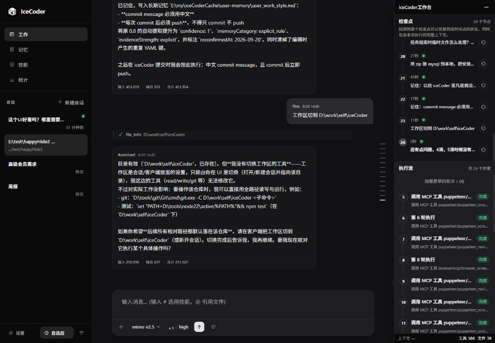
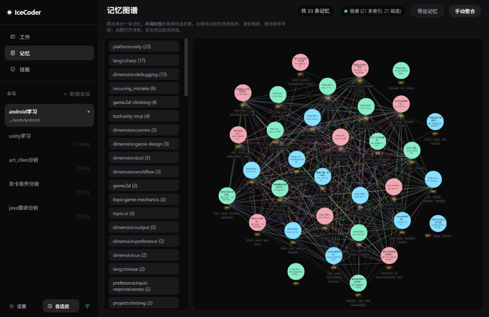
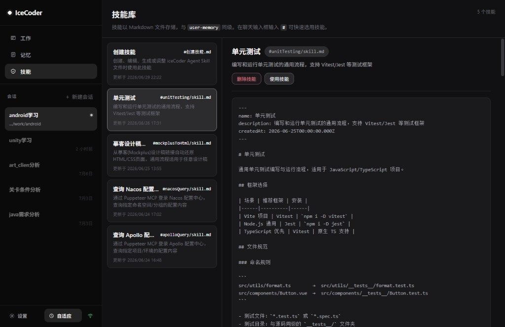
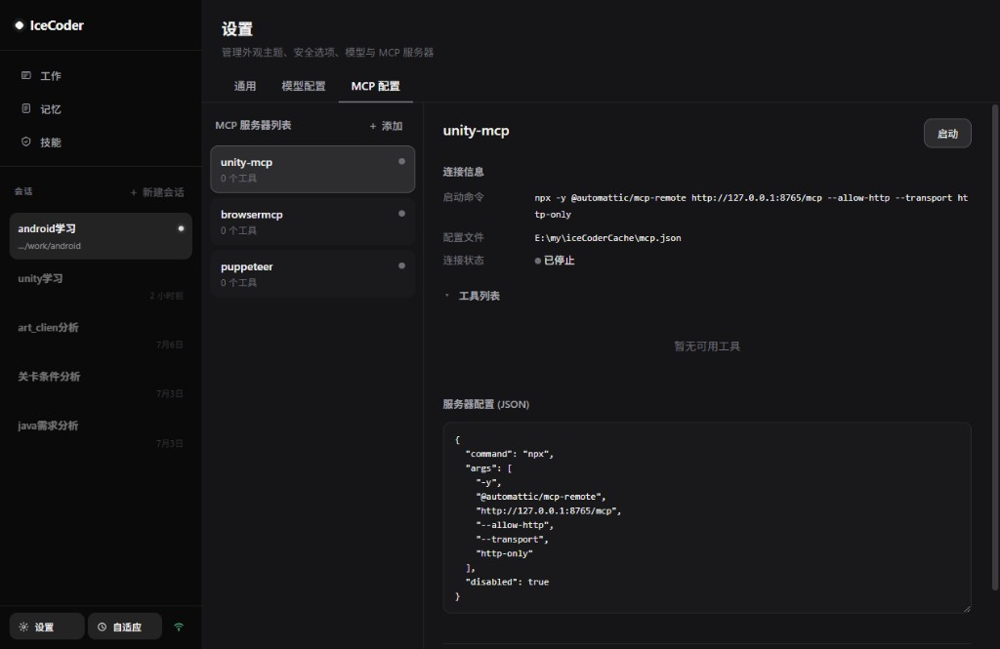
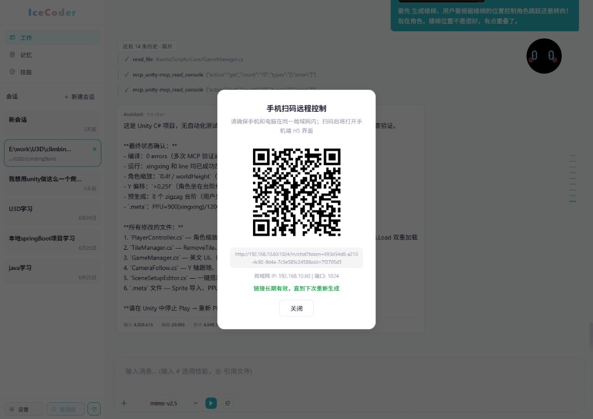
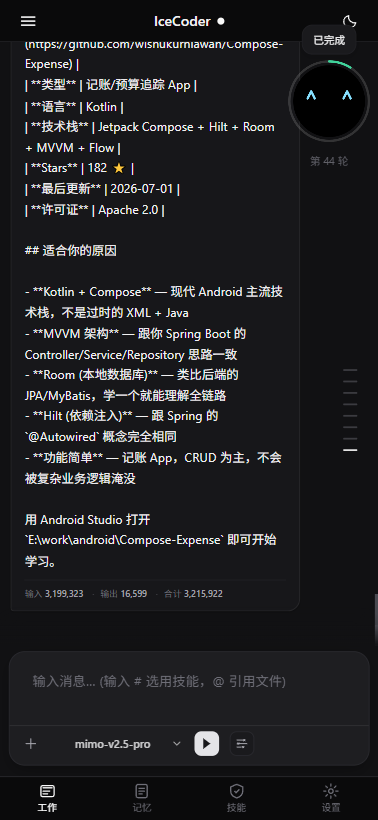
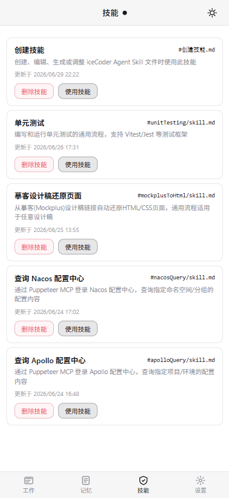
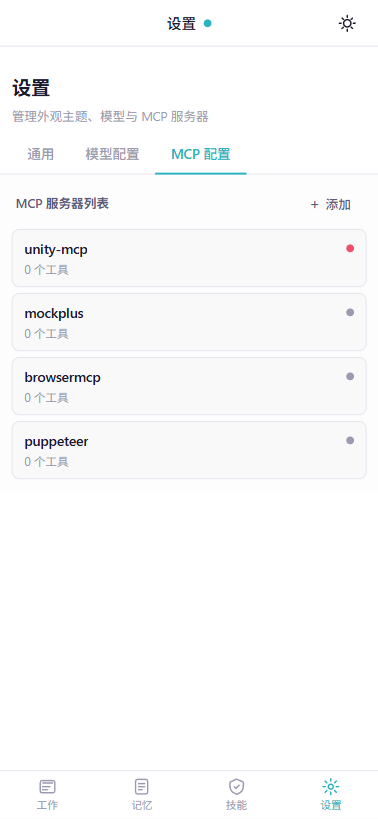

# iceCoder 使用说明

> 最后更新：2026-07-20

本文档集中说明**安装、启动、CLI、测试、Benchmark 与 Web 内置命令**。README 仅保留能力概览与跑分表，不重复命令。

## 简介

iceCoder 是面向本地仓库的 **AI 编程助手运行时**：工具调用 Harness、**L1/L2 双模监管**、文件记忆、**Agent Skills**、多会话 Web / **移动端 H5**、Checkpoint 与遥测。架构与模块见 [`PROJECT-GUIDE.md`](./PROJECT-GUIDE.md)、[`项目介绍.md`](./项目介绍.md)。

## 界面截图

完整预览见 [README.zh-CN.md §界面预览](../README.zh-CN.md#界面预览)。常用页面如下。

### 桌面端

| 页面 | 路由 | 截图 |
|------|------|------|
| 工作 / 聊天 | `#/chat` |  |
| 记忆图谱 | `#/memory` |  |
| 技能库 | `#/skills` |  |
| 设置 · MCP | `#/config` |  |
| 手机扫码（`~scan`） | 聊天内命令 |  |

### 移动端 H5

开发预览：`http://127.0.0.1:1025/#/m/work`。底栏 Tab 对应 `#/m/work`、`#/m/memory`、`#/m/skills`、`#/m/config`。

| 页面 | 路由 | 截图 |
|------|------|------|
| 工作 | `#/m/work` / `#/m/work/:sessionId` |  |
| 技能 | `#/m/skills` |  |
| 设置 · MCP | `#/m/config` |  |

## 前置要求

- **Node.js** **22+**（与 `package.json` → `engines.node` 一致）
- **npm**（仓库脚本以 npm 为准）或 pnpm / yarn

## 快速开始

```bash
git clone <repo-url>
cd iceCoder
npm install
cp data/config.example.json data/config.json
# 编辑 data/config.json，填入 API Key（见下文「配置」）
npm run dev
```

- **`npm run dev`**：本地开发**唯一**启动命令 — API（**1024**）、Vite（**1025**）、cloudflared（需 `CLOUDFLARED_BIN`）；浏览器 **http://127.0.0.1:1025/**
- 不要隧道：`npm run dev -- --no-tunnel`；调试拆分：`npm run dev -- --api` / `--web`
- **`iceCoder` CLI**（`start` / `web` / `run` / `config` 等）在 **`npm pack` 安装 tgz 后**使用，见 [`PACKAGE_USAGE.md`](../PACKAGE_USAGE.md)
- 开发期数据目录为 `./data/`（生产 / 全局安装为 `~/.iceCoder/`）

## 配置

首次使用复制模板并编辑（勿提交密钥）：

```bash
cp data/config.example.json data/config.json
```

`data/config.json` 示例（支持任意 OpenAI 兼容 API）：

```json
{
  "providers": [
    {
      "id": "minimax-m3",
      "apiUrl": "https://api.minimaxi.com/v1",
      "apiKey": "sk-fengkuyangxingqi4-v-wo-50",
      "modelName": "MiniMax-M3,MiniMax-M2",
      "activeModelName": "MiniMax-M3",
      "parameters": {
        "temperature": 0.5
      },
      "isDefault": true,
      "supportsVision": true,
      "maxContextTokens": 1000000
    }
  ],
  "supervisorMode": "adaptive"
}
```

### 多模型（同一 Provider）

| 字段 | 说明 |
|------|------|
| `modelName` | 单个模型名，或**英文逗号分隔**的多个模型（如 `gpt-4o,deepseek-chat,mimo-v2.5-pro`） |
| `activeModelName` | 当前选中的模型，**必须**出现在 `modelName` 解析结果中；未设置时使用第一个 |
| 聊天页切换 | 桌面 / 移动端 H5 底部模型下拉会写入 `activeModelName` 并保存到 `data/config.json` |
| API 调用 | Harness / CLI 实际请求使用 `activeModelName`（见 `src/config/parse-model-names.ts`） |

**示例：** 同一 API 地址下挂多个模型，开发时用 `gpt-4o` 看图、平时用 `deepseek-chat` 省成本 — 在设置页填 `modelName: "gpt-4o,deepseek-chat"`，聊天时一键切换即可。

### 图片识别（vision）

| 字段 / 机制 | 说明 |
|-------------|------|
| `supportsVision` | **Provider 级**开关，默认 `true`；`false` 时不组装多模态图片块 |
| 默认策略 | 不预判断模型能力 — **先带图发送**，API 报错后再降级（`src/llm/vision-fallback.ts`） |
| API 拒绝图片 | 自动从**本次请求**移除图片并重试，注入「当前模型不支持图片识别」说明；**不修改**会话 JSON |
| `supportsVision: false` | 图片落盘到会话 `imagesCache`，用户消息附带绝对路径，引导调用 **`image_read`** |
| `image_read` | 内部调用 LLM 时设置 `skipVisionFallback: true`，避免读图工具被降级 |

**注意：** `supportsVision` 按 **Provider** 配置，不是按 `modelName` 列表中的单个模型名。同一 Provider 内若混用支持/不支持 vision 的模型，可依赖运行时 API 报错降级，或将 `supportsVision` 设为 `false` 统一走 `image_read`。

### 用环境变量注入 API Key（不想把密钥写进 config.json）

把某 provider 的 `apiKey` 留空（`""`），改用环境变量提供，密钥不会落盘：

```powershell
# PowerShell：变量名 = provider id 大写、非字母数字转下划线，再加 _API_KEY
# 例：id="minimax-m3" → MINIMAX_M3_API_KEY
$env:MINIMAX_M3_API_KEY = "sk-你的真实key"
npm run dev          # 必须在同一终端、设置之后启动
```

要点：**先设变量、再启动**，进程起来后再改无效；换终端要重设。命名规则、厂商级备选变量、验证方式与完整示例见 [`环境变量.md`](./环境变量.md#provider_idapi_key--vendorapi_key环境变量注入)。

环境变量（`ICE_DATA_DIR`、`ICE_SKILLS_DIR`、`ICE_SUPERVISOR_SHADOW` 等）见 [`环境变量.md`](./环境变量.md)。监管档位写在 `data/config.json` 的 **`supervisorMode`**（`off` / `adaptive` / `strict`），不是环境变量。

## 启动方式

| 场景 | 命令 |
|------|------|
| **本地开发** | `npm run dev` |
| 不要 cloudflared | `npm run dev -- --no-tunnel` |
| 仅 API / 仅 Vite（调试） | `npm run dev -- --api` / `--web` |
| **安装 tgz 后** | `iceCoder start`（自动打开浏览器）、`iceCoder web`、`iceCoder run "…"` 等 — 见 [`PACKAGE_USAGE.md`](../PACKAGE_USAGE.md) |

### 一次性任务（需 CLI）

**安装包环境：**

```bash
iceCoder run "修复失败测试并跑通 npm test" --max-rounds 100
```

**源码仓库（未 pack 时）可临时：**

```bash
npx tsx src/cli/index.ts run "修复失败测试并跑通 npm test" --max-rounds 100
```

常用选项：

| 选项 | 说明 |
|------|------|
| `--max-rounds <n>` | 最大 Harness 轮次（默认 100） |
| `--json` | 以 JSON 输出结果 |

终端模式（`cli` / `start`）内置：`/scan`、`/tools`、`/clear`、`/help`、`/quit`。

## Web 路由

| Shell | 路由 | 说明 |
|-------|------|------|
| **桌面** | `#/chat` | 工作 / 聊天（默认） |
| | `#/memory` | 记忆管理 |
| | `#/skills` | 技能库 |
| | `#/config` | API 配置 |
| **移动端 H5** | `#/m/work` | 工作首页（Dashboard + 输入框 + 会话抽屉） |
| | `#/m/work/:sessionId` | 聊天详情 |
| | `#/m/memory` | 记忆 |
| | `#/m/skills` | 技能 |
| | `#/m/config` | 配置 |

开发环境打开 `http://127.0.0.1:1025/#/m/work` 可预览移动端 Shell。手机与 PC 同会话见 **`~scan`**。

## 聊天输入：`@` 文件、`#` 技能

| 触发 | 作用 |
|------|------|
| **`@`** | 级联选择**会话工作区**内文件，选中后以 chip 挂在输入框上方 |
| **`#`** | 选择 **`ICE_SKILLS_DIR`** 下的技能 Markdown，发送时注入正文 |

技能文件目录默认 `data/skills/`（生产 `~/.iceCoder/skills/`），可用 `ICE_SKILLS_DIR` 覆盖。创建/编辑技能须落在此目录，详见 [`data/skills/创建技能.md`](../data/skills/创建技能.md)。

### 生产构建与启动

```bash
npm run build          # tsc + vite build + npm pack
npm start              # NODE_ENV=production，需先 build
npm run smoke:node-pty # 验证 node-pty 可 spawn PTY（系统 Node ABI，见下文）
```

## 桌面打包（Electron）

桌面安装包内置 **Electron 内置 Node**（`ELECTRON_RUN_AS_NODE`）跑 `server-bundle`，与本地 `npm run dev` 使用的**系统 Node 22**不是同一套 ABI。`/shell` 交互协管依赖 [`node-pty`](https://www.npmjs.com/package/node-pty) 原生模块，打包前必须将其**重编译为 Electron 版本**，否则桌面包里 PTY 无法加载。

### 打包命令

```bash
npm run build:desktop:server   # 构建 server + web，复制依赖，重编译 node-pty
npm run build:desktop            # 上述 + electron-builder 打 Windows 安装包
```

产物：`desktop/release/iceCoder-windows.exe`，并复制到 `releases/windows/`。

### Windows 编译环境（仅打包开发者需要）

| 组件 | 是否必须 | 说明 |
|------|----------|------|
| **Visual Studio 2022** | ✅ | 推荐 Community；**2019 可不必新装** |
| 工作负载 **「使用 C++ 的桌面开发」** | ✅ | 含 **MSVC v143** 生成工具 |
| **Windows 10/11 SDK**（带 `10.0.xxxxx` 版本号） | ✅ | 在工作负载「可选组件」或 **「单个组件」** 中勾选；**不是** Performance Toolkit |
| **「使用 C++ 的游戏开发」** | ❌ | 不需要 |
| **Spectre-mitigated libs** | ❌ | **默认不需要**；见下文自动绕过 |

安装入口：**Visual Studio Installer** → VS 2022 → **修改**（不是 VS IDE 启动页的「打开项目」）。

### `rebuild-server-native.cjs` 行为

脚本路径：`desktop/scripts/rebuild-server-native.cjs`，由 `build:desktop:server` 自动调用。

1. **检测工具链**：Windows 上通过 `node-gyp find-visualstudio` 校验 MSVC + Windows SDK；macOS / Linux 检测 Xcode CLI 或 `g++`。
2. **无工具链时跳过**：输出安装指引，`exit 0`，**不阻断**后续 `electron-builder` 打包；但桌面包内 `/shell` 在 Electron 下不可用。
3. **有工具链时重编译**：对 `server-bundle/node_modules/node-pty` 执行 `@electron/rebuild`（与 `desktop/node_modules/electron` 版本一致）。
4. **Spectre 默认绕过（Windows）**：`node-pty` 上游 `binding.gyp` 默认要求 Spectre 缓解库，未安装时会报 **MSB8040**。打包脚本会在 rebuild 前将 `SpectreMitigation` 改为 `false` 并清理旧 `build/` 目录，**无需**再装「MSVC v143 Spectre-mitigated libs」。仅影响编译期安全加固选项，**不影响** PTY 功能。
5. **清理干扰环境变量**：若 `VCTargetsPath` 指向旧版 `v140`，rebuild 时会自动忽略。

单独执行：

```bash
node desktop/scripts/rebuild-server-native.cjs
```

成功标志：`[rebuild-server-native] done.`

### 安装 VS 组件后建议执行

**新开** PowerShell（避免旧环境变量残留）：

```powershell
Remove-Item Env:VCTargetsPath -ErrorAction SilentlyContinue
Remove-Item Env:VCINSTALLDIR -ErrorAction SilentlyContinue
cd D:\work\self\iceCoder
npm run build:desktop:server
```

若 rebuild 仍失败，可删除 node-pty 旧 build 缓存后再试：

```powershell
Remove-Item -Recurse -Force desktop\server-bundle\node_modules\node-pty\build -ErrorAction SilentlyContinue
npm run build:desktop:server
```

可选：固定使用 VS 2022

```powershell
$env:GYP_MSVS_VERSION = "2022"
npm run build:desktop:server
```

### 本地 dev 能用、桌面包不能用的原因

| 环境 | Node 运行时 | node-pty 二进制 |
|------|-------------|-----------------|
| `npm run dev` / `npm start` | 系统 Node 22 | `npm install` 自带的 prebuild（MODULE_127） |
| Electron 桌面安装包 | Electron 内置 Node 20 | 须 rebuild 为 Electron ABI（MODULE_128） |

`npm run smoke:node-pty` 只验证**系统 Node**，**不能**代替 Electron 打包时的 rebuild。

### 常见问题

| 现象 | 原因 | 处理 |
|------|------|------|
| `SKIP: 未检测到…工具链` | 未装 VS C++ 或缺 Windows SDK | VS Installer → 修改 VS2022 → 勾选「使用 C++ 的桌面开发」+ Windows SDK |
| `missing any Windows SDK` | 只装了 MSVC，未装 SDK | **单个组件** → 搜索 `Windows 11 SDK`，勾选带版本号的完整 SDK |
| `MSB8040` Spectre 库 | 上游 node-pty 要求 Spectre 库 | 使用当前仓库脚本（已默认绕过）；或手动安装 Spectre-mitigated libs |
| rebuild 成功但 `/shell` 仍失败 | 用了跳过 rebuild 的旧包 | 确认日志有 `done.` 后重新 `npm run build:desktop` |
| `Could not find Visual Studio` | 终端未重启或 `VCTargetsPath` 干扰 | 新开终端，`Remove-Item Env:VCTargetsPath` |

打包完成后，在桌面版中发送 **`/shell`** 并执行简单命令（如 `echo hello`）验证 PTY。

需求与设计背景见 [`requirement/shell-交互协管-slash-shell.md`](./requirement/shell-交互协管-slash-shell.md) §10。

## Web 聊天内置命令（`~` 前缀）

在 Web 输入框发送（非 Shell）：

| 命令 | 说明 |
|------|------|
| `~scan` | 手机扫码，与 PC **同会话**同步 |
| `~open` | 进入**目录浏览模式**（服务端确定性列举；配合 `list_drives` / `browse_directory` / `open_file`） |
| `~telemetry` | Harness / 记忆等遥测摘要 |
| `~supervisor` | L1/L2 监管事件（可与遥测同模式查看） |
| `~memory` | 记忆相关状态 |

### Shell 协作（`/` 前缀）

| 命令 | 说明 |
|------|------|
| `/shell` | 将会话固定为 **Shell 协作模式**（持久 PTY；详见 [`shell协作模式.md`](./shell协作模式.md)） |

遥测原始行见 `data/*/telemetry.jsonl`；REST 详情见 [`项目介绍.md`](./项目介绍.md)。

## 异步子代理（request_analysis）

> iceCoder 的主模型**只暴露 `request_analysis` 一个子代理工具**，不再暴露同步子代理（`delegate` 等已被移除）。所有后台分析均通过异步路径执行。

### 运行方式

1. **模型调用 `request_analysis`**，传入 `kind`（分析类型）、`task`（任务描述）和可选 `context`（补充上下文）。
2. 工具**立即返回 `taskId`**，不阻塞主 Harness 轮次 — 主模型可同时调用其他工具。
3. 后台 `AsyncSubAgentManager` 调度 `SubAgentRunner` 执行**只读分析**（白名单工具集：`read_file`、`search_codebase`、`grep`、`glob`、`browse_directory` 等），结果写入 Analysis Workspace（`sessions/{id}/analysis/`）。
4. 分析完成后，**`Analysis Ready` 摘要**（~几百 token）在后续轮次自动注入主上下文，替代原始的大量搜索/文件内容，减少上下文膨胀约 60–80%。

### 适用场景

| 场景 | 说明 |
|------|------|
| 探索不熟悉的代码库结构 | `kind: explorer` — 梳理模块关系、目录结构 |
| 跨文件搜索与内容审查 | `kind: search` — 搜索实现、查找引用 |
| 变更风险评估 | `kind: review` — 分析改动影响范围 |
| 依赖关系分析 | `kind: dependency` — 模块间依赖图 |
| 测试覆盖分析 | `kind: test_analysis` — 相关测试命令与覆盖情况 |

### 默认行为（开箱即用，无需配置）

- **自动触发**：模型在探索性任务中会自行决定是否调用 `request_analysis`，无需用户显式触发。
- **写前等待**：若主模型即将写入/编辑某路径，且存在同 scope 的 pending 分析，Harness 会软拦截一轮等待分析完成后再写入 — 保证决策基于最新分析结果。
- **并发上限**：默认 **5** 个后台子代理同时运行（`ICE_ASYNC_SUBAGENT_MAX_CONCURRENT`）。
- **子代理超时**：默认 **180000 ms**（3 分钟）（`ICE_SUBAGENT_TIMEOUT_MS`）。
- **LRU 缓存**：进程级缓存（默认 100 条），相同 `task + filesRead + mtimes` 的查询直接命中缓存，跳过重复执行。

### 环境变量参考

| 变量 | 默认值 | 说明 |
|------|--------|------|
| `ICE_ASYNC_SUBAGENT_MAX_CONCURRENT` | `5` | 后台子代理并发上限 |
| `ICE_SUBAGENT_TIMEOUT_MS` | `180000` | 单个子代理墙钟超时（ms） |
| `ICE_SUBAGENT_CACHE_MAX_ENTRIES` | `100` | 进程级 LRU 缓存条目上限 |

### 注意事项

1. **不要读 `analysis/*` artifact 路径**：Analysis Workspace 中的 artifact 是子代理内部产物，主模型需要精确源码细节时，应读取 `filesRead` 列表中的真实源码文件。
2. **同步子代理已移除**：代码树中不存在 `delegate`、`SubAgentTool` 等同步子代理工具。如有过时文档或提示词提到同步子代理，以本节为准。
3. **Analysis Ready 不可手动触发**：摘要注入由 Harness 自动调度，无需用户操作。
4. **只读约束**：子代理仅能使用白名单内的只读工具，不能执行 `write_file`、`edit_file`、`run_command` 等写操作。

### 架构概览

```
Model → request_analysis(kind, task, context?)
  → AnalysisSupervisor.requestAnalysis()
    → AsyncSubAgentManager.submit()   ← 立即返回 { taskId }
      → [后台] SubAgentRunner.run()   ← 只读白名单工具
        → AnalysisWorkspaceStore.writeArtifact()
          → [后续轮次] AnalysisReadyInjector → 注入主上下文摘要
```

详细架构与类型定义见 [`PROJECT-GUIDE.md` § Sub-Agent Runner`](./PROJECT-GUIDE.md)；实施 Phase 拆分见 [`requirement/异步子代理-phase拆分.md`](./requirement/异步子代理-phase拆分.md)。

---

## 测试与覆盖率

```bash
npm test                  # Vitest 全量，约 ~2,000 条用例（~225 文件）
npm run test:coverage     # V8 覆盖率报告（coverage/）
npm run telemetry:runtime # 汇总 runtime 遥测 JSONL
```

近期快照（以本地 `npm run test:coverage` 为准）：

- 全 `src/` 行覆盖约 **78%**
- 模块参考：Harness **~84%**、Supervisor **~95%**、记忆 **~71%**

## Agent Eval Runner

固定 case 定义在 `scripts/agent-eval-cases.ts`；runner 在 `scripts/agent-eval-runner.ts`。每个 case 在 `os.tmpdir()` 下生成独立沙箱工程，真实启动 Harness 与内置工具，不修改当前仓库。

```bash
npm run eval:agent                              # 默认 real：需 data/config.json 中已配置 LLM
npm run eval:agent -- --mode=mock               # 无 API Key 烟测（合成 pass 指标）
npm run eval:agent -- --case=single-file-edit   # 单 case
npm run eval:agent -- --format=markdown         # Markdown 报告
npm run eval:agent -- --keep-workspaces         # 失败时保留沙箱目录便于排查
```

**7 个 case：** `single-file-edit`、`test-failure-fix`、`multi-file-refactor`、`tool-failure-recovery`、`compression-recovery`、`memory-conflict`、`eval-mode-tools-disabled`。

**指标：** `task_success_rate`、`tool_call_rate`、`verification_rate`、`no_tool_final_rate`、`memory_interference_rate`、`tokens_per_successful_task`、`compaction_saved_tokens`、`compaction_recovery_success_rate` 等。

- 报告追加到 `data/eval/agent-eval-history.jsonl`（可用 `ICE_AGENT_EVAL_HISTORY` 覆盖）。
- 任一 case 失败或 P0 指标退化时返回非 0 exit code，便于 CI 门禁。
- TaskGraph 图指标另见 `npx tsx scripts/eval-runner.ts`（与 `eval:agent` 独立）。

## 数据路径

| 环境 | 数据根 |
|------|--------|
| 开发 | 项目内 `./data/` |
| **Electron 与 npm 包（`iceCoder start`）** | 同一套：默认 `~/.iceCoder/`；设置页改过的位置写在 `%APPDATA%/iceCoder/data-directory.json`（macOS/Linux 为对应 Application Support / `.config/iceCoder`） |

两边共用配置、会话、记忆、技能、MCP、图片缓存。可用 `ICE_DATA_DIR` 覆盖（优先级高于设置页指针）。记忆在 `memory-files/`，技能在 `skills/`，会话在 `sessions/` 等。

## 本地 Benchmark

与 Claude Code 等同模型、同 prompt、同沙箱的盲评对比。评分体系见 [`benchMark/md/三平台同模对比评测与裁判评分体系.md`](../benchMark/md/三平台同模对比评测与裁判评分体系.md)；跑分表见 [README.zh-CN.md](../README.zh-CN.md)。

| 路径 | 说明 |
|------|------|
| `benchMark/tasks/*.yaml` | 任务定义（prompt、时间盒、验收命令） |
| `benchMark/md/*-任务规格.md` | 出题规格与隐藏探针说明 |
| `benchMark/reports/*.md` | 已归档的平台对比报告 |

**约定：**

1. 跨平台对比必须 **同模型批次**（勿混 `m2.7` / `m2.5-pro` / `MiniMax-M3`）。
2. 指标以 **SR（验收通过）** + **Composite（Gate 40 + Judge 60）** 为主，不只比轮次或墙钟。
3. 在隔离沙箱目录跑任务 yaml 中的 prompt；勿改 `test/**`、`scripts/**`、`fixtures/**`、`package.json` 等禁改路径（以各任务规格为准）。
4. 最新 L8 报告：[`benchMark/reports/debug-saas-order-supply-approval-fusion-05.md`](../benchMark/reports/debug-saas-order-supply-approval-fusion-05.md)。

## 命令速查

| 命令 | 说明 |
|------|------|
| `npm run dev` | 本地开发：API :1024 + Web :1025 |
| `npm run dev -- --no-tunnel` | 开发栈，不启 cloudflared |
| `npm run dev -- --api` / `--web` | 仅 API / 仅 Vite（调试） |
| `iceCoder …` | **tgz 安装后**全局 CLI（见 PACKAGE_USAGE） |
| `npx tsx src/cli/index.ts …` | 源码仓临时跑 CLI 子命令 |
| `npm test` | 单元 / 集成测试 |
| `npm run test:coverage` | 覆盖率 |
| `npm run eval:agent` | Agent 行为回归（Harness + 沙箱 case；`--mode=mock` 烟测） |
| `npm run telemetry:runtime` | 汇总 runtime 遥测 |
| `npm run build` | 构建并打 tgz 包 |
| `npm run smoke:node-pty` | 验证 node-pty PTY spawn（**系统 Node**，非 Electron） |
| `npm run build:desktop:server` | 构建 server-bundle 并重编译 node-pty（Electron ABI） |
| `npm run build:desktop` | 打包 Windows Electron 安装包 |

## 相关文档

| 文档 | 内容 |
|------|------|
| [README.zh-CN.md](../README.zh-CN.md) | 能力一句话 + Benchmark 跑分表 |
| [PROJECT-GUIDE.md](./PROJECT-GUIDE.md) | 架构与模块 |
| [环境变量.md](./环境变量.md) | 全部 env 说明 |
| [记忆系统详解.md](./记忆系统详解.md) | Memory v2 设计 |
| [压缩机制详解.md](./压缩机制详解.md) | 分层压缩与恢复 |
| [双模机制详解.md](./双模机制详解.md) | L0 / L1 / L2 |
| [PACKAGE_USAGE.md](../PACKAGE_USAGE.md) | `npm pack` 安装分发 |
| [shell协作模式.md](./shell协作模式.md) | `/shell` Shell 协作：SSH、交互终端、安全与 FAQ |

## 注意事项

1. **API Key**：`data/config.json` 含敏感信息，勿提交版本库或外传。
2. **`data/` 目录**：运行期记忆、上传、会话 checkpoint、遥测等；打包发布时通常排除用户数据。
3. **首次运行**：自动创建 `data/memory-files/` 等子目录。
4. **`npm run dev`**：会设置 `ICE_TUNNEL_DEV=1` 并尝试拉起 cloudflared；需 `CLOUDFLARED_BIN`。无隧道时用 `npm run dev -- --no-tunnel`。`npm pack` 发布包不含 Quick Tunnel 实现，仅 stub。
