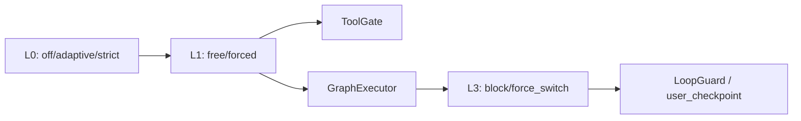

# iceCoder 单轴监管机制

> 版本：2026-08-31  
> 破坏性变更：原 L2 Runtime Supervisor 已移除。

## 1. 当前架构

iceCoder 的监管运行时已收敛为两层状态和一层图级硬约束：

| 层级 | 状态 | 职责 |
|---|---|---|
| L0 | `off / adaptive / strict` | 用户策略档位；strict 提供 forced floor |
| L1 | `free / forced` | 工具门禁、分支预算、模式防抖和最小驻留 |
| L3 | `block / force_switch` | TaskGraph 合约的确定性硬拦截与分支切换 |

原 L2 的 `supervisorPhase`、takeover、handoff、cooldown、反构图、CorrectionPort、
EventTimeline 和 shadow 评测均已删除。



## 2. 三档体验

- `off`：不启用 Execution Mode，也不首轮建图。
- `adaptive`：默认 free，运行态出现结构性信号后进入 forced；不首轮建图。
- `strict`：forced floor；关键工程任务首轮建图。

`executionMode` 仍只允许由 `ModeDecisionEngine` 裁决，并通过
`applyExecutionModeConstraints` 单点写入。进入 forced 后保留 mode lock 和
`forcedMinDwellRounds`，避免模式闪跳。

## 3. 硬约束与停止

- ToolGate 的 block 会物理跳过工具执行。
- TaskGraph 的硬偏离会 block；重复硬偏离或 critical 偏离会 `force_switch`。
- 有 fallback 时切换分支；无 fallback 时停止并请求 `user_checkpoint`。
- 连续工具失败仍由 Harness circuit breaker 限制。
- Verification/Acceptance Gate、Permission 和 HostGuard 不属于监管栈，继续独立生效。

## 4. 配置

`data/supervisor-config.json` 只保留：

```json
{
  "mode": "adaptive",
  "executionMode": {
    "pendingStepsEnterThreshold": 2,
    "writeTargetsEnterThreshold": 1,
    "diffLinesEnterThreshold": 200,
    "stableRoundsExitThreshold": 2,
    "modeLockRounds": 2,
    "forcedMinDwellRounds": 1,
    "readonlyToolNames": ["read_file", "glob", "grep", "list_dir"]
  }
}
```

侧栏 `config.json.supervisorMode` 仍是产品档位的优先入口。

## 5. Checkpoint 与遥测

Checkpoint v2 使用 `executionModeState` 保存 L1 观察字段，不再保存
`supervisorState` 或任何 L2 phase/timeline 数据。

`GET /api/supervisor/events` 现在只返回 Execution Mode enter/exit telemetry。
旧 `supervisor-events.jsonl` 不再读取。
